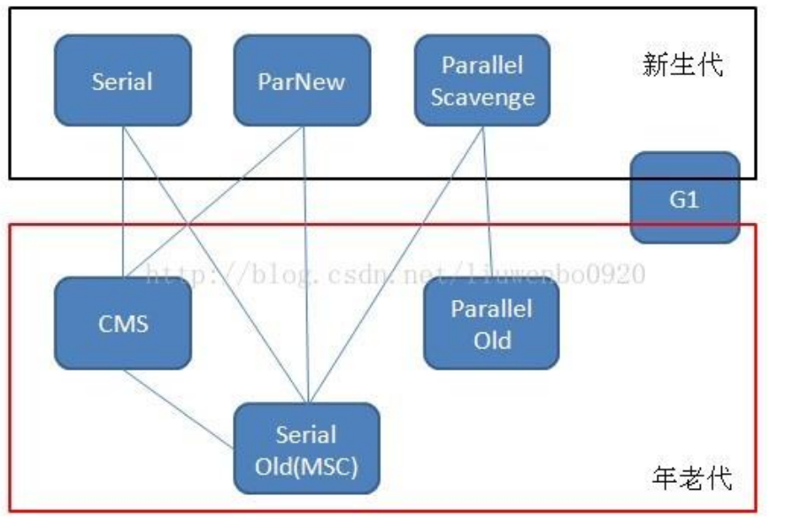

> 基本概念：JVM包括一套字节码指令集、一组寄存器、一个栈、一个垃圾回收，堆和一个存储方法域
> 
> 运行过程：将JAVA源文件通过编译器编译成字节码文件；将字节码文件通过JVM转化成机器码。
> JVM虚拟机就是负责将字节码文件转换成机器码，不同平台版本的JVM会转换成不同的机器码，所以就实现了一次编译，到处运行的目的

### 1.1 线程
并发与并行：
    * 并发：指两个或多个事件在同一个时间段内发生。
    * 并行：指两个或多个事件在同一时刻发生（同时发生）
线程与进程：
    * 进程：指一个应用程序，是系统运行程序的基本单位，一个应用程序至少有一个进程
    * 线程：是进程中的一个执行单元，一个进程中可以有多个线程。
线程调度：
    * 分时调度：所有线程轮流使⽤ CPU 的使⽤权，平均分配每个线程占⽤ CPU 的时间。
    * 抢占式调度：优先让优先级⾼的线程使⽤ CPU，如果线程的优先级相同，那么会随机选择⼀个（线程随机性）， Java使⽤的为抢占式调度。
### 1.2 JVM内存区域
JVM内存区域主要分为：
    * 线程私有：程序计数器、虚拟机栈、本地方法区
    * 线程共享区：Java堆、方法区
    * 直接内存
程序计数器：线程私有，记录当前线程所执行的字节码行号指示器

虚拟机栈：是描述java方法执行的内存模型，每个方法在执行的同时都会创建一个栈帧，用于存储局部变量表，操作数栈，动态链接。方法出口等信息。
每一个方法的调用和执行完成的过程，都对应着一个栈帧在虚拟机栈中入栈到出栈的过程

本地方法区：和java栈作用类似，区别是虚拟机栈为执行java方法服务，本地方法栈则为Native方法服务

堆：创建的对象和数组都保存在堆中，也是垃圾收集器进行垃圾收集的最重要的内存区域。
由于现代VM采用分代收集算法，因此java堆还可以从GC的角度分为：新生代（Eden区、From Survivor区和To survivor区）和老年代

方法区：即永久代，用于存储被JVM加载的类信息、常量、静态变量、即时编译后的代码等数据。
永久代的内存回收主要目标是常量池的回收和类型的卸载，因此收益一般很小

> 在java8中，永久代已经被移除，被一个成为“元空间”的区域替代。元空间的本质和永久代类似，元空间和永久代最大的区别在于：
元空间并不在虚拟机中而在本地内存中。类的元数据放入元空间，字符串池和静态变量放入Java堆

### 1.4 垃圾回收与算法

#### 如何确定垃圾
* 引用计数法：如果一个对象没有任何与之关联的引用，即他们的引用计数为零，则说明对象可能不太会被用到，那么这个对象就是可回收对象

* 可达性分析：为了解决循环引用，以一系列的GCroot对象作为起点搜索，如果对象和GCroot对象之间没有可达路径，则称该对象不可达
当经过至少两次标记后仍然是可回收对象，则面临回收

#### 标记清除算法：
最基础的垃圾回收算法，分为两阶段，标记和清除。存在内存碎片化严重，后续大对象找不到可利用的空间

#### 复制算法：
为了解决标记清除算法存在的问题而提出的算法。将内存等分为两块，每次使用只使用其中一块，当这一块内存满后将存活对象复制到另一快，然后清理内存
；可用内存压缩到一半，存活对象多的话，复制效率大大降低

#### 标记整理算法：
结合以上两个算法而提出。标记后不是清理、复制对象，而是将标记后的对象移向内存一段，然后清除存活端以外的对象

#### 分代回收算法：
是目前大部分JVM采用的方法，其核心思想是根据对象存活的生命周期划分不同的域，一般将GC堆划分为为老生代(Tenured/Old Generation)和新生代(Young
Generation)。老生代的特点是每次垃圾回收时只有少量对象需要被回收，新生代的特点是每次垃
圾回收时都有大量垃圾需要被回收，因此可以根据不同区域选择不同的算法。

新生代采用复制算法；老年代采用标记整理算法

### 1.5 JAVA中引用类型

### 1.7 GC垃圾收集器

* Serial：单线程、复制算法
* ParNeW：多线程版本的Serial
* ParallelScavenge：多线程复制算法，高效。保证了高吞吐
* SerialOld：单线程标记整理算法
* ParallelOld：多线程标记整理算法
* CMS：多线程标记清除算法；
    * 初始标记：标记与GC Roots直接关联的对象，少量停顿
    * 并发标记：跟踪GCRoot
    * 从新标记：修正用户操作而变动的对象
    * 并发清除：清除不可达对象。

### 1.8 JAVA IO/NIO

### 1.9 JVM类加载机制

## 2 JAVA集合