# Home

# DB

---

> * 常见的关系型数据库：Oracle、Mysql、SQLServer、Access
> * 非关系型数据库：MongoDB、Redis、Solr、ElasticSearch、Hive。HBase
>
> 关系型数据库就是由二维表及其之间的关系组成的一个数据集合，以行和列的形式存储数据

## Mysql

---

### [(一)全解MySQL之架构篇](assets\studay\全解MySQL之架构篇.pdf) 

>  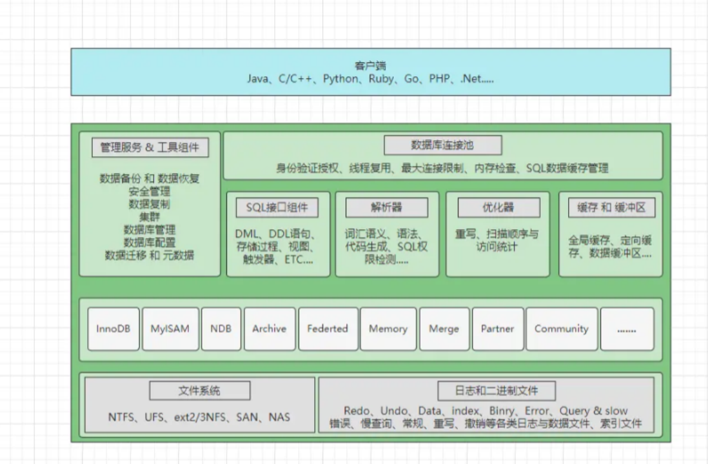
>
>  - 连接层：主要是指数据库连接池，会负责处理所有客户端接入的工作。
>  - 服务层：主要包含`SQL`接口、解析器、优化器以及缓存缓冲区四块区域。
>  - 存储引擎层：这里是指`MySQL`支持的各大存储引擎，如`InnoDB、MyISAM`等。
>  - 文件系统层：涵盖了所有的日志，以及数据、索引文件，位于系统硬盘上。
>
>  
>
>  1. 网路连接层：TCP协议，半全双工。mysql -h 127.0.0.1 -uroot -p123456。连接成功后创建一个session。
>  	`show processlist;`   ` show full processlist` 查看运行的线程
>
>  	数据库连接池：主要是为了复用线程、管理线程以及限制最大连接数。
>
>  	1. `show variables like '%max_connections%';`：查询目前`DB`的最大连接数。
>  	2. `set GLOBAL max_connections = 200;`：修改数据库的最大连接数为指定值。
>  	3. `MySQL`本身还会对客户端的连接数进行统计，对于这点可以通过命令`show status like "Threads%";`
>  		1. `Threads_cached`：目前空闲的数据库连接数。
>  		2. `Threads_connected`：当前数据库存活的数据库连接数。
>  		3. `Threads_created`：`MySQL-Server`运行至今，累计创建的连接数。
>  		4. `Threads_running`：目前正在执行的数据库连接数。
>
>  2. 系统服务层：`MySQL`大多数核心功能都位于这一层，包括客户端`SQL`请求解析、语义分析、查询优化、缓存以及所有的内置函数（例如：日期、时间、统计、加密函数...），所有跨引擎的功能都在这一层实现，譬如存储过程、触发器和视图等一系列服务。
>
>  	1. SQL接口组件：负责处理客户端的`SQL`语句，当客户端连接建立成功之后，会接收客户端的`SQL`命令，比如`DML、DDL`语句以及存储过程、触发器等，当收到`SQL`语句时，`SQL`接口会将其分发给其他组件，然后等待接收执行结果的返回，最后会将其返回给客户端。
>
>  		1. SQL分类：
>
>  			DML：数据库操作语句，比如update、delete、insert等都属于这个分类。
>  			DDL：数据库定义语句，比如create、alter、drop等都属于这个分类。
>  			DQL：数据库查询语句，比如最常见的select就属于这个分类。
>  			DCL：数据库控制语句，比如grant、revoke控制权限的语句都属于这个分类。
>  			TCL：事务控制语句，例如commit、rollback、setpoint等语句属于这个分类。
>
>  		2. 触发器：
>
>  			存储过程：是指提前编写好的一段较为常用或复杂`SQL`语句，然后指定一个名称存储起来，然后先经过编译、优化，完成后，这个“过程”会被嵌入到`MySQL`中。
>  			触发器：则是一种特殊的存储过程。存储过程需要手动调用后才可执行，而触发器可由某个事件主动触发执行。在`MySQL`中支持`INSERT、UPDATE、DELETE`三种事件触发，同时也可以通过`AFTER、BEFORE`语句声明触发的时机，是在操作执行之前还是执行之后。
>
>  		
>
>  	2. 解析器： 客户端连接发送的`SQL`语句，经过`SQL`接口后会被分发到解析器，解析器的作用主要是做词法分析、语义分析、语法树生成...这类工作的
>
>  	3. 优化器：解析器完成相应的词法分析、语法树生成....等一系列工作后，紧接着会来到优化器，优化器的主要职责在于生成执行计划，比如选择最合适的索引，选择最合适的`join`方式等，最终会选择出一套最优的执行计划。
>  		优化器生成了执行计划后，维护当前连接的线程会负责根据计划去执行`SQL`，这个执行的过程实际上是在调用存储引擎所提供的`API`。
>
>  	4. 缓存&缓冲：主要分为了读取缓存与写入缓冲，读取缓存主要是指`select`语句的数据缓存，当然也会包含一些权限缓存、引擎缓存等信息，但主要还是`select`语句的数据缓存，`MySQL`会对于一些经常执行的查询`SQL`语句，将其结果保存在`Cache`中，因为这些`SQL`经常执行，因此如果下次再出现相同的`SQL`时，能从内存缓存中直接命中数据，自然会比走磁盘效率更高，对于`Cache`是否开启可通过命令查询。
>  		`  show global variables like "%query_cache_type%";`：查询缓存是否开启
>  		`show global variables like "%query_cache_size%";`：查询缓存的空间大小
>  		同时还可以通过`show status like'%Qcache%';`命令查询缓存相关的统计信息。
>
>  3. 存储引擎层： 存储引擎也可以理解成`MySQL`最重要的一层，在前面的服务层中，聚集了`MySQL`所有的核心逻辑操作，而引擎层则负责具体的数据操作以及执行工作。
>  	`MySQL`目前有非常多的存储引擎可选择，其中最为常用的则是`InnoDB`与`MyISAM`引擎，可以通过`show variables like '%storage_engine%';`命令来查看当前所使用的引擎
>  	存储引擎是`MySQL`数据库中与磁盘文件打交道的子系统，不同的引擎底层访问文件的机制也存在些许细微差异，引擎也不仅仅只负责数据的管理，也会负责库表管理、索引管理等，`MySQL`中所有与磁盘打交道的工作，最终都会交给存储引擎来完成。
>
>  4. 文件系统层：这一层则是`MySQL`数据库的基础，本质上就是基于机器物理磁盘的一个文件系统，其中包含了配置文件、库表结构文件、数据文件、索引文件、日志文件等各类`MySQL`运行时所需的文件，这一层的功能比较简单，也就是与上层的存储引擎做交互，负责数据的最终存储与持久化工作。
>
>  	1. 日志板块： 在`MySQL`中主要存在七种常用的日志类型，如下：
>  		- `binlog`二进制日志，主要记录`MySQL`数据库的所有写操作（增删改）。
>  		- `redo-log`重做/重写日志，`MySQL`崩溃时，对于未落盘的操作会记录在这里面，用于重启时重新落盘（`InnoDB`专有的）。
>  		- `undo-logs`撤销/回滚日志：记录事务开始前[修改数据]的备份，用于回滚事务。
>  		- `error-log`：错误日志：记录`MySQL`启动、运行、停止时的错误信息。
>  		- `general-log`常规日志，主要记录`MySQL`收到的每一个查询或`SQL`命令。
>  		- `slow-log`：慢查询日志，主要记录执行时间较长的`SQL`。
>  		- `relay-log`：中继日志，主要用于主从复制做数据拷贝
>  	2. 数据模块：`MySQL`的所有数据最终都会落盘（写入到磁盘），而不同的数据在磁盘空间中，存储的格式也并不相同，因此再列举出一些`MySQL`中常见的数据文件类型：
>  		- `db.opt`文件：主要记录当前数据库使用的字符集和验证规则等信息。
>  		- `.frm`文件：存储表结构的元数据信息文件，每张表都会有一个这样的文件。
>  		- `.MYD`文件：用于存储表中所有数据的文件（`MyISAM`引擎独有的）。
>  		- `.MYI`文件：用于存储表中索引信息的文件（`MyISAM`引擎独有的）。
>  		- `.ibd`文件：用于存储表数据和索引信息的文件（`InnoDB`引擎独有的）。
>  		- `.ibdata`文件：用于存储共享表空间的数据和索引的文件（`InnoDB`引擎独有）。
>  		- `.ibdata1`文件：这个主要是用于存储`MySQL`系统（自带）表数据及结构的文件。
>  		- `.ib_logfile0/.ib_logfile1`文件：用于故障数据恢复时的日志文件。
>  		- `.cnf/.ini`：`MySQL`的配置文件，`Windows`下是`.ini`，其他系统大多为`.cnf`。
>  		- `......`
>
>  ---

---

###  [(二)一条SQL语句从诞生至结束的多姿多彩历程！](assets\studay\全解MySQL.pdf) 

>  1. 网络层
>
>  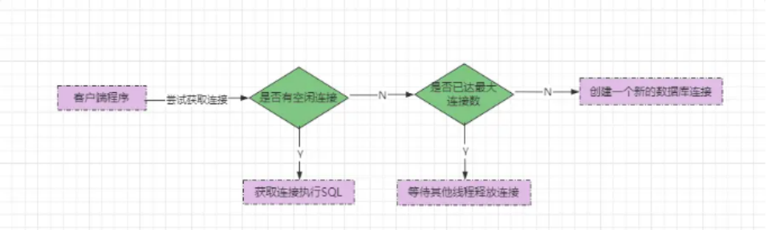
>
>  当尝试从连接池中获取连接时，如果此时连接池中有空闲连接，可以直接拿到复用，但如果没有，则要先判断一下当前池中的连接数是否已达到最大连接数，如果连接数已经满了，当前线程则需要等待其他线程释放连接对象，没满则可以直接再创建一个新的数据库连接使用。
>  假设此时连接池中没有空闲连接，需要再次创建一个新连接，那么就会先发起网络请求建立连接。也就等价于在`MySQL`中创建了一个客户端会话。然后会发生下图一系列工作：
>
>  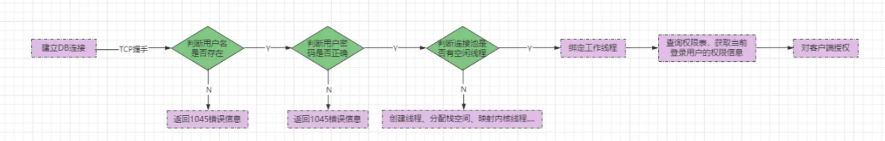
>
>  - 首先会验证客户端的用户名和密码是否正确：
>
>  	- 如果用户名不存在或密码错误，则抛出`1045`的错误码及错误信息。
>  	- 如果用户名和密码验证通过，则进入第②步。
>
>  - 判断
>
>  	MySQL连接池中是否存在空闲线程：
>
>  	- 存在：直接从连接池中分配一条空闲线程维护当前客户端的连接。
>  	- 不存在：创建一条新的工作线程（映射内核线程、分配栈空间....）。
>
>  - 工作线程会先查询`MySQL`自身的用户权限表，获取当前登录用户的权限信息并授权。
>
>  到这里为止，执行`SQL`前的准备工作就完成了，已经打通了执行`SQL`的通道，下一步则是准备执行`SQL`语句，工作线程会等待客户端将`SQL`传递过来。
>
>  2. 服务层：`MySQL`执行`SQL`语句时也会存在些许差异，这里是指读操作和写操作，两者`SQL`的执行过程并不相同
>
>    * 读：
>        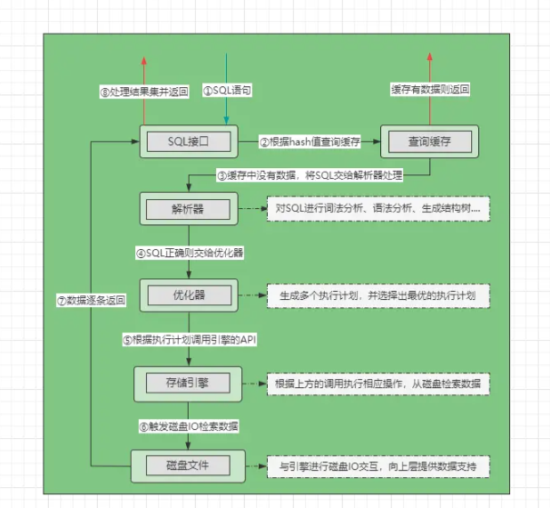
>
>      * 先将`SQL`发送给`SQL`接口，`SQL`接口会对`SQL`语句进行哈希处理。
>      * `SQL`接口在缓存中根据哈希值检索数据，如果缓存中有则直接返回数据。
>      * 缓存中未命中时会将SQL交给解析器，解析器会判断SQL语句是否正确：
>      	- 错误：抛出`1064`错误码及相关的语法错误信息。
>      	- 正确：将`SQL`语句交给优化器处理，进入第④步。
>      * 优化器根据`SQL`制定出不同的执行方案，并择选出最优的执行计划。
>      * 工作线程根据执行计划，调用存储引擎所提供的`API`获取数据。
>      * 存储引擎根据`API`调用方的操作，去磁盘中检索数据（索引、表数据....）。
>      * 发送磁盘`IO`后，对于磁盘中符合要求的数据逐条返回给`SQL`接口。
>      * `SQL`接口会对所有的结果集进行处理（剔除列、合并数据....）并返回。
>
>    上述是一个简单的流程概述，一般情况下查询`SQL`的执行都会经过这些步骤，下面再将每一步拆开详细聊一聊。
>
>      1. SQL接口：
>          
>      	1. 当客户端将`SQL`发送过来之后，`SQL`紧接着会交给`SQL`接口处理，首先会对`SQL`做哈希处理，也就是根据`SQL`语句计算出一个哈希值，然后去「查询缓存」中比对，如果缓存中存在相同的哈希值，则代表着之前缓存过相同`SQL`语句的结果，那此时则直接从缓存中获取结果并响应给客户端。如果没有从缓存中查询到数据，紧接着会将`SQL`语句交给解析器去处理。
>          
>      	2. 解析器： 解析器收到`SQL`后，会开始检测`SQL`是否正确，也就是做词法分析、语义分析等工作，在这一步，解析器会根据`SQL`语言的语法规则，判断客户端传递的`SQL`语句是否合规，如果不合规就会返回`1064`错误码及错误信息但如果`SQL`语句没有问题，此时就会对`SQL`语句进行关键字分析，也就是根据`SQL`中的`SELECT、UPDATE、DELETE`等关键字，先判断`SQL`语句的操作类型，是读操作还是写操作，然后再根据`FROM`关键字来确定本次`SQL`语句要操作的是哪张表，也会根据`WHERE`关键字后面的内容，确定本次`SQL`的一些结果筛选条件.....。
>        	总之，经过关键字分析后，一条`SQL`语句要干的具体工作就会被解析出来。
>        	在这一步也就相当于Java中的`.java`源代码变为`.class`字节码的过程，目的就是将`SQL`语句翻译成数据库可以看懂的指令。
>        
>      	3. 优化器： 优化器最开始会根据语法树制定出多个执行计划，然后从多个执行计划中选择出一个最好的计划，交给工作线程去执行。``MySQL`优化器的一些优化准则如下：
>          
>      		- ❶多条件查询时，重排条件先后顺序，将效率更好的字段条件放在前面。
>      		- ❷当表中存在多个索引时，选择效率最高的索引作为本次查询的目标索引。
>      		- ❸使用分页`Limit`关键字时，查询到对应的数据条数后终止扫表。
>      		- ❹多表`join`联查时，对查询表的顺序重新定义，同样以效率为准。
>      		- ❺对于SQL中使用函数时，如count()、max()、min()...，根据情况选择最优方案。
>      			- `max()`函数：走`B+`树最右侧的节点查询（大的在右，小的在左）。
>      			- `min()`函数：走`B+`树最左侧的节点查询。
>      			- `count()`函数：如果是`MyISAM`引擎，直接获取引擎统计的总行数。
>      			- `......`
>      		- ❻对于`group by`分组排序，会先查询所有数据后再统一排序，而不是一开始就排序。
>      		- ❼`......`
>        
>        	总之，根据`SQL`不同，优化器也会基于不同的优化准则选择出最佳的执行计划。但需要牢记的一点是：MySQL虽然有优化器，但对于效率影响最大的还是SQL本身，因此编写出一条优秀的SQL，才是提升效率的最大要素。
>        
>      	4. 存储引擎：经过优化器后，会得到一个最优的执行计划，紧接着工作线程会根据最优计划，去依次调用存储引擎提供的`API` 工作线程根据执行计划调用存储引擎的`API`查询指定的表，最终也就是会发生磁盘`IO`，从磁盘中检索数据，当然，检索的数据有可能是磁盘中的索引文件，也有可能是磁盘中的表数据文件，这点要根据执行计划来决定，我们只需要记住，经过这一步之后总能够得到执行结果即可。
>
>    * 写
>
>    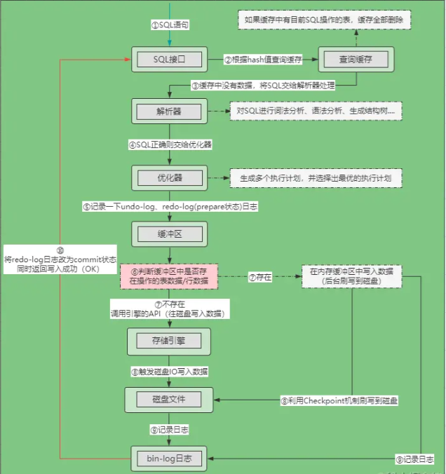
>
>      * 先将`SQL`发送给`SQL`接口，`SQL`接口会对`SQL`语句进行哈希处理。
>      * 在缓存中根据哈希值检索数据，如果缓存中有则将对应表的所有缓存全部删除。
>      * 经过缓存后会将SQL交给解析器，解析器会判断SQL语句是否正确：
>        - 错误：抛出`1064`错误码及相关的语法错误信息。
>        - 正确：将`SQL`语句交给优化器处理，进入第④步。
>      * 优化器根据`SQL`制定出不同的执行方案，并择选出最优的执行计划。
>      * 在执行开始之前，先记录一下`undo-log`日志和`redo-log(prepare状态)`日志。
>      * 在缓冲区中查找是否存在当前要操作的行记录或表数据（内存中）：
>        - 存在：
>        	- 直接对缓冲区中的数据进行写操作。
>        	- 然后利用`Checkpoint`机制刷写到磁盘。
>        - 不存在：
>        	- 根据执行计划，调用存储引擎的`API`。
>        	- 发生磁盘`IO`，对磁盘中的数据做写操作。
>      * 写操作完成后，记录`bin-log`日志，同时将`redo-log`日志中的记录改为`commit`状态。
>      * 将`SQL`执行耗时及操作成功的结果返回给`SQL`接口，再由`SQL`接口返回给客户端。
>
>  和读操作的区别：
>
>    1. 个表的所有缓存清空，确保缓存的强一致性。
>    2. 唯一性判断：如果表中的某个字段建立了唯一约束或唯一索引后，当插入/修改一条数据时，就会先检测一下目前插入/修改的值，是否与表中的唯一字段存在冲突，如果表中已经存在相同的值，则会直接抛出异常，反之会继续执行。
>    3. 缓冲区：在真正调用存储引擎的`API`操作磁盘之前，首先会在「缓冲区」中查找有没有要操作的目标数据/目标表，如果存在则直接对缓冲区中的数据进行操作，然后`MySQL`会在后台以一种名为`Checkpoint`的机制，将缓冲区中更新的数据刷回到磁盘。只有当缓冲区没有找到目标数据时，才会去真正调用存储引擎的`API`，然后发生磁盘`IO`，去对应磁盘中的表数据进行修改。
>    4. 日志：
>
>      * undo-log：回滚、事务日志
>        - 如果目前是`insert`插入操作，则生成一个对应的`delete`操作
>        - 如果目前是`delete`删除操作，`InnoDB`中会修改隐藏字段`deleted_bit=1`，则生成改为`0`的语句
>        - 如果目前的`update`修改操作，比如将姓名从竹子改成了熊猫，那就生成一个从熊猫改回竹子的操作

---

###  [(三)MySQL之库表设计篇 ](assets\studay\MySQL之库表设计篇.pdf) 

>  数据库范式中，声名远扬的有三大范式，但除此之外也有一些其他设计规范，如：
>
>  - 数据库三大范式（`1NF、2NF、3NF`）
>  - 第四范式(`4NF`）和第五范式：完美范式（`5NF`）
>  - 巴斯-科德范式（`BCNF`）
>  - 反范式设计
>
>  1. 三大范式：
>  	三大范式之间，它们是递进的关系。
>
>  	- 第一范式：确保原子性，表中每一个列数据都必须是不可再分的字段。
>
>  		
>
>  	- 第二范式：确保唯一性，每张表都只描述一种业务属性，一张表只描述一件事。要求表中的所有列，其数据都必须依赖于主键
>  		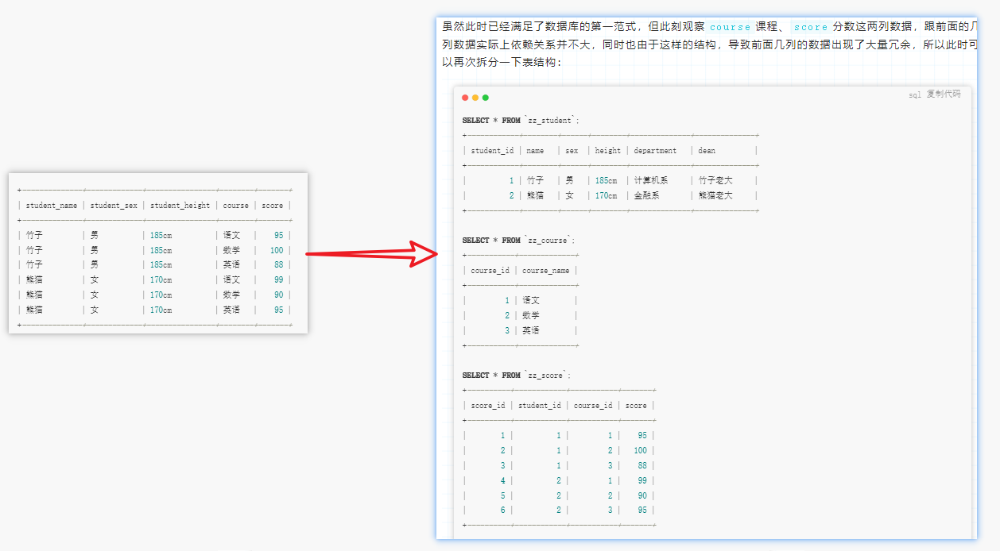
>
>  	- 第三范式：确保独立性，表中除主键外，每个字段之间不存在任何依赖，都是独立的。任何非主键字段不能与其他非主键字段间存在依赖关系
>  		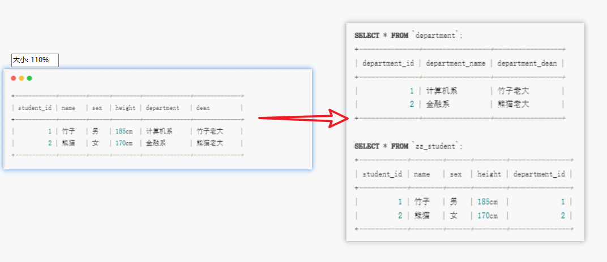
>
>  2. 巴斯·科德范式（BCNF）：
>  	巴斯-科德范式并没有定义新的设计规范，仅是对第三范式的做了补充及完善，修正了第三范式。第三范式只要求非主键字段之间，不能存在依赖关系，但没要求联合主键中的字段不能存在依赖，因此第三范式并未考虑完善，巴斯-科德范式修正的就是这点。
>  3. 第四范式：消除表中的多值依赖关系
>
>  - 第一范式：原子性，每个字段的值不能再分。
>  - 第二范式：唯一性，表内每行数据必须描述同一业务属性的数据。
>  - 第三范式：独立性，表中每个非主键字段之间不能存在依赖性。
>  - 巴斯范式：主键字段独立性，联合主键字段之间不能存在依赖性。
>  - 第四范式：表中字段不能存在多值依赖关系。
>  - 第五范式：表中字段的数据之间不能存在连接依赖关系。
>  - 域键范式：试图研究出一个库表设计时的终极完美范式。

---

###  [(四)MySQL之索引初识篇](assets\studay\MySQL之索引初识篇.pdf) 

* 索引增删改查：

	1. 使用create 语句创建：**CREATE** INDEX indexName **ON** tableName (columnName(length) [**ASC**|**DESC**]);

		- `indexName`：当前创建的索引，创建成功后叫啥名字。
		- `tableName`：要在哪张表上创建一个索引，这里指定表名。
		- `columnName`：要为表中的哪个字段创建索引，这里指定字段名。
		- `length`：如果字段存储的值过长，选用值的前多少个字符创建索引。
		- `ASC|DESC`：指定索引的排序方式，`ASC`是升序，`DESC`是降序，默认`ASC`。

		上述语句中的`INDEX`也可更改为`KEY`，作用都是创建一个普通索引，而对于其他的索引类型，这点在后续的索引分类中再聊。

	2. 使用**ALTER**语句创建：**ALTER** **TABLE** tableName **ADD** INDEX indexName(columnName(length) [**ASC**|**DESC**]);

	3. 建表时创建：

		```sql
		CREATE TABLE tableName(  
		  columnName1 INT(8) NOT NULL,   
		  columnName2 ....,
		  .....,
		  INDEX [indexName] (columnName(length))  
		);	
		```

	4. 查询、删除索引：

		- 查询：**SHOW** INDEX FROM tableName;
		- 删除：**DROP** INDEX indexName **ON** tableName;

```tel
SELECT * FROM table_name FORCE INDEX(index_name) WHERE .....;

FORCE INDEX 键字可以为一条查询语句强制指定走哪个索引查询，但要牢记的是：如果当前的查询SQL压根不会走指定的索引字段，哪这种方式是行不通的，这个关键字的用法是：一条查询语句在有多个索引可以检索数据时，显式指定一个索引，减少优化器选择索引的耗时。但要注意：如果你对于你整个业务系统十分熟悉，那可以这样干。但如果不熟悉的话，还是交给优化器来自行选择，否则会适得其反！

```

* 索引分类：

	1. 索引数据结构层次：

		- `B+Tree`类型：`MySQL`中最常用的索引结构，大部分引擎支持，有序。
		- `Hash`类型：大部分存储引擎都支持，字段值不重复的情况下查询最快，无序。
		- `R-Tree`类型：`MyISAM`引擎支持，也就是空间索引的默认结构类型。
		- `T-Tree`类型：`NDB-Cluster`引擎支持，主要用于`MySQL-Cluster`服务中。

		在`MySQL`中创建索引时，其默认的数据结构就为`B+Tree`，如何更换索引的数据结构呢？如下：

		**CREATE** INDEX indexName **ON** tableName (columnName(length) [**ASC**|**DESC**]) **USING** HASH;

		同时索引会被分为有序索引和无序索引，这是指索引文件中存储索引节点时，会不会按照字段值去排序。那一个索引到底是有序还是无序，就是依据数据结构决定的，例如`B+Tree、R-Tree`等树结构都是有序，而哈希结构则是无序的。

	2. 字段层次：

		* 单列索引：基于一个字段建立的索引
			- 唯一索引：指索引中的索引节点值不允许重复，一般配合唯一约束使用。
			- 主键索引：主键索引是一种特殊的唯一索引，和普通唯一索引的区别在于不允许有空值。
			- 普通索引：通过`KEY、INDEX`关键字创建的索引就是这个类型，没啥限制，单纯的可以让查询快一点。
		* 多列索引：多个字段组合建立的索引
			* 组合索引、联合索引、复合索引、多值索引....

	3. 功能逻辑层次：

		> 请回答一下你知道的`MySQL`索引类型。这题的答案该怎么回答呢？
		>
		> 其实主要就是指`MySQL`索引从逻辑上可以分为那些类型，以功能逻辑划分索引类型，这也是最常见的划分方式，从这个维度来看主要可划分为五种：
		>
		> - **普通索引、唯一索引、主键索引、全文索引、空间索引**

		- 全文索引：全文索引类似于`ES、Solr`搜索中间件中的分词器，或者说和之前常用的`like+%`模糊查询很类似，它只能创建在`CHAR、VARCHAR、TEXT`等这些文本类型字段上，而且使用全文索引查询时，条件字符数量必须大于`3`才生效。
		- 空间索引：在`MySQL`中总共支持`GEOMETRY、POINT、LINESTRING、POLYGON`四种空间数据类型，而空间索引则是基于这些类型的字段建立的，也就是可以帮助我们快捷检索空间数据。

	4. 存储方式层次：

		- 聚簇索引：也被称为聚集索引、簇类索引。
			逻辑上连续且物理空间上的连续。
		- 非聚簇索引：也叫非聚集索引、非簇类索引、二级索引、辅助索引、次级索引。
			逻辑上的连续但物理空间上不连续。

		一张表中只能存在一个聚簇索引，一般都会选用主键作为聚簇索引，其他字段上建立的索引都属于非聚簇索引，或者称之为辅助索引、次级索引。但也不要走进一个误区，虽然`MySQL`默认会使用主键上建立的索引作为聚簇索引，但也可以指定其他字段上的索引为聚簇索引，一般聚簇索引要求索引必须是非空唯一索引才行。`其实就算表中没有定义主键，`InnoDB`中会选择一个唯一的非空索引作为聚簇索引，但如果非空唯一索引也不存在，`InnoDB`隐式定义一个主键来作为聚簇索引。

	* 索引的使用方式

		* 唯一索引：在创建时，需要通过`UNIQUE`关键字创建
			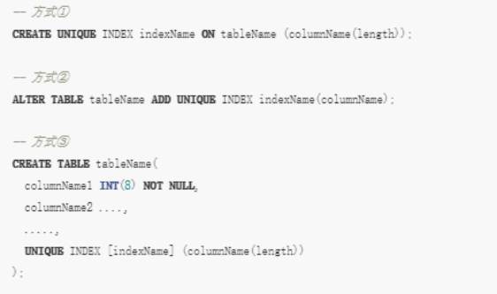

		在已有的表基础上创建唯一索引时要注意，如果选用的字段，表中字段的值存在相同值时，这时唯一索引是无法创建的

		* 主键索引：是一种特殊的唯一索引，通过`PRIMARY`关键字创建
			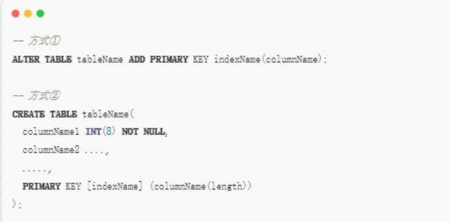

			创建主键索引时，必须要将索引字段先设为主键，否则会抛`1068`错误码。

			这里也不能使用`CREATE`语句创建索引，否则会提示`1064`语法错误。

			同时创建索引时，关键字要换成`KEY`，并非`INDEX`，否则也会提示语法错误。

		* 全文索引：`MySQL`版本必须要在`5.7`及以上，使用`FULLTEXT`关键字
			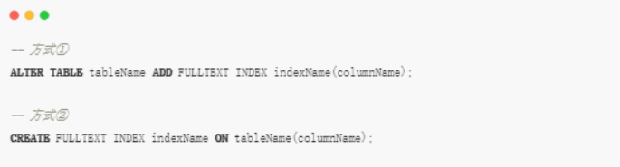

			5.6`版本的`MySQL`中，存储引擎必须为`MyISAM`才能创建。

			创建全文索引的字段，其类型必须要为`CHAR、VARCHAR、TEXT`等文本类型。

			如果想要创建出的全文索引支持中文，需要在最后指定解析器：`with parser ngram`。

			```sql
			ALTER TABLE 
			    zz_article ADD 
			FULLTEXT INDEX 
			    ft_article_name(article_name) 
			WITH PARSER NGRAM;
			```

			**最小搜索长度和最大搜索长度**：show variables like '%ft%'
			全文索引中有两个专门用于检索的关键字：

			1. MATCH(column)：指定要搜索的列，这里要指定创建全文索引的字段
			2. AGAINST(关键字)：要搜索的关键字，也就是要搜索的词语

			这两个检索函数也支持三种搜索模式：

			1. 自然语言模式(默认搜索模式)
				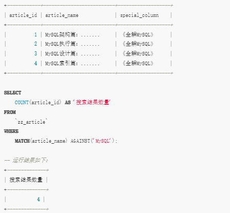

			2. 布尔搜索模式：布尔搜索模式有些特殊，因为在这种搜索模式中，还需要掌握特定的搜索语法：

				- `+`：表示必须匹配的行数据必须要包含相应关键字。

				- `-`：和上面的`+`相反，表示匹配的数据不能包含相应的关键字。

				- `>`：提升指定关键字的相关性，在查询结果中靠前显示。

				- `<`：降低指定关键字的相关性，在查询结果中靠后显示。

				- `~`：表示允许出现指定关键字，但出现时相关性为负。

				- `*`：表示以该关键字开头的词语，如`A*`，可以匹配`A、AB、ABC....`

				- `""`：双引号中的关键字作为整体，检索时不允许再分词。

				- "X Y"@n：""包含的多个词语之间的距离必须要在n之间，单位-字节，如：竹子 熊猫@10`：表示竹子和熊猫两个词语之间的距离要在`10字节内。

				- .......
					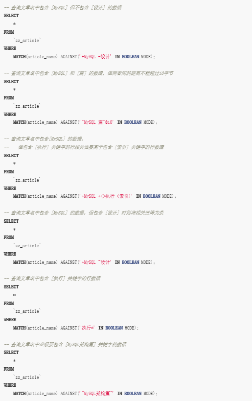

					最后的`IN BOOLEAN MODE`表示使用布尔搜索模式

					相关性：检索数据后，数据的优先级顺序，当相关性越高，对应数据在结果中越靠前，当相关性为负，则相应的数据排到最后。

			3. 查询拓展搜索：在自然语言模式的查询语句基础上，最后面多加一个`WITH QUERY EXPANSION`表示使用查询拓展搜索，这种模式下会比自然语言模式多一次检索过程，比如上述的例子中：

				- 首先会根据指定的关键字`MySQL`进行一次全文检索。
				- 然后第二阶段还会对指定的关键进行分词，然后再进行一次全文检索。

			4. 空间索引：通过`SPATIAL`关键字创建

				ALTER TABLE tableName ADD SPATIAL KEY indexName(columnName);

				- 目前`MySQL`常用引擎中，仅有`MyISAM`支持空间索引，所以表引擎必须要为它。
				- 空间索引必须要建立在类型为`GEOMETRY、POINT、LINESTRING、POLYGON`的字段上。

			5. 联合索引：它是索引的一种特殊结构，可以使用多个字段建立索引

				CREATE INDEX indexName ON tableName (column1(length),column2...);
				ALTER TABLE tableName ADD INDEX indexName(column1(length),column2...);

				- 你可以使用`INDEX`关键字，让多个列组成一个普通联合索引
				- 也可以使用`UNIQUE INDEX`关键字，让多个列组成一个唯一联合索引
				- 甚至还可以使用`FULLTEXT INDEX`关键字，让多个列组成一个全文联合索引

				SELECT语句的查询条件中，必须包含组成联合索引的第一个字段，此时才会触发联合索引，否则是无法使用联合索引的。


###  [(五)MySQL索引应用篇](assets\studay\MySQL索引应用篇.pdf) 

索引优劣势：

* 优势：

	①整个数据库中，数据表的查询速度直线提升，数据量越大时效果越明显。

	②通过创建唯一索引，可以确保数据表中的数据唯一性，无需额外建立唯一约束。

	③在使用分组和排序时，同样可以显著减少`SQL`查询的分组和排序的时间。

	④连表查询时，基于主外键字段上建立索引，可以带来十分明显的性能提升。

	⑤索引默认是`B+Tree`有序结构，基于索引字段做范围查询时，效率会明显提高。

	⑥从`MySQL`整体架构而言，减少了查询`SQL`的执行时间，提高了数据库整体吞吐量。

* 劣势：

	①建立索引会生成本地磁盘文件，需要额外的空间存储索引数据，磁盘占用率会变高。

	②写入数据时，需要额外维护索引结构，增、删、改数据时，都需要额外操作索引。

	③写入数据时维护索引需要额外的时间开销，执行写`SQL`时效率会降低，性能会下降。

索引优劣分析：

* 主键索引存在的陷阱：
	由于主键索引是聚簇索引，表数据和索引数据在一块、如果主键字段值无序（UUID），那代表着几乎每次插入都有可能导致树结构要调整
	因此数据表的主键，最好选用带顺序性的值，否则有可能掉入主键索引的“陷阱”中。
* 联合索引存在的矛盾：联合索引生效的前提，查询条件必须包含第一个索引字段。
	因此在建立索引时也需要考虑这个问题，确保建立出的联合索引能够命中率够高。
* 前缀索引存在的弊端： 前缀索引的特点是短小精悍，我们可以利用一个字段的前`N`个字符创建索引。相较于使用一个完整字段创建索引，前缀索引能够更加节省存储空间，当数据越多时，带来的优势越明显。
	不过前缀索引虽然带来了节省空间的好处，但也正由于其索引节点中，未存储一个字段的完整值，所以`MySQL`也无法通过前缀索引来完成`ORDER BY、GROUP BY`等分组排序工作，同时也无法完成覆盖扫描等操作。
* 全文索引存在的硬伤：利用全文索引代替`like%`语法实现模糊查询，它的性能会比`like%`快上`N`倍。
	但由于全文索引是基于分词实现的，`MySQL`会对该字段做分词处理，这些分词结果也会被存储在全文索引中，因此全文索引的文件会额外的大！当修改字段值后，分词是需要时间的，所以修改字段数据后不会立马自动更新全文索引，此时需要咱们写存储过程，并调用它手动更新全文索引中的数据
	全文索引最大的硬伤在于对中文支持不够友好，英文可以直接通过符号、空格来分词，中文不行
	推荐`ElasticSearch、Solr、MeiliSearch`等搜索引擎
* 唯一索引存在的快慢问题：
	* 快：查询快。唯一索引和普通的索引区别于其唯一性，当唯一索引找到一条数据后会直接返回而普通索引会继续向下查找。
	* 慢：插入慢。唯一索引插入时回检查表中是否存在相同数据，普通索引不会。
* hash索引的致命问题：采用哈希结构的索引，会以哈希表的形式存储索引字段值，当基于该字段查询数据时，只需要经过一次哈希计算就可获取到数据。
	但哈希结构的致命问题在于无序，也就是无法基于哈希索引的字段做排序、分组等工作。

创建合适的索引

* 回表：指一条`SQL`语句在`MySQL`内部，要经过两次查询过程才能获取到数据
	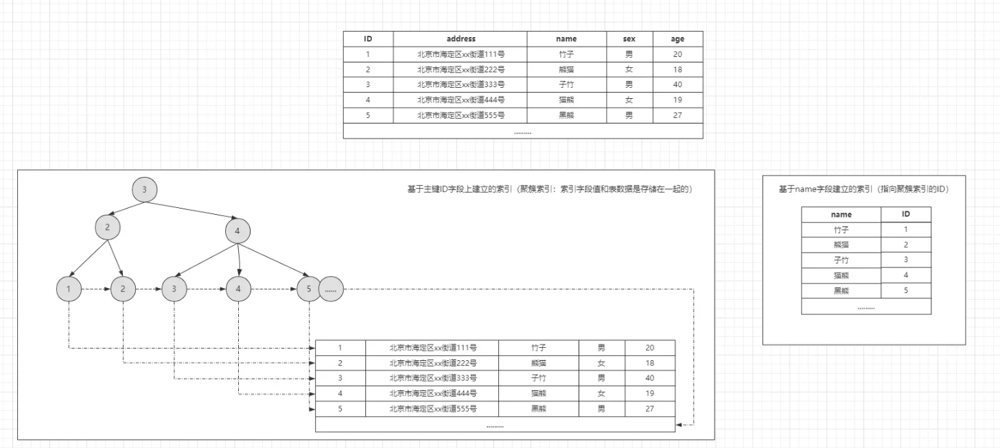

	在上图用户表中，基于`ID`字段先建立了一个主键索引，然后又基于`name`字段建立了一个普通索引，此时`MySQL`默认会选用主键索引作为聚簇索引，将表数据和主键索引存在同一个文件中，也就是主键索引的每个索引节点，都直接对应着行数据。而基于`name`字段建立的索引，其索引节点存放的则是指向聚簇索引的`ID`值。
	**SELECT** * **FROM** `zz_user` **WHERE** name = "子竹";
	这条SQL首先会走`name`字段的索引，然后找到对应的`ID`值，然后再基于查询到的`ID`值，再走`ID`字段的主键索引，最终得到一整条行数据并返回。这个过程则被称之为回表。

回表动作会导致额外的查询开销，因此尽量可以基于主键做查询，如果实在需要使用非主键字段查询，那么尽量要写明查询的结果字段，而并非使用`*`

**建立索引时要遵守的原则**：

- ①经常频繁用作查询条件的字段应酌情考虑为其创建索引。
- ②表的主外键或连表字段，必须建立索引，因为能很大程度提升连表查询的性能。
- ③建立索引的字段，一般值的区分性要足够高，这样才能提高索引的检索效率。
- ④建立索引的字段，值不应该过长，如果较长的字段要建立索引，可以选择前缀索引。
- ⑤建立联合索引，应当遵循最左前缀原则，将多个字段之间按优先级顺序组合。
- ⑥经常根据范围取值、排序、分组的字段应建立索引，因为索引有序，能加快排序时间。
- ⑦对于唯一索引，如果确认不会利用该字段排序，那可以将结构改为`Hash`结构。
- ⑧尽量使用联合索引代替单值索引，联合索引比多个单值索引查询效率要高。

注意点：

- 值经常会增删改的字段，不合适建立索引，因为每次改变后需维护索引结构。
- 一个字段存在大量的重复值时，不适合建立索引，比如之前举例的性别字段。
- 索引不能参与计算，因此经常带函数查询的字段，并不适合建立索引。
- 一张表中的索引数量并不是越多越好，一般控制在3，最多不能超过5。
- 建立联合索引时，一定要考虑优先级，查询频率最高的字段应当放首位。
- 当表的数据较少，不应当建立索引，因为数据量不大时，维护索引反而开销更大。
- 索引的字段值无序时，不推荐建立索引，因为会造成页分裂，尤其是主键索引。

联合索引的最左前缀原则：联合索引的最左前缀原则，道理很简单的，就是组成联合索引的多个列，越靠左边优先级越高，同时也只有`SQL`查询条件中，包含了最左的字段，才能使用联合索引。将查询频率越高的字段放首位，就代表着查询时命中索引的几率越大

**索引失效：**

Explain：

- `id`：这是执行计划的`ID`值，这个值越大，表示执行的优先级越高。
- select_type：当前查询语句的类型，有如下几个值：
	- `simple`：简单查询。
	- `primary`：复杂查询的外层查询。
	- `subquery`：包含在查询语句中的子查询。
	- `derived`：包含在`FROM`中的子查询。
- `table`：表示当前这个执行计划是基于那张表执行的。
- type：当前执行计划查询的类型，有几种情况：
  system > const > eq_ref > ref > range > index > ALL
  - `all`：表示走了全表查询，未命中索引或索引失效。
  - `system`：表示要查询的表中仅有一条数据。
  - `const`：表示当前`SQL`语句的查询条件中，可以命中索引查询。
  - `range`：表示当前查询操作是查某个区间。
  - `eq_ref`：表示目前在做多表关联查询。
  - `ref`：表示目前使用了普通索引查询。
  - `index`：表示目前`SQL`使用了辅助索引查询。
- `possible_keys`：执行`SQL`时，优化器可能会选择的索引（最后执行不一定用）。
- `key`：查询语句执行时，用到的索引名字。
- `key_len`：这里表示索引字段使用的字节数。
- `ref`：这里显示使用了那种查询的类型。
- `rows`：当前查询语句可能会扫描多少行数据才能检索出结果。
- Extra：这里是记录着额外的一些索引使用信息，有几种状态：
	- `using index`：表示目前使用了覆盖索引查询（稍后讲）。
	- `using where`：表示使用了`where`子句查询，通常表示没使用索引。
	- `using index condition`：表示查询条件使用到了联合索引的前面几个字段。
	- `using temporary`：表示使用了临时表处理查询结果。
	- `using filesort`：表示以索引字段之外的方式进行排序，效率较低。
	- `select tables optimized away`：表示在索引字段上使用了聚合函数。

失效场景：

1. 查询中带有OR：
2. 模糊查询中like以%开头
3. 字符串类型查询，条件不带引号
4. 索引字段参与计算：`+、-、*、/、!.....`
5. 索引字段用于函数计算
6. 违背最左前缀原则：
7. 不同字段值对于比：从一张表中查询出一些值，然后根据这些值去其他表中筛选数据
	EXPLAIN **SELECT** * **FROM** `zz_users` **WHERE** user_name = user_sex;
8. 反向范围操作：
	正向范围：`>、<、between、like、in...`
	反向范围：`NOT IN、NOT LIKE、IS NOT NULL、!=、<>...`

在`MySQL`中还有一种特殊情况会导致索引失效，也就是当走索引扫描的行数超过表行数的`30%`时，`MySQL`会默认放弃索引查询，转而使用全表扫描的方式检索数据，因此这种情况下走索引的顺序磁盘`IO`，反而不一定有全表的随机磁盘`IO`快。

关于索引是否会失效，实际上也跟索引的数据结构、`MySQL`的版本、存储引擎的不同有关，例如一条`SQL`语句在`B+Tree`索引中会导致索引失效，但在哈希索引中却不会（好比`IS NULL/IS NOT NULL`），这种情况在不同版本、不同引擎中都有可能会体现出来。

总结如下：

- ①查询`SQL`中尽量不要使用`OR`关键字，可以使用多`SQL`或子查询代替。
- ②模糊查询尽量不要以`%`开头，如果实在要实现这个功能可以建立全文索引。
- ③编写`SQL`时一定要注意字段的数据类型，否则`MySQL`的隐式转换会导致索引失效。
- ④一定不要在编写`SQL`时让索引字段执行计算工作，尽量将计算工作放在客户端中完成。
- ⑤对于索引字段尽量不要使用计算类函数，一定要使用时请记得将函数计算放在`=`后面。
- ⑥多条件的查询`SQL`一定要使用联合索引中的第一个字段，否则会打破最左匹配原则。
- ⑦对于需要对比多个字段的查询业务时，可以拆分为连表查询，使用临时表代替。
- ⑧在`SQL`中不要使用反范围性的查询条件，大部分反范围性、不等性查询都会让索引失效。
- ⑨`.......`

实际上无非就是根据前面给出的索引失效情况，尽量让自己编写的`SQL`不会导致索引失效即可，写出来的`SQL`能走索引查询，那就能在很大程度上提升数据检索的效率。


**索引覆盖：**要查询的列被联合索引包含

**索引下推：**索引下推是`MySQL5.6`版本以后引入的一种优化机制，默认开启
set optimizer_switch='index_condition_pushdown=off|on'

```sql
{
    ["熊猫","女","6666"] : 	1,
    ["竹子","男","1234"] : 	2,
    ["子竹","男","4321"] : 	3,
    ["1111","男","4321"] :	  4,
    ["竹竹","女","8888"] : 	5
}
SELECT * FROM `zz_users` WHERE `user_name` LIKE "竹%" AND `user_sex`="男";
利用联合索引中的user_name字段找出「竹子、竹竹」两个索引节点。
返回索引节点存储的值「2、5」给Server层，然后去逐一做回表扫描。
在Server层中根据user_sex="男"这个条件逐条判断，最终筛选到「竹子」这条数据。

索引下推
利用联合索引中的user_name字段找出「竹子、竹竹」两个索引节点。
根据user_sex="男"这个条件在索引节点中逐个判断，从而得到「竹子」这个节点。
最终将「竹子」这个节点对应的「2」返回给Server层，然后聚簇索引中回表拿数据。
```

**MRR(Multi-Range Read)机制**：简称为**MRR**机制，`MySQL5.6`及以后的版本是默认开启的
**SELECT** * **FROM** `zz_student_score` **WHERE** `score` **BETWEEN** 0 **AND** 59;

这条`SQL`的执行流程是什么样的呢？

- 先在成绩字段的索引上找到`0`分的节点，然后拿着`ID`去回表得到成绩零分的学生信息。
- 再次回到成绩索引，继续找到所有`1`分的节点，继续回表得到`1`分的学生信息。
- 再次回到成绩索引，继续找到所有`2`分的节点......
- 周而复始，不断重复这个过程，直到将`0~59`分的所有学生信息全部拿到为止。

**MRR**机制就主要是解决这个问题的，针对于辅助索引的回表查询，减少离散`IO`，并且将随机`IO`转换为顺序`IO`，从而提高查询效率
**MRR**机制中，对于辅助索引中查询出的`ID`，会将其放到缓冲区的`read_rnd_buffer`中，然后等全部的索引检索工作完成后，或者缓冲区中的数据达到`read_rnd_buffer_size`大小时，此时`MySQL`会对缓冲区中的数据排序，从而得到一个有序的`ID`集合：`rest_sort`，最终再根据顺序`IO`去聚簇/主键索引中回表查询数据。
SET @@optimizer_switch='mrr=on|off,mrr_cost_based=on|off';

**Index Skip Scan索引跳跃式扫描：**`MySQL8.x`版本中加入索引跳跃式扫描
SELECT @@optimizer_switch
set @@optimizer_switch = 'skip_scan=on|off'
跳跃扫描机制也有很多限制，比如多表联查时无法触发、`SQL`条件中有分组操作也无法触发、`SQL`中用了`DISTINCT`去重也无法触发.....

跳跃性扫描机制，只有在唯一性较差的情况下，才能发挥出不错的效果，如果你联合索引的第一个字段，是一个值具备唯一性的字段，那去重一次再拼接，几乎就等价于走一次全表。

`show status like '%Handler_read%';`查看当前会话的索引使用情况。
`show global status like 'Handler_read%';`：查询全局索引使用情况。

---

###  [(六)MySQL索引原理篇](assets/studay/MySQL索引原理篇.pdf) 

为什么建立索引：

没有索引每次查询都会扫描全表，因为表中没有主键、唯一索引。
全表扫描：每触发一次磁盘IO，就会从磁盘中读取一部分数据到内存，然后对内存中的数据进行遍历判断
符合写到结果集中。如果表中还有其他数据，则继续触发磁盘IO，如果没有则将结果集返回。

Mysql为什么选择B+Tree结构：
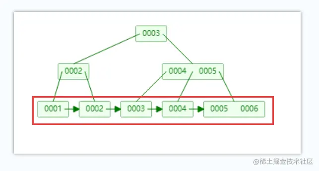
B+Tree：分为叶节点和叶子节点。叶节点存储的是指针地址，叶子节点存储的是数据或是主键
叶节点中不会存储数据，仅存储指向叶子节点的指针，这样做的好处在于能够让一个叶节点中存储更多的元素，从而确保树的高度不会由于数据增长而变得很高。

B+Tree变种：设计索引结构时，对于原始的`B+Tree`又一次做了改造，叶子节点之间除开一根单向的指针之外，又多新增了一根指针，指向前面一个叶子节点，也就是`MySQL`索引底层的结构，实际是`B+Tree`的变种，叶子节点之间是互存指针的，所有叶子节点是一个双向链表结构。
这样做的好处在于：即可以快速按正序进行范围查询，而可以快速按倒序进行范围操作，在某些业务场景下又能进一步提升整体性能


索引为什么不选择二叉树？


①如果索引的字段值是按顺序增长的，二叉树会转变为链表结构。
②由于结构转变成了链表结构，因此检索的过程和全表扫描无异。
③由于树结构在磁盘中，各节点的数据并不连续，因此无法利用局部性原理。

红黑树：
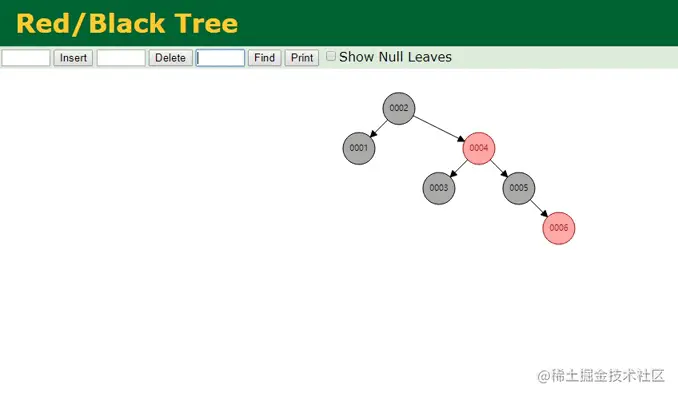

①虽然对比二叉树来说，树高有所降低，但数据量一大时，依旧会有很大的高度。
②每个节点中只存储一个数据，节点之间还是不连续的，依旧无法利用局部性原理。

B-Tree：

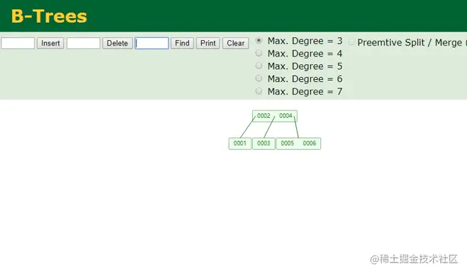
①虽然对比之前的红黑树更矮，检索数据更快，也能够充分利用局部性原理减少`IO`次数，但对于大范围查询的需求，依旧需要通过多次磁盘`IO`来检索数据。


索引创建后发生的事情：

当手动创建索引后，`MySQL`会先看一下当前表的存储引擎是谁，接着会判断一下表中是否存在数据，如果表中没有数据，则直接构建一些索引的信息，例如索引字段是谁、索引键占多少个字节、创建的是啥类型索引、索引的名字、索引归属哪张表、索引的数据结构.....，然后直接写入对应的磁盘文件中，比如`MyISAM`的表则写入到`.MYI`文件中，`InnoDB`引擎的表则写入到`.ibd`文件中。
当表中有数据时，首先`MySQL-Server`会先看一下目前要创建什么类型的索引，然后基于索引的类型对索引字段的值，进行相应的处理，比如：

- 唯一索引：判断索引字段的每个值是否存在重复值，如果有则抛出错误码和信息。
- 主键索引：判断主键字段的每个值是否重复、是否有空值，有则抛出错误信息。
- 全文索引：判断索引字段的数据类型是否为文本，对索引字段的值进行分词处理。
- 前缀索引：对于索引字段的值进行截取工作，选用指定范围的值作为索引键。
- 联合索引：对于组成联合索引的多个列进行值拼接，组成多列索引键。
- `........`

根据索引类型做了相应处理后，紧接着会再看一下当前索引的数据结构是什么？是`B+Tree、Hash`亦或是其他结构，然后根据数据结构对索引字段的值进行再次处理，如：

- `B+Tree`：对索引字段的值进行排序，按照顺序组成`B+`树结构。
- `Hash`：对索引字段的值进行哈希计算，处理相应的哈希冲突，方便后续查找。

对索引字段的值处理好了，此时就会准备将内存中处理好的字段数据，写入到本地相应的磁盘文件中那在写入前还会做最后一个判断，也就是判断当前的索引是否为主键/聚簇索引：
如果当前创建索引的字段是主键字段，则在写入时重构`.ibd`文件中的数据，将索引键和行数据调整到一块区域中存储。不是主键/聚簇索引，或者目前是`MyISAM`引擎，则意味着现在需要创建的是非聚簇索引，因此会先会为每个索引键（索引字段值）寻找相应的行数据，找到之后与索引键关联起来

`InnoDB`引擎中的非聚簇索引，都是主键/聚簇索引附，因此每个索引信息中是以「索引键：聚簇字段值」这种形式关联的。
`MyISAM`引擎中由于表数据和索引数据都是分开存储的，所以`MyISAM`的每个非聚簇索引都是独立的，因此每个索引信息则是以「索引键：行数据的地址指针」这种形式关联。

聚簇和非聚簇区别：
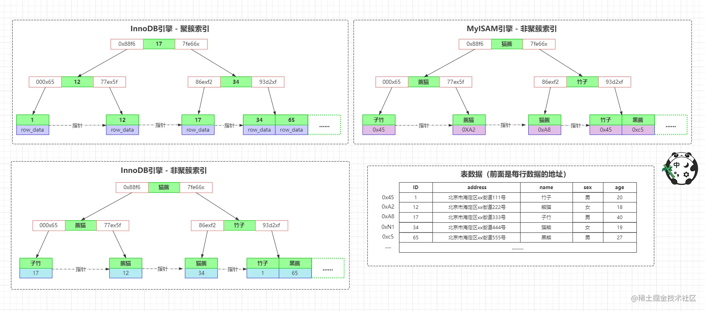

---

###  [(七)MySQL事务篇](assets\studay\MySQL事务篇.pdf) 

* 事务的ACID：

  - `A/Atomicity`：原子性
  - `C/Consistency`：一致性
  - `I/Isolation`：独立性/隔离性
  - `D/Durability`：持久性

  原子性：
  一组SQL要么都成功要么都失败

  一致性：
  数据的一致性。SQL执行前的数据是一致的，执行后数据还是一致的。
  添加用户成功后，用户角色也必须添加成功，使数据完整、一致。

  独立性/隔离性：
  事务和事务之间互不影响

  持久性：
  事务一旦被提交，修改的数据就会被写入磁盘做持久化处理

* 事务管理
  手动管理事务：

  - `start transaction | begin | begin work`：开启一个事务
  - `commit`：提交一个事务
  - `rollback`：回滚一个事务
  - SHOW VARIABLES LIKE autocommit; 查看自动提交事务是否开启
  	SET autocommit = 0|1|ON|OFF;关闭或开启自动提交
  - savepoint point_name`：添加一个事务回滚点
  - rollback to point_name：回滚到指定的事务回滚点
  	

* 事务隔离机制

  - `Read uncommitted/RU`：未提交读
  - `Read committed/RC`：已提交读
  - `Repeatable read/RR`：可重复读
  - `Serializable`：序列化/串行化

  脏读、幻读、不可重复读

  * 脏读：一个事务读到了其他事务还未提交的数据
  * 不可重复读：一个事务每次读取的数据都不一样
  * 幻读：一个事务在第一个事务要处理的目标数据范围之内新增了数据。另一个事务先于第一个事务提交造成的问题。

  脏写：两个事务同时向表中添加一条`ID=88`的数据，此时就会造成数据覆盖，或者主键冲突的问题，这个问题也被称之为更新丢失问题。

* 事务的隔离级别解决了什么问题：

  - 未提交读：处于该隔离级别的数据库，脏读、不可重复读、幻读问题都有可能发生。
  - 已提交读：处于该隔离级别的数据库，解决了脏读问题，不可重复读、幻读问题依旧存在。
  - 可重复读：处于该隔离级别的数据库，解决了脏读、不可重复读问题，幻读问题依旧存在。默认级别
  - 序列化/串行化：处于该隔离级别的数据库，解决了脏读、不可重复读、幻读问题都不存在。

  查询方式
  SELECT @@transaction_isolation ;
  SELECT @@tx_isolation;
  show variables like '%transaction_isolation %';
  show variables like '%tx_isolation%';

  设置方式：
  当前连接有效：SET transaction_isolation = 'read-committed'
  全局有效：SET  global.transaction_isolation = 'serializable'; 

* 未提交读：这种隔离级别是基于「写互斥锁」实现的，当一个事务开始写某一个数据时，另外一个事务也来操作同一个数据，此时为了防止出现问题则需要先获取锁资源，只有获取到锁的事务，才允许对数据进行写操作，同时获取到锁的事务具备排他性/互斥性，也就是其他线程无法再操作这个数据。这个级别中解决了前面说到的脏写问题。

* 提交读：在这个隔离级别中，对于写操作同样会使用「写互斥锁」，也就是两个事务操作同一事务时，会出现排他性，而对于读操作则使用了一种名为`MVCC`多版本并发控制的技术处理，也就是有事务中的`SQL`需要读取当前事务正在操作的数据时，`MVCC`机制不会让另一个事务读取正在修改的数据，而是读取上一次提交的数据（也就是读原本的老数据），每次读取都会创建一个新的ReadView。

* 可重复读：在可重复读级别中，不会每次查询时都创建新的`ReadView`，而是在一个事务中，只有第一次执行查询会创建一个`ReadView`，在这个事务的生命周期内，所有的查询都会从这一个`ReadView`中读取数据，从而确保了一个事务中多次读取相同数据是一致的，也就是解决了不可重复读问题。

* 序列化/串行化级别：这个隔离级别是最高的级别，处于该隔离级别的`MySQL`绝不会产生任何问题，因为从它的名字上就可以得知：序列化意思是将所有的事务按序排队后串行化处理，也就是操作同一张表的事务只能一个一个执行，事务在执行前需要先获取表级别的锁资源，拿到锁资源的事务才能执行，其余事务则陷入阻塞，等待当前事务释放锁。

	

* 原子性要求事务中所有操作要么全部成功，要么全部失败，这点是基于`undo-log`来实现的，因为在该日志中会生成相应的反`SQL`，执行失败时会利用该日志来回滚所有写入操作。

* 持久性要求的是所有`SQL`写入的数据都必须能落入磁盘存储，确保数据不会丢失，这点则是基于`redo-log`实现的，具体的实现过程在前面事务恢复机制讲过。

* 隔离性的要求是一个事务不会受到另一个事务的影响，对于这点则是通过锁机制和`MVCC`机制实现的，只不过`MySQL`屏蔽了加锁和`MVCC`的细节，具体的会在后续章节中细聊。

* 一致性要求数据库的整体数据变化，只能从一个一致性状态变为另一个一致性状态，其实前面的原子性、持久性、隔离性都是为了确保这点而存在的。

---

###  [(八)MySQL锁机制](assets\studay\MySQL锁机制.pdf) 

`MySQL`的锁体系：
- 以锁粒度的维度划分：
  - ①表锁：
  	- 全局锁：加上全局锁之后，整个数据库只能允许读，不允许做任何写操作。
  	- 元数据锁 / `MDL`锁：基于表的元数据加锁，加锁后整张表不允许其他事务操作。
  	- 意向锁：这个是`InnoDB`中为了支持多粒度的锁，为了兼容行锁、表锁而设计的。
  	- 自增锁 / `AUTO-INC`锁：这个是为了提升自增ID的并发插入性能而设计的。
  - ②页面锁
  - ③行锁：
  	- 记录锁 / `Record`锁：也就是行锁，一条记录和一行数据是同一个意思。
  	- 间隙锁 / `Gap`锁：`InnoDB`中解决幻读问题的一种锁机制。
  	- 临建锁 / `Next-Key`锁：间隙锁的升级版，同时具备记录锁+间隙锁的功能。
- 以互斥性的维度划分：
  - 共享锁 / `S`锁：不同事务之间不会相互排斥、可以同时获取的锁。
  - 排他锁 / `X`锁：不同事务之间会相互排斥、同时只能允许一个事务获取的锁。
  - 共享排他锁 / `SX`锁：`MySQL5.7`版本中新引入的锁，主要是解决`SMO`带来的问题。
- 以操作类型的维度划分：
  - 读锁：查询数据时使用的锁。
  - 写锁：执行插入、删除、修改、`DDL`语句时使用的锁。
- 以加锁方式的维度划分：
  - 显示锁：编写`SQL`语句时，手动指定加锁的粒度。
  - 隐式锁：执行`SQL`语句时，根据隔离级别自动为`SQL`操作加锁。
- 以思想的维度划分：
  - 乐观锁：每次执行前认为自己会成功，因此先尝试执行，失败时再获取锁。
  - 悲观锁：每次执行前都认为自己无法成功，因此会先获取锁，然后再执行。
  放眼望下来，是不是看着还蛮多的，但总归说来说去其实就共享锁、排他锁两种，只是加的方式不同，加的地方不同，因此就演化出了这么多锁的称呼。

共享锁
SELECT ... LOCK IN SHARE MODE;
-- MySQL8.0之后也优化了写法，如下：
SELECT ... FOR SHARE;

排它锁
SELECT ... FOR UPTATE;

表锁：
MyISAM引擎中获取读锁（具备读-读可共享特性）
LOCK TABLES `table_name` READ;
MyISAM引擎中获取写锁（具备写-读、写-写排他特性）
LOCK TABLES `table_name` WRITE;
查看目前库中创建过的表锁（in_use>0表示目前正在使用的表锁）
SHOW OPEN TABLES WHERE in_use > 0;
释放已获取到的锁
UNLOCK TABLES;
MyISAM引擎中，获取了锁还需要自己手动释放锁，否则会造成死锁现象出现，因为如果不手动释放锁，就算事务结束也不会自动释放，除非当前的数据库连接中断时才会释放。

* 元数据锁：`Meta Data Lock`元数据锁，也被简称为`MDL`锁，这是基于表的元数据加锁。
  所有存储引擎的表都会存在一个.frm文件，这个文件中主要存储表的结构（DDL语句），而`DML`锁就是基于`.frm`文件中的元数据加锁的。
  这个锁主要是用于：更改表结构时使用

* 意向锁：意向锁则是`InnoDB`中为了支持多粒度的锁，为了兼容行锁、表锁而设计的。
  当事务`T1`打算对`ID=8888888`这条数据加一个行锁之前，就会先加一个表级别的意向锁。此时当事务`T2`尝试获取一个表级锁时，就会先看一下表上是否有意向锁，如果有的话再判断一下与自身是否冲突，比如表上存在一个意向共享锁，目前`T2`要获取的是表级别的读锁，那自然不冲突可以获取。但反之，如果`T2`要获取一个表记的写锁时，就会出现冲突，`T2`事务则会陷入阻塞，直至`T1`释放了锁（事务结束）为止。

* 自增锁：自增锁也是一种特殊的表锁，但它仅为具备`AUTO_INCREMENT`自增字段的表服务。同时自增锁也分成了不同的级别，可以通过`innodb_autoinc_lock_mode`参数控制。

  三种插入类型：

  - 普通插入：指通过`INSERT INTO table_name(...) VALUES(...)`这种方式插入。
  - 批量插入：指通过`INSERT ... SELECT ...`这种方式批量插入查询出的数据。
  - 混合插入：指通过`INSERT INTO table_name(id,...) VALUES(1,...),(NULL,...),(3,...)`这种方式插入，其中一部分指定`ID`，一部分不指定。

  * `innodb_autoinc_lock_mode = 0`：传统模式
  	单线程
  * `innodb_autoinc_lock_mode = 1`：连续模式（`MySQL8.0`以前的默认模式）
  	普通插入，采用预读的方式。因为普通插入可以确定插入数量，然后范围自增。
  	批量和混入不能采用预读的方式，还是单线程
  * `innodb_autoinc_lock_mode = 2`：交错模式（`MySQL8.0`之后的默认模式）
  	事务`T1、T2`都要执行批量插入的操作`T1`分配`{1、3、5、7、9....}`，给`T2`分配`{2、4、6、8、10.....}`，然后两个事务交错插入，这样岂不是做到了自增值即不重复但自增值有可能出现空隙

* 全局锁：是一种尤为特殊的表锁，其实将它称之为库锁也许更合适。一般全局锁是在对整库做数据备份时使用。
  获取全局锁的命令  FLUSH TABLES WITH READ LOCK;
  释放全局锁的命令  UNLOCK TABLES;


行锁：
目前仅InnoDB引擎支持行锁。因为InnoDB支持聚簇索引，如果命中索引则加行锁，否则加表锁

* 记录锁：实际上就是行锁，一行表数据、一条表记录本身就是同一个含义，因此行锁也被称为记录锁

* 间隙锁：间隙锁是对行锁的一种补充，主要是用来解决幻读问题的
  间隙：主键不连续。间隙锁锁定的就是缺少的主键，空数据。
  幻读：一个事务执行时，另一个事务插入了一条数据。当第一个事务执行完后，发现结果与预期不一致。
  对于新增的数据称为幻影数据。

* 临键锁：临键锁是间隙锁的`Plus`版本，或者可以说成是一种由记录锁+间隙锁组成的锁：

  - 记录锁：锁定的范围是表中具体的一条行数据。
  - 间隙锁：锁定的范围是左闭右开的区间，并不包含最后一条真实数据。

  当`T1`要对`ID>3`的用户做密码重置，锁定`4、9`这两条行数据时，默认会加的是临键锁，也就是当事务`T2`尝试插入`ID=6`的数据时，因为有临建锁存在，因此无法再插入这条“幻影数据”，也就至少保障了`T1`事务执行过程中，不会碰到幻读问题

* 插入意向锁：插入意向锁是一种间隙锁 ，这种锁是一种隐式锁，无法手动的获取这种锁。通常在`MySQL`中插入数据时，是并不会产生锁的，但在插入前会先简单的判断一下，当前事务要插入的位置有没有存在间隙锁或临键锁，如果存在的话，当前插入数据的事务则需阻塞等待，直到拥有临键锁的事务提交。
  能够真正执行的插入语句，绝对是通过了唯一检测的，因此插入时可以让多事务并发执行，同时如果设置了自增`ID`，也会获取自增锁确保安全性，所以当多个事务要向一个区间插入数据时，插入意向锁是不会排斥其他事务的，从这种角度而言，插入意向锁也是一种共享锁。

锁粗化：行锁会在某些特殊情况下发生粗化，主要有两种情况：

- 在内存中专门分配了一块空间存储锁对象，当该区域满了后，就会将行锁粗化为表锁。
- 当做范围性写操作时，由于要加的行锁较多，此时行锁开销会较大，也会粗化成表锁。

页面锁、乐观锁和悲观锁
表锁：以表为粒度，锁住的是整个表数据。
行锁：以行为粒度，锁住的是一条数据。
页锁：以页为粒度，锁住的是一页数据。
乐观锁：每次执行都认为只会有自身一条线程操作，因此无需拿锁直接执行。
悲观锁：每次执行都认为会有其他线程一起来操作，因此每次都需要先拿锁再执行。

* 页面锁：估计就是只一个索引页的大小，即`16KB`左右。

* 乐观锁：一般都是基于`CAS`思想实现的，而在`MySQL`中则可以通过`version`版本号+`CAS`的形式实现乐观锁，也就是在表中多设计一个`version`字段，然后在`SQL`修改时以如下形式操作：
  UPDATE ... SET version = version + 1 ... WHERE ... AND version = version;
  一般的乐观锁都会配合轮询重试机制，比如上述`T1`执行失败后，再次执行相同语句，直到成功为止。
  乐观锁更加适用于读大于写的业务场景，频繁写库的业务则并不适合加乐观锁。

  * 悲观锁：即每次执行时都会先加锁再执行

---

###  [(九)MySQL之MVCC机制](assets\studay\MySQL之MVCC机制.pdf)

MVCC机制的全称为`Multi-Version Concurrency Control`，即多版本并发控制技术，主要是为了提升数据库并发性能而设计的，其中采用更好的方式处理了读-写并发冲突，做到即使有读写冲突时，也可以不加锁解决，从而确保了任何时刻的读操作都是非阻塞的。
目前只有InnoDB实现了这种机制

并发事务的四种场景：

* 读-读：不会有并发问题

* 写-写：写覆盖问题。脏写

* 读-写：脏读、不可重复读、幻读

* 写-读：脏读、不可重复读、幻读

	`MySQL`中仅在`RC`读已提交级别、`RR`不可重复读级别才会使用`MVCC`机制，且这种机制只有InnoDB实现


MVCC `三剑客`

* 隐藏字段：基于InnoDB创建表时，还会构建一些隐藏字段，主要有：
	* DB_ROW_ID（6Bytes）：InnoDB隐式定义的顺序递增的主键。用于创建索引树
	* DB_Deleted_Bit：删除标识0/1；添加、删除都会导致索引树结构的改变。删除时只会改变该值
	* DB_TRX_ID：transaction_id，事务id。最近一次修改当前数据的事务id
	* DB_ROLL_PTR（7Bytes）：回滚指针。该指针指向undo-Log中上次修改的旧数据地址。行数据的多版本
* Undo-log：Undo-log日志会存储旧版本数据组成一个单向链表。最新数据会插入到表头
* **ReadView**：当一个事务启动后，执行select时，MVCC就会生成一个ReadView读视图，该视图包含一下核心内容：
	* creator_trx_id：创建当前视图的事务id
	* trx_ids：生成当前视图时，系统内活跃的事务ids列表
	* up_limit_id：活跃的事务id列表中最小的事务id
	* low_limit_id：生成当前视图时，系统为下一个事务分配的事务id

原理：

- 当一个事务尝试改动某条数据时，会将原本表中的旧数据放入`Undo-log`日志中。
- 当一个事务尝试查询某条数据时，`MVCC`会生成一个`ReadView`快照。

其中`Undo-log`主要实现数据的多版本，`ReadView`则主要实现多版本的并发控制。

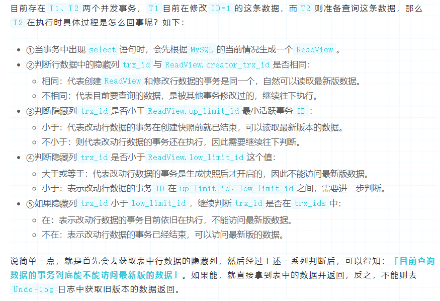

如果`Undo-log`日志中的旧数据存在一个版本链时，此时会首先根据隐藏列`roll_ptr`找到链表头，然后依次遍历整个列表，从而检索到最合适的一条数据并返回。条件如下：

- 旧版本的数据，其隐藏列`trx_id`不能在`ReadView.trx_ids`活跃事务列表中。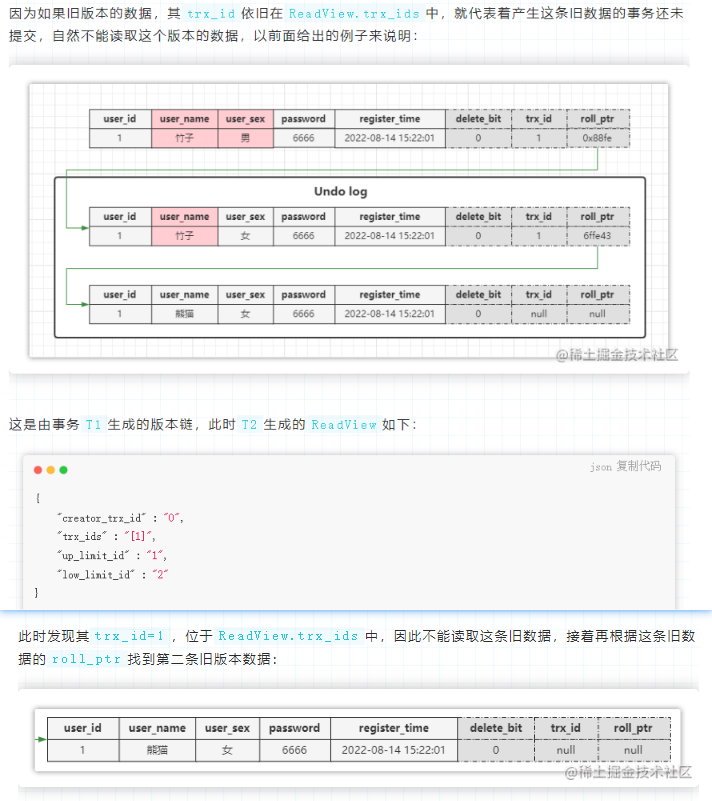
	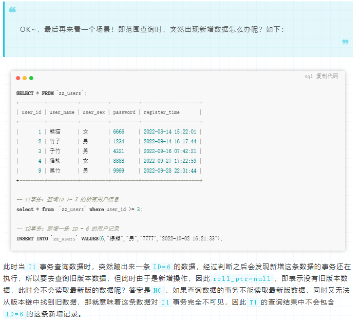

RC、RR不同级别下的MVCC机制
RC提交读，每次select都会创建一个ReadView
RR可重复读，只有第一次select时会创建一个ReadView


###  [(十)全解MySQL之死锁问题分析、事务隔离与锁机制的底层原理剖析](assets\studay\MySQL之死锁问题分析-事务隔离与锁机制的底层原理剖析.pdf) 

Mysql死锁现象：

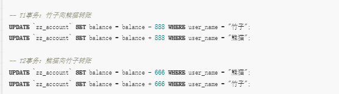


死锁解决：

- 锁超时机制：事务/线程在等待锁时，超出一定时间后自动放弃等待并返回(50S)。
	**show** variables **like** 'innodb_lock_wait_timeout'; 

- 外力介入打破僵局：第三者介入，将死锁情况中的某个事务/线程强制结束，让其他事务继续执行。
	死锁检测算法 - wait-for graph：算法被启用后，会要求`MySQL`收集两个信息：

	- 锁的信息链表：目前持有每个锁的事务是谁。

	- 事务等待链表：阻塞的事务要等待的锁是谁。
		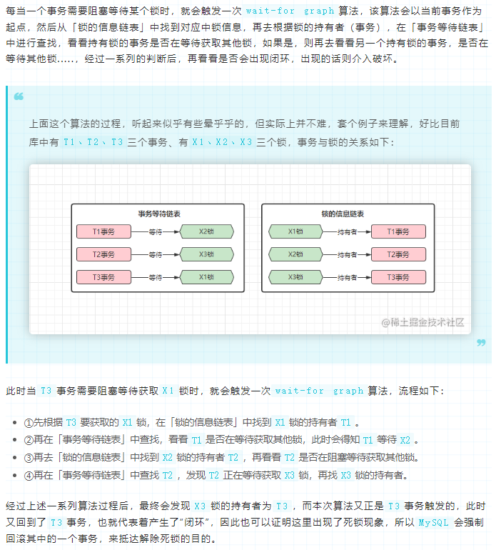

		出现死锁问题时，`MySQL`会选择哪个事务回滚呢？之前分析过，当一个事务在执行`SQL`更改数据时，都会记录在`Undo-log`日志中，`Undo`量越小的事务，代表它对数据的更改越少，同时回滚的代价最低，因此会选择`Undo`量最小的事务回滚（如若两个事务的`Undo`量相同，会选择回滚触发死锁的事务）。

		死锁检测机制在`MySQL`后续的高版本中是默认开启的，但实际上死锁检测的开销不小，上面三个并发事务阻塞时，会对「事务等待链表、锁的信息链表」共计检索六次，那当阻塞的并发事务越来越多时，检测的效率也会呈线性增长。

避免死锁产生：

* 把大事务变成小事务
* 减小锁的粒度
* 把较大、耗时较长的事务尽量防止特定时间执行

锁机制的实现原理：

锁对象：结构信息
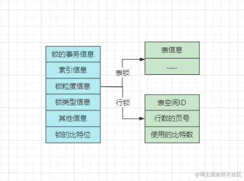

* 锁的事务信息：当先的锁对象是由那个事务生成的，记录的是指针，指向一个具体的事务
* 索引的信息：行锁特有的信息。记录行锁的行数据属于那个索引、那个节点。
* 锁粒度信息：表锁，记录的是表的信息。行锁，记录行数据信息，行信息主要记录一下三个：
	* Space ID：枷锁的行数据，所在表空间ID
	* PageNumber：所在页号
	* n_bits：使用的比特位，对于一页数据中，加了多少个锁
* 锁类型信息：
	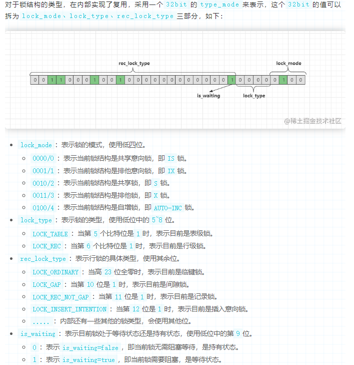
	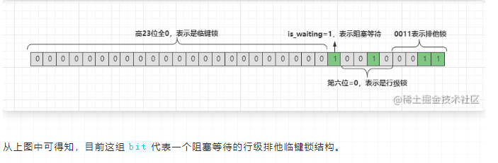
* 其他信息：这个所谓的其他信息，也就是指一些用于辅助锁机制的信息，比如之前死锁检测机制中的「事务等待链表、锁的信息链表」，每一个事务和锁的持有、等待关系，都会在这里存储，将所有的事务、锁连接起来，就形成了上述的两个链表。
* 锁的比特位：也可以说数据的比特位。如果查询出来2条数据，则会形成一个比特数组：0000，之所以是4比特位，是因为行锁中，间隙锁可以锁定无穷大、无穷小这两个间隙，即首位无穷小，末尾无穷大

事务隔离机制底层实现

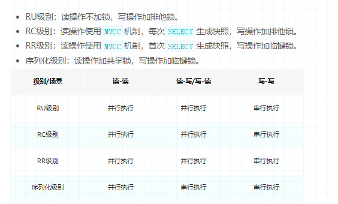

RR级别解决了幻影读

---

###  [(十一)MySQL日志篇之undo-log、redo-log、bin-log ](assets\studay\MySQL日志篇.pdf) 


* undo-log：撤销日志、回滚日志；当需要回滚事务时，直接用`Undo`旧记录覆盖表中修改过的新记录
	`MySQL5.5`之前没有太多参数，如下：

	- `innodb_max_undo_log_size`：本地磁盘文件中，`Undo-log`的最大值，默认`1GB`。
	- `innodb_rollback_segments`：指定回滚段的数量，默认为`1`个。

	除开上述两个参数外，其他参数基本上是在`MySQL5.6`才有的，如下：

	- `innodb_undo_directory`：指定`Undo-log`的存放目录，默认放在`.ibdata`文件中。
	- `innodb_undo_logs`：指定回滚段的数量，默认为`128`个，也就是之前的`innodb_rollback_segments`。
	- `innodb_undo_tablespaces`：指定`Undo-log`分成几个文件来存储，必须开启`innodb_undo_directory`参数。
	- `innodb_undo_log_truncate`：是否开启`Undo-log`的在线压缩功能，即日志文件超过大小一半时自动压缩，默认`OFF`关闭。

	没错，在`MySQL5.5`版本以后，`Undo-log`日志支持单独存放，并且多出了几个参数可以调整`Undo-log`的区域。

* redo-log：重做日志，用来实现数据的恢复。redo-log 和 undo-log 日志都是`InnoDB`引擎独有的。
	当`MySQL`启动后就会在内存中创建一个`BufferPool`，运行过程中会将大量操作汇集在内存中进行，比如写入数据时，先写到内存中，然后由后台线程再刷写到磁盘。
	因为数据写到内存后有丢失风险，这明显违背了事务`ACID`原则中的持久性，所以`Redo-log`的出现就是为了解决该问题，`Redo-log`是一种预写式日志，即在向内存写入数据前，会先写日志，当后续数据未被刷写到磁盘、`MySQL`崩溃时，就可以通过日志来恢复数据，确保所有提交的事务都会被持久化。
	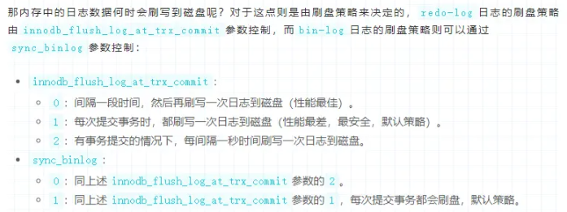
	默认每次提交事务时都会刷盘

	常用参数：

	* `innodb_flush_log_at_trx_commit`：设置`redo_log_buffer`的刷盘策略，默认每次提交事务都刷盘。
	* `innodb_log_group_home_dir`：指定`redo-log`日志文件的保存路径，默认为`./`。
	* `innodb_log_buffer_size`：指定`redo_log_buffer`缓冲区的大小，默认为`16MB`。
	* `innodb_log_files_in_group`：指定`redo`日志的磁盘文件个数，默认为`2`个。
	* `innodb_log_file_size`：指定`redo`日志的每个磁盘文件的大小限制，默认为`48MB`。

* bin-log变更日志：也被称之为二进制日志，主要是记录所有对数据库表结构变更和表数据修改的操作，对于`select、show`这类读操作并不会记录。
	`MySQL-Server`会给每一条工作线程，都分配一个`bin_log_buffer`，而并不是放在共享缓冲区中

	在`bin-log`的本地文件中，存储的日志记录共有`Statment、Row、Mixed`三种格式

	对于`Redo-log、Bin-log`两者的区别，主要可以从四个维度上来说：

	- ①生效范围不同，`Redo-log`是`InnoDB`专享的，`Bin-log`是所有引擎通用的。
	- ②写入方式不同，`Redo-log`是用两个文件循环写，而`Bin-log`是不断创建新文件追加写。
	- ③文件格式不同，`Redo-log`中记录的都是变更后的数据，而`Bin-log`会记录变更`SQL`语句。
	- ④使用场景不同，`Redo-log`主要实现故障情况下的数据恢复（数据一致），`Bin-log`则用于数据灾备、同步。

	bin-log相关的参数

	- `log_bin`：是否开启`bin-log`日志，默认`ON`开启，表示会记录变更`DB`的操作。
	- `log_bin_basename`：设置`bin-log`日志的存储目录和文件名前缀，默认为`./bin.0000x`。
	- `log_bin_index`：设置`bin-log`索引文件的存储位置，因为本地有多个日志文件，需要用索引来确定目前该操作的日志文件。
	- `binlog_format`：指定`bin-log`日志记录的存储方式，可选`Statment、Row、Mixed`。
	- `max_binlog_size`：设置`bin-log`本地单个文件的最大限制，最多只能调整到`1GB`。
	- `binlog_cache_size`：设置为每条线程的工作内存，分配多大的`bin-log`缓冲区。
	- `sync_binlog`：控制`bin-log`日志的刷盘频率。
	- `binlog_do_db`：设置后，只会收集指定库的`bin-log`日志，默认所有库都会记录。

	两阶段提交：是指`Redo-log`分两次写入
	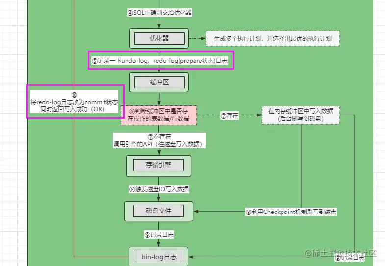
	如果只写一次：

	* 先写bin-log：写完bin-log后，redo-log没有写。主机没有该事务信息，所以不会恢复，
		而从节点同步时是拿bin-log同步的。所以主节点会比从节点少一条数据
	* 先写redo-log：写完redo-log后，bin-log没有写。主机有该事务信息，会恢复，
		而从节点同步时是拿bin-log同步的。所以主节点会比从节点多一条数据

	设置成两阶段提交后，整个执行过程有三处崩溃点：

	- `redo-log(prepare)`：在写入准备状态的`redo`记录时宕机，事务还未提交，不会影响一致性。
	- `bin-log`：在写`bin`记录时崩溃，重启后会根据`redo`记录中的事务`ID`，回滚前面已写入的数据。
	- `redo-log(commit)`：在`bin-log`写入成功后，写`redo(commit)`记录时崩溃，因为`bin-log`中已经写入成功了，所以从机也可以同步数据，因此重启时直接再次提交事务，写入一条`redo(commit)`记录即可。

	通过这种两阶段提交的方案，就能够确保`redo-log、bin-log`两者的日志数据是相同的，`bin-log`中有的主机再恢复，如果`bin-log`没有则直接回滚主机上写入的数据，确保整个数据库系统的数据一致性。

* 其他日志：`

	- `error-log`：`MySQL`线上`MySQL`由于非外在因素（断电、硬件损坏...）导致崩溃时，辅助线上排错的日志。
	- `slow-log`：系统响应缓慢时，用于定位问题`SQL`的日志，其中记录了查询时间较长的`SQL`。
	- `general log`即查询日志。`MySQL`会向其中写入所有收到的查询命令，如`select、show`等，同时要注意：无论`SQL`的语法正确还是错误、也无论`SQL`执行成功还是失败，`MySQL`都会将其记录下来。
	- `relay-log`：搭建`MySQL`高可用热备架构时，用于同步数据的辅助日志。

---

###  [(十二)MySQL之内存篇 - 掘金.pdf](assets\studay\MySQL之内存篇.pdf) 


###  SQL

* DML：数据操作语言，操作数据库的数据，增删改
* DQL：数据查询语言，查询数据库的数据
* DDL：数据定义语言，定义数据库库、表、列等
* DCL：数据控制语言：用了定义访问权限和安全级别

#### 库

##### 建库

> create database d1 DEFAULT CHARACTER SET UTF8;


##### 删库

>  drop database d1;


##### 查库

> show databases;

##### 使用数据库

> user d1;


#### 表

##### 创建表

> create table t_door(
>
> id int primary key  auto_increment,
>
> door_name varchar(100),
>
> ]tel varchar(50)
>
> )

##### 修改表

> alter table t_door add column price NUMERIC(7,2);

##### 删除表

> drop table t_door;

##### 查看表

> show tables;
>
> desc t_door;   //查看表结构


#### 数据

##### 插入数据

> insert into t_door values(null,"1",66.50);

##### 查询记录

> select * from t_door;

##### 修改记录

>  update t_door set tel = 222 where id = 1;

##### 删除记录

> delete from t_door where id = 2;

##### 排序

> select *from t_door order by id DESC/ASC;

##### 聚合

> select count(*)totalCount from  t_door;


#### SQL优化

> 索引：
> 
>
> 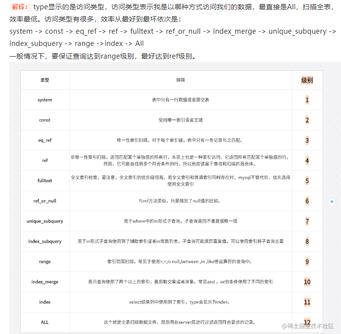
>
> * 最左匹配原则：最左优先，以最左边的为起点任何连续的索引都能匹配上。同时遇到范围查询(>、<、between、like)就会停止匹配。
> * 
>
> 

### 数据类型

#### 字符

> char：定长字符串（最大255）；不足使用空格填充。查询速度快单浪费空间
>
> varchar：边长字符串（最大16383）：查询稍慢但不占用空间
>
> text：长文本(Mysql：v8  65535byte)
>
> blob：二进制形式的长文本(Mysql：v8  65535byte)
>
> 

#### 数字

> tinyint,int整数类型
>
> float,double小数类型
>
> numberic(5,2) decimal(5,2)—也可以表示小数,表示总共5位,其中可以有两位小数
>
> decimal和numeric表示精确的整数数字

#### 日期

> date 包含年月日
>
> time时分秒
>
> datetime包含年月日和时分秒
>
> timestamp时间戳，不是日期，而是从1970年1月1日到指定日期的毫秒数

#### 图片

>  blob 二进制数据，可以存放图片、声音，容量4g。早期有这样的设计。但其缺点非常明显，数据库庞大，备份缓慢，这些内容去备份多份价值不大。同时数据库迁移时过大，迁移时间过久。所以目前主流都不会直接存储这样的数据，而只存储其访问路径，文件则存放在磁盘上。

---

### 字段约束

> 查询约束：
>
> SELECT *FROM information_schema.TABLE_CONSTRAINTS

#### 主键

> 主键约束：如果为一个列添加了主键约束，那么这个列就是主键，主键的特点是唯一且不能为空。通常情况下，每张表都会有主键。
>
> create  table d1 (
>
> id int primary key auto_increment
>
> );

#### 非空约束

> 非空约束：如果为一个列添加了非空约束，那么这个列的值就不能为空，但可以重复。
>
> password varchar(50) not null

#### 唯一约束

> 唯一约束：如果为一个列添加了唯一约束，那么这个列的值就必须是唯一的（即不能重复），但可以为空。
>
> username varchar(50) unique

#### 默认约束

> 给某个字段某列指定默认值，一旦设置默认值，在插入数据时，如果此字段没有显式赋值，则赋值为默认值
>
> sex char(1) default '0'


### 函数

#### 字符串函数

##### lower()

##### upper()

##### length()

##### substr()

##### concat()

replace()

##### ifnull()

##### round() & ceil() & floor()

##### uuid()

##### year() & month() & day()

##### ascii()

##### conv()

##### bin()

##### oct()

##### hex()

##### length()

##### locate()

##### position()

##### ldap()

##### rdap()

##### left()

##### right()

##### substring()

##### substring_index()

##### ltrim()

##### rtrim()

##### trim()

##### space()

##### replace()

##### repeat()

##### reverse()

##### insert()

##### elt()

##### field()

##### find_in_set()

##### make_set()

##### export_set()

##### lower()

##### upper()

##### load_file()

#### 数学函数

##### abs()

##### sign()

##### mod()

##### floor()

##### feiling()

##### round()

##### exp()

##### log()

##### log10()

##### power()

##### sqrt()

##### pi()

##### cos()

##### sin()

##### tan()

##### acos()

##### asin()

##### atan()

##### atan2()

##### cot()

##### rand()

##### degrees()

##### radians()

##### truncate()

##### least()

##### greatest()

---

#### 日期时间函数

##### dayofweek()

##### weekday()

##### dayofmonth()

##### dayofyear()

##### month()

##### dayname()

##### monthname()

##### quarter()

##### week()

##### year()

##### hour()

##### minute()

##### second()

##### period_add()

##### period_diff()

##### adddate()

##### subdate()

##### extract()

##### to_days()

##### from_days()

##### date_format()

##### time_format()

##### curdate()

##### curtime()

##### now()

##### unix_timestamp()

##### from_unixtime()

##### sec_to_time()

> select sec_to_time(2378);   
>
> 以'hh:mm:ss'或hhmmss格式返回秒数转成的time值(根据返回值所处上下文是字符串或数字) 
>
>  '00:39:38'   
>
> select sec_to_time(2378) + 0;  
>
> 3938 

##### time_to_sex()

> select time_to_sec('22:23:00'); 
>
> 返回time值有多少秒   
>
> 80580 
>
> 

---

#### 转换函数

##### cast()

> 用法：cast(字段 as 数据类型) [当然是否可以成功转换，还要看数据类型强制转化时注意的问题]

##### convert()

> 用法：convert(字段,数据类型)
>
> - binary：二进制类型；
> - char：字符类型；
> - date：日期类型；
> - time：时间类型；
> - datetime：日期时间类型；
> - decimal：浮点型；
> - signed：整型；
> - unsigned：无符号整型。


# Server

---

## docker

> Docker是一个用于开发，交付和运行应用程序的开放平台。Docker使您能够将应用程序和基础框架分开，从而可以快速交付软件。借助Docker，您可以与管理应用程序相同的方式管理基础架构。通过利用Docker的方法快速交付，测试和部署代码，您可以大大减少编写代码和在生产环境中运行代码之间的延迟。
>
> 容器非常适合持续集成和持续交付（CI / CD）工作流程
>
> Docker应用场景
>
> * web应用的自动化打包和发布
> * 自动化测试和持续集成、发布
> * 在服务型环境中部署和调整数据库和其他的后台应用
> * 从头编译或者扩展现有的OpenShift或Cloud Foundry

#### 架构

* 镜像（Image）：相当于是一个root文件系统。比如官方镜像Ubuntu：16.04就包含了完整的一套ubuntu16.01最小的文件系统。
* 容器（Container）：镜像和容器的关系，就像是面向对象程序设计中的类和实例一样，镜像是静态的定义，容器是镜像运行的实体。容器可以被创建、启动、停止、删除、暂停等
* 仓库（Repository）：仓库可以看成代码控制中心，用来存储镜像


#### 安装

> CentOS：
>
> **存储库安装**
>
> * 卸载旧版本
>
> 	```tcl
> 	sudo yum remove docker \
> 	                  docker-client \
> 	                  docker-client-latest \
> 	                  docker-common \
> 	                  docker-latest \
> 	                  docker-latest-logrotate \
> 	                  docker-logrotate \
> 	                  docker-engine
> 	```
>
> 	卸载Docker引擎
>
> 	```tcl
> 	卸载 Docker Engine、CLI、Containerd 和 Docker Compose 软件包：
> 	sudo yum remove docker-ce docker-ce-cli containerd.io docker-compose-plugin
> 	
> 	删除所有映像、容器和卷：
> 	sudo rm -rf /var/lib/docker
> 	sudo rm -rf /var/lib/containerd
> 	```
>
> 	
>
> * 设置Docker存储库
>
> 	```tcl
> 	sudo yum install -y yum-utils
> 	
> 	官方源地址
> 	sudo yum-config-manager \
> 	    --add-repo \
> 	    https://download.docker.com/linux/centos/docker-ce.repo
> 	
> 	阿里云
> 	sudo yum-config-manager \
> 	    --add-repo \
> 	    http://mirrors.aliyun.com/docker-ce/linux/centos/docker-ce.repo
> 	
> 	清华大学源
> 	sudo yum-config-manager \
> 	    --add-repo \
> 	   https://mirrors.tuna.tsinghua.edu.cn/docker-ce/linux/centos/docker-ce.repo
> 	```
>
> * 安装Docker引擎(Docker Engine-Community)
>
> 	默认安装最新版本
>
> 	```tel
> 	### 查看可用版本
> 	yum list docker-ce --showduplicates | sort -r
> 	
> 	3:20.10.8-3.el7
> 	VERSION = 20.10.8
> 	```
>
> 	安装
>
> 	```tel
> 	sudo yum install docker-ce docker-ce-cli containerd.io docker-compose-plugin
> 	
> 	指定版本
> 	sudo yum install docker-ce-VERSION docker-ce-cli-VERSION containerd.io
> 	
> 	
> 	```
>
> 
>
> **包安装**
>
> [前往](https://download.docker.com/linux/centos/)并选择您的 CentOS 版本。然后浏览`x86_64/stable/Packages/` 并下载`.rpm`要安装的 Docker 版本的文件。
>
> 安装
>
>  sudo yum install /path/to/package.rpm
>
> **脚本安装**
>
> [[Docker 在https://get.docker.com/](https://get.docker.com/)提供了一个方便的脚本， 以非交互方式将 Docker 安装到开发环境中。不建议将便利脚本用于生产环境，但它对于创建适合您的需求的配置脚本很有用。另请参阅 [使用存储库](https://docs.docker.com/engine/install/centos/#install-using-the-repository)安装步骤以了解使用包存储库安装的安装步骤。该脚本的源代码是开源的，可以 [`docker-install`在 GitHub 上的存储库中找到](https://github.com/docker/docker-install)。
>
> ```
> curl -fsSL https://get.docker.com -o get-docker.sh
> $ sudo sh get-docker.sh
> ```


#### 命令

> 启动：systemctl start docker
>
> 运行HelloWorld：sudo docker run hello-world

#### 容器使用

> 拉取ubuntu镜像：docker pull ubuntu
>
> 启动容器并进入容器：docker  run  -it --name  ubuntu /bin/bash
>
> - **-i**: 交互式操作。
> - **-t**: 终端。
> - **ubuntu**: ubuntu 镜像。
> - **/bin/bash**：放在镜像名后的是命令，这里我们希望有个交互式 Shell，因此用的是 /bin/bash。
> - 容器名称
>
> 退出容器：exit 退出容器并停止容器   
>
> 退出容器：docker exec -it 243c32535da7 /bin/bash  
>   Ctrl + Q + P
>
> 查看所有容器：docker ps -a
>
> 启动一个已经停止的容器：docker start b750bbbcfd88 
>
> 后台运行：docker run -itd --name ubuntu-test ubuntu /bin/bash
>
> 停止容器：docker stop b750bbbcfd88 
>
> 重启容器：docker restart b750bbbcfd88 
>
> 进入容器：docker attach b750bbbcfd88 
>
> 导出容器：docker export 1e560fca3906 > ubuntu.tar
>
> 导入容器：cat ubuntu.tar | docker import  - newubuntu:v2
>
> 删除容器：docker rm -f  b750bbbcfd88 
>
> 删除所有已经停止的容器：docker container prune
>
> 

#### 运行一个web应用

> 拉取镜像：docker pull training/webapp
>
> 启动容器：docker run -d -P training/webapp python app.py
>
> - **-d:**让容器在后台运行。
> - **-P:**将容器内部使用的网络端口**随机**映射到我们使用的主机上。
> - 0.0.0.0:32769->5000/tcp   32769主机端口  5000容器端口
>
>
> 指定主机端口：docker run -d -p 80:5000 training/webapp python app.py
>
> 查看日志：docker logs -f  awesome_nobel
>
> 查看容器进程：docker top awesome_nobel
>
> 查看容器详细信息：docker inspect  awesome_nobel
>
> 查看最后一次创建的容器：docker ps -l

#### 镜像使用

> 查询镜像：docker images
>
> [查找镜像](https://hub.docker.com/)：docker search httpd
>
> 拉取镜像：docker pull httpd
>
> 删除镜像：docker rmi hello-world
>
> 打包容器：docker commit -m="has update" -a="runoob" e218edb10161 runoob/ubuntu:v2
>
> - **-m:** 提交的描述信息
> - **-a:** 指定镜像作者
> - **e218edb10161：**容器 ID
> - **runoob/ubuntu:v2:** 指定要创建的目标镜像名
>
> 构建镜像：docker build -t runoob/centos:6.7 .
>
> * **-t** ：指定要创建的目标镜像名
> * **.** ：Dockerfile 文件所在目录，可以指定Dockerfile 的绝对路径
>
> 添加镜像标签：docker tag 860c279d2fec runoob/centos:dev
>
> 删除镜像（标签）：docker -rmi  runoob/centos:dev

#### 容器连接

> 容器中可以运行一些网络应用，要让外部也可以访问这些应用，可以通过 -P 或 -p 参数来指定端口映射。
>
> - **-P :**是容器内部端口**随机**映射到主机的端口。
> - **-p :** 是容器内部端口绑定到**指定**的主机端口。
>
> 新建网络：docker network create -d bridge test-net
>
> **-d**：参数指定 Docker 网络类型，有 bridge、overlay。
>
> 其中 overlay 网络类型用于 Swarm mode，在本小节中你可以忽略它。

#### 配置 DNS

> 我们可以在宿主机的 /etc/docker/daemon.json 文件中增加以下内容来设置全部容器的 DNS：
>
> ```json
> {
>   "dns" : [
>     "114.114.114.114",
>     "8.8.8.8"
>   ]
> }
> 
> ```
>
> 配置完，需要重启 docker 才能生效。
>
> 查看容器的 DNS 是否生效可以使用以下命令，它会输出容器的 DNS 信息：docker run -it --rm  ubuntu  cat etc/resolv.conf
>
> 指定的容器设置 DNS：docker run -it --rm -h host_ubuntu  --dns=114.114.114.114 --dns-search=test.com ubuntu
>
> * **--rm**：容器退出时自动清理容器内部的文件系统。
>
> * **-h HOSTNAME 或者 --hostname=HOSTNAME**： 设定容器的主机名，它会被写到容器内的 /etc/hostname 和 /etc/hosts。
>
> * **--dns=IP_ADDRESS**： 添加 DNS 服务器到容器的 /etc/resolv.conf 中，让容器用这个服务器来解析所有不在 /etc/hosts 中的主机名。
>
> * **--dns-search=DOMAIN**： 设定容器的搜索域，当设定搜索域为 .example.com 时，在搜索一个名为 host 的主机时，DNS 不仅搜索 host，还会搜索 host.example.com。

#### 仓库管理

> 仓库（Repository）是集中存放镜像的地方。以下介绍一下 [Docker Hub](https://hub.docker.com/)。当然不止 docker hub，只是远程的服务商不一样，操作都是一样的。
>
> 登录：docker login 
>
> 退出：docker logout
>
> 查找官方（公共）镜像：docker search ubuntu
>
> 拉取：docker pull ubuntu
>
> dckr_pat_L2aHULFHJiy4LbGh-47iJV1XA2k
>
> 推送镜像：
>
> 1. 修改镜像标签：docker tag ubuntu:v1  账号/ubuntuv1
> 2. 推送：docker push  账号/ubuntuv1
>

#### Dockerfile

> Dockerfile 是一个用来构建镜像的文本文件
>
> ```tcl
> FROM nginx
> RUN echo '这是一个本地构建的nginx镜像' > /usr/share/nginx/html/index.html
> ```
>
> * FROM：定制的镜像都是基于 FROM 的镜像，这里的 nginx 就是定制需要的基础镜像。后续的操作都是基于 nginx。
>
> * RUN：用于执行后面跟着的命令行命令。有以下俩种格式：
>
> ```tel
> RUN <命令行命令>
> # <命令行命令> 等同于，在终端操作的 shell 命令。
> 
> RUN ["可执行文件", "参数1", "参数2"]
> # 例如：
> # RUN ["./test.php", "dev", "offline"] 等价于 RUN ./test.php dev offline
> ```
>
> **注意**：Dockerfile 的指令每执行一次都会在 docker 上新建一层。所以过多无意义的层，会造成镜像膨胀过大。例如：
>
> ```tel
> FROM centos
> RUN yum -y install wget
> RUN wget -O redis.tar.gz "http://download.redis.io/releases/redis-5.0.3.tar.gz"
> RUN tar -xvf redis.tar.gz
> 以上执行会创建 3 层镜像。可简化为以下格式：
> FROM centos
> RUN yum -y install wget \
> && wget -O redis.tar.gz "http://download.redis.io/releases/redis-5.0.3.tar.gz" \
> && tar -xvf redis.tar.gz
> 如上，以 && 符号连接命令，这样执行后，只会创建 1 层镜像。
> ```
>
> * 上下文路径：. 是上下文路径；指 docker 在构建镜像，有时候想要使用到本机的文件（比如复制），docker build 命令得知这个路径后，会将路径下的所有内容打包。
> 	**注意**：上下文路径下不要放无用的文件，因为会一起打包发送给 docker 引擎，如果文件过多会造成过程缓慢。
>
> * COPY：复制指令，从上下文目录中复制文件或者目录到容器里指定路径。
>
> 	```tel
> 	支持通配符
> 	COPY hom* /mydir/
> 	COPY hom?.txt /mydir/
> 	```
>
> * ADD：ADD 指令和 COPY 的使用格类似（同样需求下，官方推荐使用 COPY）。功能也类似，不同之处如下：
>
> 	- ADD 的优点：在执行 <源文件> 为 tar 压缩文件的话，压缩格式为 gzip, bzip2 以及 xz 的情况下，会自动复制并解压到 <目标路径>。
> 	- ADD 的缺点：在不解压的前提下，无法复制 tar 压缩文件。会令镜像构建缓存失效，从而可能会令镜像构建变得比较缓慢。具体是否使用，可以根据是否需要自动解压来决定。
>
> * CMD：类似于 RUN 指令，用于运行程序，但二者运行的时间点不同:
>
> 	- RUN 是在 docker build。
> 	- CMD 在docker run 时运行。
>
> 	**注意**：如果 Dockerfile 中如果存在多个 CMD 指令，仅最后一个生效。
>
> 	格式：
>
> 	```tel
> 	CMD <shell 命令> 
> 	CMD ["<可执行文件或命令>","<param1>","<param2>",...] 
> 	CMD ["<param1>","<param2>",...]  # 该写法是为 ENTRYPOINT 指令指定的程序提供默认参数
> 	
> 	推荐使用第二种格式，执行过程比较明确。第一种格式实际上在运行的过程中也会自动转换成第二种格式运行，并且默认可执行文件是 sh。
> 	```
>
> * ENTRYPOINT：类似于 CMD 指令，但其不会被 docker run 的命令行参数指定的指令所覆盖，而且这些命令行参数会被当作参数送给 ENTRYPOINT 指令指定的程序。
>
> 	```tel
> 	优点：在执行 docker run 的时候可以指定 ENTRYPOINT 运行所需的参数。
> 	注意：如果 Dockerfile 中如果存在多个 ENTRYPOINT 指令，仅最后一个生效。
> 	格式
> 	ENTRYPOINT ["<executeable>","<param1>","<param2>",...]
> 	可以搭配 CMD 命令使用：一般是变参才会使用 CMD ，这里的 CMD 等于是在给 ENTRYPOINT 传参，以下示例会提到。
> 	```
>
> 	示例：
>
> 	```tel
> 	假设已通过 Dockerfile 构建了 nginx:test 镜像：
> 	FROM nginx
> 	ENTRYPOINT ["nginx", "-c"] # 定参
> 	CMD ["/etc/nginx/nginx.conf"] # 变参 
> 	
> 	1、不传参运行
> 	$ docker run  nginx:test
> 	容器内会默认运行以下命令，启动主进程。
> 	nginx -c /etc/nginx/nginx.conf
> 	
> 	2、传参运行
> 	$ docker run  nginx:test -c /etc/nginx/new.conf
> 	容器内会默认运行以下命令，启动主进程(/etc/nginx/new.conf:假设容器内已有此文件)
> 	nginx -c /etc/nginx/new.conf
> 	```
>
> * ENV：设置环境变量，定义了环境变量，那么在后续的指令中，就可以使用这个环境变量。
>
> 	```tel
> 	格式：
> 	ENV <key> <value>
> 	ENV <key1>=<value1> <key2>=<value2>...
> 	
> 	ENV NODE_VERSION 7.2.0
> 	RUN curl -SLO "https://nodejs.org/dist/v$NODE_VERSION/node-v$NODE_VERSION-linux-x64.tar.xz" \
> 	&& curl -SLO "https://nodejs.org/dist/v$NODE_VERSION/SHASUMS256.txt.asc"
> 	
> 	
> 	${variable:-word}表示如果variable设置，则结果将是该值。如果variable未设置然后word将是结果。
> 	${variable:+word}表示如果variable然后设置word将是结果，否则结果为空字符串。
> 	```
>
> * ARG：构建参数，与 ENV 作用一致。不过作用域不一样。ARG 设置的环境变量仅对 Dockerfile 内有效，也就是说只有 docker build 的过程中有效，构建好的镜像内不存在此环境变量。
>
> 	构建命令 docker build 中可以用 --build-arg <参数名>=<值> 来覆盖。
>
> * VOLUME：定义匿名数据卷。在启动容器时忘记挂载数据卷，会自动挂载到匿名卷。
>
> 	- 避免重要的数据，因容器重启而丢失，这是非常致命的。
>
> 	- 避免容器不断变大。
>
> 		```tel
> 		格式
> 		VOLUME ["<路径1>", "<路径2>"...]
> 		VOLUME <路径>
> 		
> 		在启动容器 docker run 的时候，我们可以通过 -v 参数修改挂载点。
> 		```
>
> * EXPORT：仅仅只是声明端口。
>
> * WORKDIR：指定工作目录。用 WORKDIR 指定的工作目录，会在构建镜像的每一层中都存在。（WORKDIR 指定的工作目录，必须是提前创建好的）。
>
> 	docker build 构建镜像过程中的，每一个 RUN 命令都是新建的一层。只有通过 WORKDIR 创建的目录才会一直存在。
>
> * USER：用于指定执行后续命令的用户和用户组，这边只是切换后续命令执行的用户（用户和用户组必须提前已经存在）。
>
> * HEALTHCHECK：用于指定某个程序或者指令来监控 docker 容器服务的运行状态。
>
> 	```tel
> 	HEALTHCHECK [选项] CMD <命令>：设置检查容器健康状况的命令
> 	HEALTHCHECK NONE：如果基础镜像有健康检查指令，使用这行可以屏蔽掉其健康检查指令
> 	HEALTHCHECK [选项] CMD <命令> : 这边 CMD 后面跟随的命令使用，可以参考 CMD 的用法。
> 	```
>
> * ONBUILD：用于延迟构建命令的执行。简单的说，就是 Dockerfile 里用 ONBUILD 指定的命令，在本次构建镜像的过程中不会执行（假设镜像为 test-build）。当有新的 Dockerfile 使用了之前构建的镜像 FROM test-build ，这时执行新镜像的 Dockerfile 构建时候，会执行 test-build 的 Dockerfile 里的 ONBUILD 指定的命令。
>
> * LABLE：LABEL 指令用来给镜像添加一些元数据（metadata），以键值对的形式
>
>   ```tel
>   格式：LABEL <key>=<value> <key>=<value> <key>=<value> ...
>   比如我们可以添加镜像的作者：
>   LABEL org.opencontainers.image.authors="runoob"
>   ```
>
>   DOCKER COMPOSE：Compose 是用于定义和运行多容器 Docker 应用程序的工具。通过 Compose，您可以使用 YML 文件来配置应用程序需要的所有服务。然后，使用一个命令，就可以从 YML 文件配置中创建并启动所有服务。
>
>   
>
>   
>
> 


#### ideaDocker

> vim  /usr/lib/systemd/system/docker.service
>
> 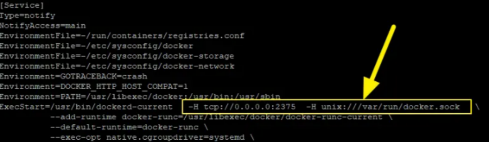
>
> -H tcp://0.0.0.0:2375  -H unix:///var/run/docker.sock
>
> 配置完成后，保存退出，然后重启 Docker：
>
> systemctl daemon-reload    
>
> service docker restart 


## nginx

> `Nginx`是一个高性能的`http`和反向代理服务器，其特点是占用内存小，并发能力强。`Nginx`专为性能优化而开发，性能是其最重要的考量，能经受高负载的考验，有报告表明能支持高达50000个并发连接数。
>
> 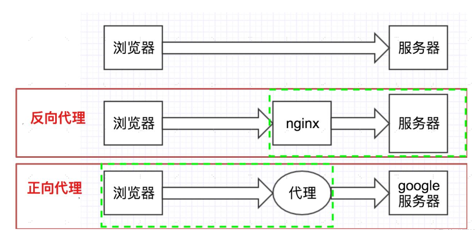
>
> * 正向代理：在浏览器中配置代理服务器，通过代理服务器进行互联网访问。
> * 反向代理：将请求发送到反向代理服务器，由反向代理服务器去选择目标服务器获取数据后，再返回给客户端，此时反向代理服务器和目标服务器对外就是一个服务器，暴漏的是代理服务器地址。
>
> * 负载均衡：如果请求数过大，单个服务器解决不了，我们增加服务器的数量，然后将请求分发到各个服务器上，将原先请求集中到单个服务器的情况改为请求分发到多个服务器上，就是负载均衡。
>
> * 为了加快服务器的解析速度，可以把动态页面和静态页面交给不同的服务器来解析，加快解析速度，降低原来单个服务器的压力。
>
> * 安装：
>
> 	```tel
> 	安装pcre依赖
> 	wget http://downloads.sourceforge.net/project/pcre/pcre/8.37/pcre-8.37.tar.gz
> 	tar -xvf  pcre-8.37.tar.gz
> 	
> 	进入解压后的名录，执行以下命令
> 	./configure
> 	make && make install
> 	查看安装的pcre版本号
> 	pcre-config --version
> 	
> 	安装openssl，zlib等依赖
> 	yum -y install make zlib zlib-devel gcc-c++ libtool openssl openssl-devel
> 	
> 	
> 	
> 	
> 	nginx官网下载nginx，官网地址：https://nginx.org/download/
> 	将压缩包拖到服务器上;
> 	使用命令 tar -xvf nginx-1.12.2.tar.gz 解压压缩包;
> 	使用命令 ./configure 检查；
> 	使用命令 make && make isntall 编译安装；
> 	
> 	安装openssl，zlib等依赖
> 	yum -y install make zlib zlib-devel gcc-c++ libtool openssl openssl-devel
> 	```
>
> 	```tel
> 	nginx path prefix: /usr/local/nginx
> 	nginx binary file: /usr/local/nginx/sbin/nginx
> 	nginx configuration prefix: /usr/local/nginx/conf
> 	nginx configuration file: /usr/local/nginx/conf/nginx.conf
> 	nginx pid file: /usr/local/nginx/logs/nginx.pid
> 	nginx error log file: /usr/local/nginx/logs/error.log
> 	nginx http access log file: /usr/local/nginx/logs/access.log
> 	
> 	```
>
> 	```xml
> 	#user  nobody;
> 	worker_processes  1;
> 	
> 	#error_log  logs/error.log;
> 	#error_log  logs/error.log  notice;
> 	#error_log  logs/error.log  info;
> 	
> 	#pid        logs/nginx.pid;
> 	
> 	events {
> 	    worker_connections  1024;
> 	}
> 	
> 	http {
> 	    include       mime.types;
> 	    default_type  application/octet-stream;
> 	
> 	    #log_format  main  '$remote_addr - $remote_user [$time_local] "$request" '
> 	    #                  '$status $body_bytes_sent "$http_referer" '
> 	    #                  '"$http_user_agent" "$http_x_forwarded_for"';
> 	
> 	    #access_log  logs/access.log  main;
> 	
> 	    sendfile        on;
> 	    #tcp_nopush     on;
> 	
> 	    #keepalive_timeout  0;
> 	    keepalive_timeout  65;
> 	
> 	    #gzip  on;
> 	
> 	    server {
> 	        listen       80;
> 	        server_name  localhost;
> 	
> 	        #charset koi8-r;
> 	
> 	        #access_log  logs/host.access.log  main;
> 	
> 	        location / {
> 	            root   html;
> 	            index  index.html index.htm;
> 	        }
> 	
> 	        #error_page  404              /404.html;
> 	
> 	        # redirect server error pages to the static page /50x.html
> 	        #
> 	        error_page   500 502 503 504  /50x.html;
> 	        location = /50x.html {
> 	            root   html;
> 	        }
> 	
> 	        # proxy the PHP scripts to Apache listening on 127.0.0.1:80
> 	        #
> 	        #location ~ \.php$ {
> 	        #    proxy_pass   http://127.0.0.1;
> 	        #}
> 	
> 	        # pass the PHP scripts to FastCGI server listening on 127.0.0.1:9000
> 	        #
> 	        #location ~ \.php$ {
> 	        #    root           html;
> 	        #    fastcgi_pass   127.0.0.1:9000;
> 	        #    fastcgi_index  index.php;
> 	        #    fastcgi_param  SCRIPT_FILENAME  /scripts$fastcgi_script_name;
> 	        #    include        fastcgi_params;
> 	        #}
> 	
> 	        # deny access to .htaccess files, if Apache's document root
> 	        # concurs with nginx's one
> 	        #
> 	        #location ~ /\.ht {
> 	        #    deny  all;
> 	        #}
> 	    }
> 	
> 	    # another virtual host using mix of IP-, name-, and port-based configuration
> 	    #
> 	    #server {
> 	    #    listen       8000;
> 	    #    listen       somename:8080;
> 	    #    server_name  somename  alias  another.alias;
> 	
> 	    #    location / {
> 	    #        root   html;
> 	    #        index  index.html index.htm;
> 	    #    }
> 	    #}
> 	
> 	    # HTTPS server
> 	    #
> 	    #server {
> 	    #    listen       443 ssl;
> 	    #    server_name  localhost;
> 	
> 	    #    ssl_certificate      cert.pem;
> 	    #    ssl_certificate_key  cert.key;
> 	
> 	    #    ssl_session_cache    shared:SSL:1m;
> 	    #    ssl_session_timeout  5m;
> 	
> 	    #    ssl_ciphers  HIGH:!aNULL:!MD5;
> 	    #    ssl_prefer_server_ciphers  on;
> 	
> 	    #    location / {
> 	    #        root   html;
> 	    #        index  index.html index.htm;
> 	    #    }
> 	    #}
> 	}
> 	
> 	```
>
> 	