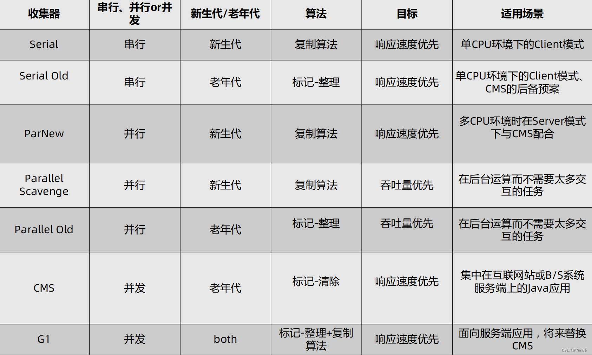
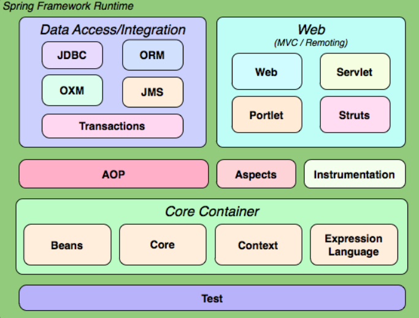
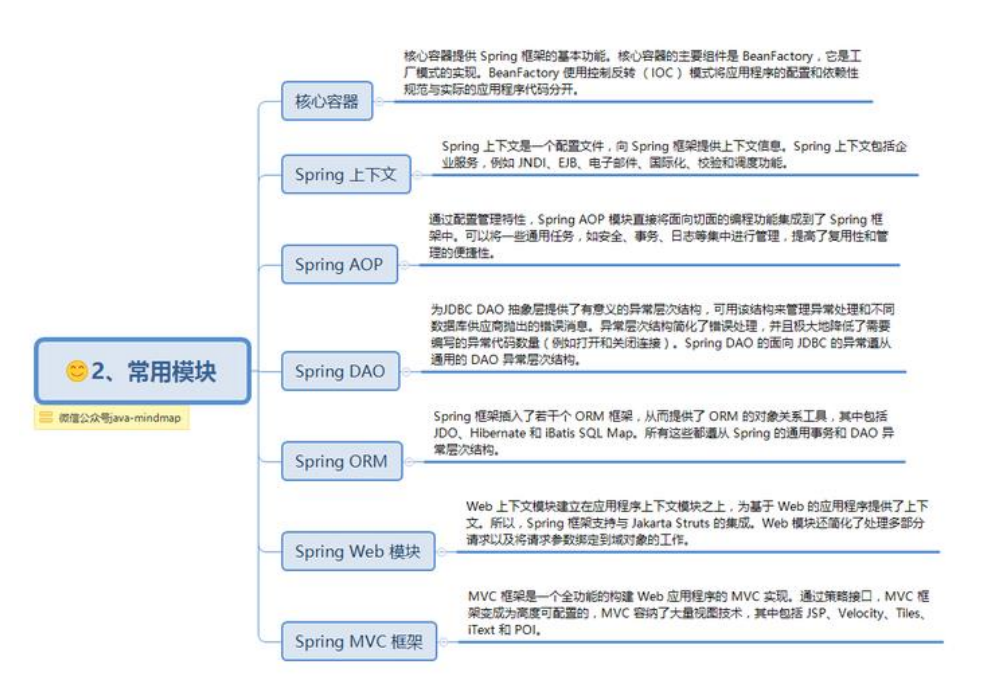
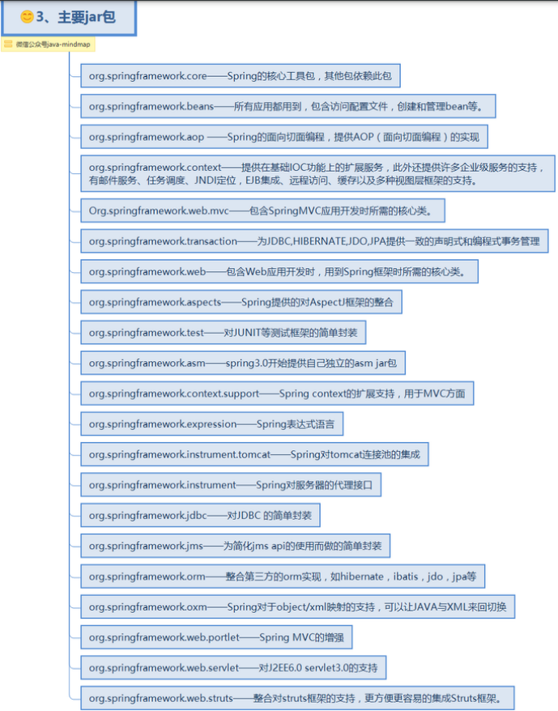
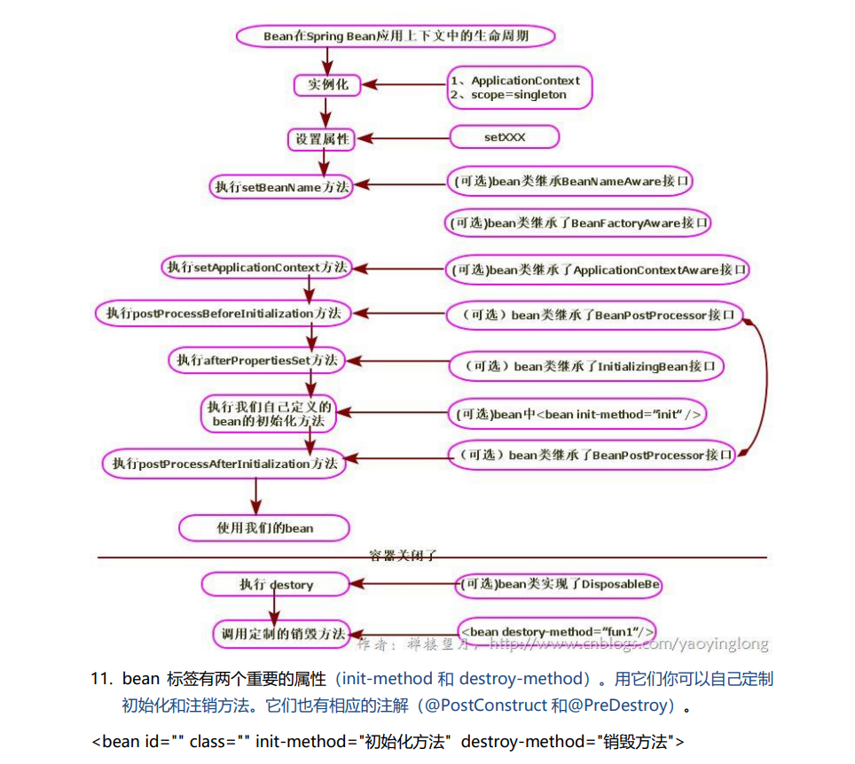
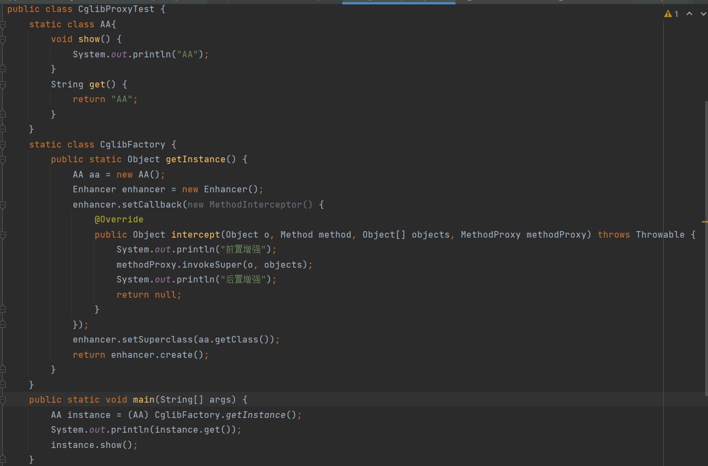
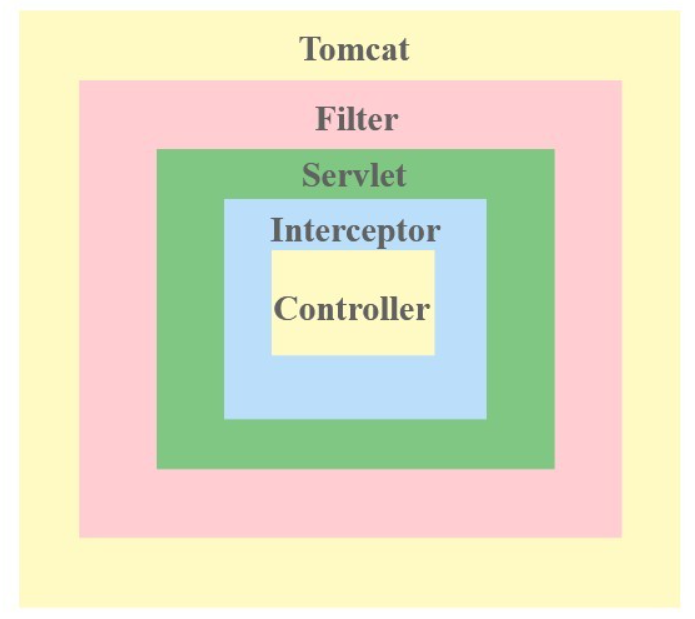

# 回顾

## JVM算法

引用计数法：如果一个对象的被引用次数为0，则说明这个对象可能不再会被用到，那么这个对象就是可回收的对象
存在循环引用问题

可达性分析：为了解决循环引用，以一系列的GCroot对象作为起点搜索，如果GC roots 和一个对象之间没有可达路径，这称该对象不可达，在经过两侧标记过程后，将面临回收

在Java语言中，可作为GC Roots的对象包含以下几种：

  * 虚拟机栈(栈帧中的本地变量表)中引用的对象。(可以理解为:引用栈帧中的本地变量表的所有对象)

  * 方法区中静态属性引用的对象(可以理解为:引用方法区该静态属性的所有对象)

  * 方法区中常量引用的对象(可以理解为:引用方法区中常量的所有对象)

  * 本地方法栈中(Native方法)引用的对象(可以理解为:引用Native方法的所有对象)

标记清除法：最基础的回收算法。分为两阶段，标记和清除。标记所有需要清除的对象，清除回收被标记的对象所占用的空间
存在内存碎片化问题，后续大对象找不到可利用的空间

复制算法：为了解决碎片化。将内存等分，每次只是用其中一个，当这块内存满后将存活对象复制到另外一块上去，其余的清除。这种算法实现简单，内存效率高，不易产生碎片
但是内存被压缩到了一半，且存活对象多的话，Copying算法的效率大大降低。

标记整理算法：结合以上两个算法而提出。标记后不是清理对象而是将存活的对象压缩到内存的一端，顺序排放，然后清除边界外的所有空间


分代收集算法：分代收集法是目前大部分 JVM 所采用的方法，根据对象存活的不同生命周期将内存
划分为不同的域，一般情况下将 GC 堆划分为老生代(Tenured/Old Generation)和新生代(Young
Generation)。老生代的特点是每次垃圾回收时只有少量对象需要被回收，新生代的特点是每次垃
圾回收时都有大量垃圾需要被回收，因此可以根据不同区域选择不同的算法

### GC 分代收集算法 VS 分区收集算法
当前主流 JVM 垃圾收集都采用”分代收集”(Generational Collection)算法, 这种算法会根据
对象存活周期的不同将内存划分为几块, 如 JVM 中的 新生代、老年代、永久代，这样就可以根据
各年代特点分别采用最适当的 GC 算法

#### 在新生代-复制算法
每次垃圾收集都能发现大批对象已死, 只有少量存活. 因此选用复制算法, 只需要付出少量
存活对象的复制成本就可以完成收集.

#### 在老年代-标记整理算法
因为对象存活率高、没有额外空间对它进行分配担保, 就必须采用“标记—清理”或“标
记—整理”算法来进行回收, 不必进行内存复制, 且直接腾出空闲内存.

### 分区收集算法
分区算法则将整个堆空间划分为连续的不同小区间, 每个小区间独立使用, 独立回收. 这样做的
好处是可以控制一次回收多少个小区间 , 根据目标停顿时间, 每次合理地回收若干个小区间(而不是
整个堆), 从而减少一次 GC 所产生的停顿。

## JAVA 四中引用类型

1. 在 Java 中最常见的就是强引用，把一个对象赋给一个引用变量，这个引用变量就是一个强引
用。当一个对象被强引用变量引用时，它处于可达状态，它是不可能被垃圾回收机制回收的，即
使该对象以后永远都不会被用到 JVM 也不会回收。因此强引用是造成 Java 内存泄漏的主要原因之
一。

2. 软引用需要用 SoftReference 类来实现，对于只有软引用的对象来说，当系统内存足够时它
不会被回收，当系统内存空间不足时它会被回收。软引用通常用在对内存敏感的程序中。

3. 弱引用需要用 WeakReference 类来实现，它比软引用的生存期更短，对于只有弱引用的对象
来说，只要垃圾回收机制一运行，不管 JVM 的内存空间是否足够，总会回收该对象占用的内存。


4. 虚引用需要 PhantomReference 类来实现，它不能单独使用，必须和引用队列联合使用。虚
引用的主要作用是跟踪对象被垃圾回收的状态。


## JAVAGC收集器
* Serial GC：它是最古老的垃圾收集器，采用单线程，复制算法。进行垃圾收集时会暂停所有线程。Client模式下JVM的默认选项
<br/>-XX:+UseSerialGC
* ParNew GC：新生代GC实现。它实际上是Serial的多线程版本，默认开启和 CPU 数目相同的线程数，可以通过-XX:ParallelGCThreads 参数来限
制垃圾收集器的线程数。最常见的应用是配合老年代CMS GC 工作。
<br/>-XX:+UseConcMarkSweepGC -XX:+UseParNewGC 
* Parallel Scavenge GC：JDK 8 等版本中，它是 server 模式 JVM 的默认 GC 选择，也被称作是吞吐量优先的 GC。它重点关注的是程序达到一个可控制的吞吐量
（Thoughput，CPU 用于运行用户代码的时间/CPU 总消耗时间，即吞吐量=运行用户代码时间/(运行用户代码时间+垃圾收集时间)）
高吞吐量可以最高效率地利用 CPU 时间，尽快地完成程序的运算任务，主要适用于在后台运算而
不需要太多交互的任务。自适应调节策略也是 ParallelScavenge 收集器与 ParNew 收集器的一个
重要区别。
* Serial Old GC：Serial Old 是 Serial 垃圾收集器年老代版本，它同样是个单线程的收集器，使用标记-整理算法，
这个收集器也主要是运行在 Client 默认的 java 虚拟机默认的年老代垃圾收集器。
* Parallel Old GC：Parallel Old 收集器是Parallel Scavenge的年老代版本，使用多线程的标记-整理算法，
在 JDK1.6才开始提供。
* CMS GC：Concurrent mark sweep(CMS)收集器是一种年老代垃圾收集器，其最主要目标是获取最短垃圾回收停顿时间，
和其他年老代使用标记-整理算法不同，它使用多线程的标记-清除算法。
<br/>最短的垃圾收集停顿时间可以为交互比较高的程序提高用户体验。
  1. 暂停所有工作线程，标记GC Roots直接关联对象。速度很快
  2. 并发跟踪GC Roots，该过程不会暂停用户线程
  3. 暂停所有工作线程，修正用户线程运行时变动的对象标记记录，重新标记。
  4. 并发清除，清除GC Roots 不可达对象，不需要暂停用户线程
<br/>
并发标记与并发清除最耗时，但是不用STW。所以整体的回收的底停顿的。

```info title="CMS为什么采用标记清除算法而不是标记整理算法呢？"
因为当并发清除的时候，用标记整理算法整理内存的话，原来的用户线程使用的内存还怎么用呢？要保证用户线程能继续执行，前提的它运行的资源不受影响嘛。
标记整理算法更适合“Stop the World” 这种场景下使用
```


* G1 GC:基于标记整理算法，可用精准控制停顿时间，在不牺牲吞吐量的前提下，实现低停顿回收<br/>
内存分区上不存在老年代和新生代的区别，只是在逻辑上有分代的概念，随着G1的运行，每个分区都可能在不同代之间切换。
G1垃圾收集器还增加了一种新的内存区域，叫做Humongous内存区域，主要用于存储大对象，如果超过1.5个region，就放到H。
对于堆中的对象(Eden放不下的大对象)，默认直接会被分配到老年代，但是如果它是一个短期存在的大对象就会对垃圾收集器造成负面影响。
G1垃圾收集器回收时只会回收部分分区，并且选择回收价值高的分区进行回收<br/>
G1垃圾收集过程包含三个环节：
  * 年轻代GC（Yang GC）：当年轻代的Eden区用尽时开始年轻代回收过程；G1的年轻代收集阶段是一个并行的独占式收集器。在年轻代回收期，
  G1GC暂停所有应用程序线程，启动多线程执行年轻代回收。然后从年轻代区间移动存活对象到Survivor区间或者老年区间，也有可能是两个区间都会涉及。
  * 老年代并发标记过程（Concurrent Marking）：当堆内存使用达到一定值（默认45%）时，开始老年代并发标记过程。标记完成马上开始混合回收过程。
  * 混合回收（Mixed GC）：G1 GC从老年区间移动存活对象到空闲区间，这些空闲区间也就成为了老年代的一部分。G1的老年代回收器不需要整个老年代被回收，一次只需要扫描/回收一小部分老年代的Region就可以了。
  同时，这个老年代Region是和年轻代一起被回收的。<br/>
  为了避免全局扫描而引入记忆集的概念`Remembered Set`;
  G1为了避免`STW`式的整堆扫描为每个分区各自分配了一个 RSet（Remembered Set），它内部类似于一个反向指针，记录了其它 Region 对当前 Region 的引用情况，这样就带来一个极大的好处：
  回收某个Region时，不需要执行全堆扫描，只需扫描它的 RSet 就可以找到外部引用进而确定本分区对象存活的情况


[参考](https://zhuanlan.zhihu.com/p/519446431)
[参考](https://blog.csdn.net/a745233700/article/details/121724998)

### GC 如何选择


1. 如果系统考虑吞吐优先，CPU 资源都用来最大程度处理业务，用 Parallel GC；
2. 如果系统考虑低延迟有限，每次 GC 时间尽量短，用 CMS GC；
3. 如果系统内存堆较大，同时希望整体来看平均 GC 时间可控，使用 G1 GC

对于内存大小的考量：
1. 一般 4G 以上，算是比较大，用 G1 的性价比较高。
1. 一般超过 8G，比如 16G-64G 内存，非常推荐使用 G1 GC。

jdk1.7 默认垃圾收集器Parallel Scavenge（新生代【标记-复制算法】）+Parallel Old（老年代【标记整理算法】） 
jdk1.8 默认垃圾收集器Parallel Scavenge（新生代）+Parallel Old（老年代） 
jdk1.9 默认垃圾收集器G1【从局部(两个Region之间)来看是基于"标记—复制"算法实现，从整体来看是基于"标记-整理"算法实现】

在JVM中是+XX配置实现的搭配组合：
* UseSerialGC 表示 “Serial” + "Serial Old"组合
* UseParNewGC 表示 “ParNew” + “Serial Old”
* UseConcMarkSweepGC 表示 “ParNew” + “CMS”. 组合，“CMS” 是针对旧生代使用最多的
* UseParallelGC 表示 “Parallel Scavenge” + "Parallel Old"组合

## 类的加载机制
类的加载指的是将类的.class文件中的二进制数据读入到内存中，将其放在运行时数据区的方法区内，然后在堆区创建一个java.lang.Class对象，
用来封装类在方法区内的数据结构。类的加载的最终产品是位于堆区中的Class对象，Class对象封装了类在方法区内的数据结构，并且向Java程序员提供了访问方法区内的数据结构的接口。

类的加载过程
1. 加载：将Java类的字节码文件加载到机器内存中，并在内存中构建出Java类的原型——类模板对象。
所谓类模板对象，其实就是Java类在JVM内存中的一个快照，JVM将从字节码文件中解析出的常量池、类字段、类方法等信息存储到类模板中，
这样JVM在运行期便能通过类模板而获取Java类中的任意信息，能够对Java类的成员变量进行遍历，也能进行Java方法的调用。
类模型的位置，加载的类在JVM中创建相应的类结构，类结构会存储在方法区(JDK1.8之前:永久代;JDK1.8及之后:元空间)。
一般来说加载分为以下几步：
(1) 通过一个类的全限定名获取此类的二进制字节流
(2) 将这个字节流所代表的静态存储结构转化为方法区的运行时数据结构
(3) 在内存中生成一个代表这个类的java.lang.Class对象，作为方法区这个类的各种数据的访问入口
2. 连接（验证，准备，解析） 
  * 验证：用于确保类或接口的二进制表示结构上是正确的，从而确保字节流包含的信息对虚拟机来说是安全的。
  * 准备：准备阶段是正式为类变量分配内存并设置类变量的初始值阶段，即在方法区中分配这些变量所使
用的内存空间。
  * 解析：是指虚拟机将常量池中的符号引用替换为直接引用的过程。
3. 初始化：是执行类构造器方法的过程，类构造器方法私有编译器自动收集类中的类变量的赋值赋值操作
和静态语句块中的的语句合并而成的。
虚拟机会保证子构造器方法执行前，父构造器方法已经执行完毕。
如果一个类中没有对静态变量赋值也没有静态代码块，name编译器就可以不为这个类生成类构造器方法


## 类加载器
1. 启动类加载器（BootStrap ClassLoader）
负责加载 JAVA_HOME\lib 目录中的，或通过-Xbootclasspath 参数指定路径中的，且被
虚拟机认可（按文件名识别，如 rt.jar）的类。
2. 扩展类加载器（Extension ClassLoader）
负责加载 JAVA_HOME\lib\ext 目录中的，或通过 java.ext.dirs 系统变量指定路径中的类
库。
3. 应用程序加载器（Application ClassLoader）
负责加载用户路径（classpath）上的类库。

可以通过继承ClassLoader自定义类加载器

### 双亲委派模型
当一个类收到加载请求，它首先不会尝试自己加载这个类，而是委托给父类去加载，每一层类加载器都是如此。
因此每个加载请求都会请求到启动类加载器去加载。只有当父类加载器无法加载的时候才会被子类尝试加载、
这样确保了使用不同的类加载器最终加载的都是同一个类


## JAVA集合
集合类存放于 Java.util 包中，主要有 3 种：`set(集）`、`list(列表包含 Queue）`和 `map(映射)`。

* List
  * ArrayList（数组）：是通过数组实现，它允许对元素进行快速随机访问。当数组大小不满足时需要增加存储能力，就要将已经有数
组的数据复制到新的存储空间中。当从 ArrayList 的中间位置插入或者删除元素时，需要对数组进
行复制、移动代价比较高。因此，它适合随机查找和遍历，不适合插入和删除。
  * Vector（数组实现、线程同步）：Vector 与 ArrayList 一样，也是通过数组实现的，不同的是它支持线程的同步，即某一时刻只有一
个线程能够写 Vector，避免多线程同时写而引起的不一致性，但实现同步需要很高的花费，因此，
访问它比访问 ArrayList 慢。
  * LinedkList（链表）：LinkedList 是用链表结构存储数据的，很适合数据的动态插入和删除，随机访问和遍历速度比较
慢。另外，他还提供了 List 接口中没有定义的方法，专门用于操作表头和表尾元素，可以当作堆
栈、队列和双向队列使用。
* Set
    存储无序，值不能重复对象的相等性本质是对象 hashCode 值（java 是依据对象的内存地址计算出的此序号）判断
的，如果想要让两个不同的对象视为相等的，就必须覆盖 Object 的 hashCode 方法和 equals 方
法。
  * HashSet（Hash 表）：哈希表边存放的是哈希值。HashSet 存储元素的顺序并不是按照存入时的顺序（和 List 显然不
同） 而是按照哈希值来存的所以取数据也是按照哈希值取得。元素的哈希值是通过元素的
hashcode 方法来获取的, HashSet 首先判断两个元素的哈希值，如果哈希值一样，接着会比较
equals 方法 如果 equls 结果为 true ，HashSet 就视为同一个元素。如果 equals 为 false 就不是
同一个元素。
HashSet 通过 hashCode 值来确定元素在内存中的位置。一个 hashCode 位置上可以存放多个元素。
  
  * TreeSet（二叉树）：TreeSet()是使用二叉树的原理对新 add()的对象按照指定的顺序排序（升序、降序），每增
加一个对象都会进行排序，将对象插入的二叉树指定的位置。Integer 和 String 对象都可以进行默认的 TreeSet 排序，而自定义类的对象是不可以的，自
己定义的类必须实现 Comparable 接口，并且覆写相应的 compareTo()函数，才可以正常使
用。在覆写 compare()函数时，要返回相应的值才能使 TreeSet 按照一定的规则来排序比较此对象与指定对象的顺序。如果该对象小于、等于或大于指定对象，则分别返回负整
数、零或正整数。
  * LinkHashSet（HashSet+LinkedHashMap）：对于 LinkedHashSet 而言，它继承与 HashSet、又基于 LinkedHashMap 来实现的。
LinkedHashSet 底层使用 LinkedHashMap 来保存所有元素，它继承与 HashSet，其所有的方法
操作上又与 HashSet 相同，因此 LinkedHashSet 的实现上非常简单，只提供了四个构造方法，并
通过传递一个标识参数，调用父类的构造器，底层构造一个 LinkedHashMap 来实现，在相关操
作上与父类 HashSet 的操作相同，直接调用父类 HashSet 的方法即可。
* Map
  * HashMap（数组+链表+红黑树）:HashMap 最多只允许一条记录的键为 null，允许多条记
录的值为 null。HashMap 非线程安全，即任一时刻可以有多个线程同时写 HashMap，可能会导
致数据的不一致。如果需要满足线程安全，可以用 Collections 的 synchronizedMap 方法使
HashMap 具有线程安全的能力，或者使用 ConcurrentHashMap。
<br/>
capacity：当前数组容量，始终保持 2^n，可以扩容，扩容后数组大小为当前的 2 倍。初始16<br/>
loadFactor：负载因子，默认为 0.75。<br/>
threshold：扩容的阈值，等于 capacity * loadFactor<br/>
JAVA7实现：HashMap 里面是一个数组，然后数组中每个元素是一个单向链表
<br/>
JAVA8实现：是利用了红黑树，所以其由 数组+链表+红黑树 组成。当链表长度超过8时转换成红黑树
  * ConcurrentHashMap：ConcurrentHashMap 和 HashMap 思路是差不多的，但是因为它支持并发操作，所以要复杂一
些。整个 ConcurrentHashMap 由一个个 Segment 组成，Segment 代表”部分“或”一段“的
意思，所以很多地方都会将其描述为分段锁。
  * HashTable（线程安全）：是遗留类。不需要线程安全的场合可以用 HashMap 替换，需要线程安全的场合可以用 ConcurrentHashMap 替换。
  * TreeMap（可排序）：在使用 TreeMap 时，key 必须实现 Comparable 接口或者在构造 TreeMap 传入自定义的
Comparator，否则会在运行时抛出 java.lang.ClassCastException 类型的异常。
  * LinkedHashMap（记录插入顺序）： 是 HashMap 的一个子类，保存了记录的插入顺序，在用 Iterator 遍历
LinkedHashMap 时，先得到的记录肯定是先插入的，也可以在构造时带参数，按照访问次序排序。
内部维护了一个运行于所有条目的双重链接列表

## JAVA多线程并发
Thread 类本质上是实现了 Runnable 接口的一个实例，代表一个线程的实例。启动线程的唯一方
法就是通过 Thread 类的 start()实例方法。start()方法是一个 native 方法，它将启动一个新线程，
并执行 run()方法。


继承Thread、实现Runnable接口、实现Callable接口均可自定义线程类。

### 线程的生命周期（状态）
当线程被创建并启动以后，它既不是一启动就进入了执行状态，也不是一直处于执行状态。
在线程的生命周期中，它要经过新建(New)、就绪（Runnable）、运行（Running）、阻塞
(Blocked)和死亡(Dead)5 种状态。尤其是当线程启动以后，它不可能一直"霸占"着 CPU 独自
运行，所以 CPU 需要在多条线程之间切换，于是线程状态也会多次在运行、阻塞之间切换
1. 新建状态：使用 new 关键字创建了一个线程之后，该线程就处于新建状态，此时仅由 JVM 为其分配
内存，并初始化其成员变量的值
2. 就绪状态：当线程对象调用了 start()方法之后，该线程处于就绪状态。Java 虚拟机会为其创建方法调用栈和
程序计数器，等待调度运行。
3. 运行状态：如果处于就绪状态的线程获得了 CPU，开始执行 run()方法的线程执行体，则该线程处于运行状态。
4. 阻塞状态：阻塞状态是指线程因为某种原因放弃了 cpu 使用权，暂时停止运行。阻塞的情况分三种：
   1. 等待阻塞：运行的线程调用wait()方法，JVM会把线程放入等待队列中
   2. 同步阻塞：运行的线程在获取同步锁时。若该同步锁被别的线程占用，JVM会把线程放入锁池中。
   3. 其他阻塞：Thread.sleep()、t.join、I/O请求，当 sleep()状态超时、join()等待线程终止或者超时、
   或者 I/O、socket 中的 receiver,accept
处理完毕时，线程重新转入可运行(runnable)状态。
5. 线程死亡：
   1. 正常结束：run()或 call()方法执行完成，线程正常结束
   2. 异常结束：线程抛出一个未捕获的 Exception 或 Error。
   3. 调用stop：直接调用该线程的 stop()方法来结束该线程—该方法通常容易导致死锁，不推荐使用

### 线程基本方法
线程相关的基本方法有 wait，notify，notifyAll，sleep，join，yield 等。
1. wait()：调用该方法的线程进入 WAITING 状态，只有等待另外线程的通知或被中断才会返回，
需要注意的是调用 wait()方法后，会释放对象的锁。因此，wait 方法一般用在同步方法或同步代码块中。
2. sleep()：sleep 导致当前线程休眠，与 wait 方法不同的是 sleep 不会释放当前占有的锁,
sleep(long)会导致线程进入 TIMED-WATING 状态，而 wait()方法会导致当前线程进入 WATING 状态
3. yield()：yield 会使当前线程让出 CPU 执行时间片，与其他线程一起重新竞争 CPU 时间片。
4. interrupt()：中断一个线程，其本意是给这个线程一个通知信号，会影响这个线程内部的一个中断标识位。
这个线程本身并不会因此而改变状态(如阻塞，终止等)。若调用 sleep()而使线程处于 TIMED-WATING 状态，这时调用 interrupt()方法，
会抛出InterruptedException,从而使线程提前结束 TIMED-WATING 状态.抛出异常前，都会清除中断标识位，所以抛出异常后，
调用 isInterrupted()方法将会返回 false<br/>
<p>中断状态是线程固有的一个标识位，可以通过此标识位安全的终止线程。在线程的 run 方法内部可以根据 thread.isInterrupted()的值来优雅的终止线程。
</p>
5. Join()：join() 方法，等待其他线程终止，在当前线程中调用一个线程的 join() 方法，
则当前线程转为阻塞状态，回到另一个线程结束，当前线程再由阻塞状态变为就绪状态。
<p>很多情况下，主线程生成并启动了子线程，需要用到子线程返回的结果，也就是需要主线程需要在子线程结束后再结束，
    这时候就要用到 join() 方法。
</p>
6. notify()：随机唤醒一个等待线程
7. notifyAll()：唤醒所有等待线程
8. isAlive()： 判断一个线程是否存活。
9. activeCount()： 程序中活跃的线程数。
10. enumerate()： 枚举程序中的线程。
11. currentThread()： 得到当前线程。
12. setDaemon()： 设置一个线程为守护线程。(用户线程和守护线程的区别在于，是否等待主线程依赖于主线程结束而结束) 
13. setName()： 为线程设置一个名称。
14. setPriority()： 设置一个线程的优先级。

### 线程上下文切换
CPU 给每个任务都服务一定的时间，然后把当前任务的状态保存下来。然后加载下一任务的状态，继续服务下一任务。
任务的状态保存及再加载, 这段过程就叫做上下文切换。时间片轮转的方式使多个任务在同一颗 CPU 上执行变成了可能。

#### 进程
是指一个程序运行的实例。
#### 上下文
是指某一时间点 CPU 寄存器和程序计数器的内容。
#### 寄存器
是 CPU 内部的数量较少但是速度很快的内存
#### 程序计数器
是一个专用的寄存器，用于表明指令序列中 CPU 正在执行的位置，存的值为正在执行的指令的位置或者下一个将要被执行的指令的位置


### 线程池
线程和数据库连接这些资源都是非常宝贵的资源。那么每次需要的时候创建，不需要的时候销毁，是非常浪费资源的。
那么我们就可以使用缓存的策略，也就是使用线程池。

Java 里面线程池的顶级接口是 Executor，但是严格意义上讲 Executor 并不是一个线程池，而
只是一个执行线程的工具。真正的线程池接口是 ExecutorService。

#### 四种线程池
1. Executors.newCacheThreadPool()：可缓存线程池，先查看池中有没有以前建立的线程，如果有，就直接使用。
如果没有，就建一个新的线程加入池中，缓存型池子通常用于执行一些生存期很短的异步型任务
2. Executors.newFixedThreadPool(int n)：创建一个可重用固定个数的线程池，以共享的无界队列方式来运行这些线程。
定长线程池的大小最好根据系统资源进行设置。如Runtime.getRuntime().availableProcessors()
3. Executors.newScheduledThreadPool(int n)：创建一个定长线程池，支持定时及周期性任务执行
4. Executors.newSingleThreadExecutor()：创建一个单线程化的线程池，它只会用唯一的工作线程来执行任务，
保证所有任务按照指定顺序(FIFO, LIFO, 优先级)执行。

#### 自定义线程池
```java
public ThreadPoolExecutor(int corePoolSize, int maximumPoolSize,
                          long keepAliveTime, TimeUnit unit,
                          BlockingQueue<Runnable> workQueue,
                          ThreadFactory threadFactory,
                          RejectedExecutionHandler handler) 
```

1. corePoolSize：指定了线程池中的线程数量。
2. maximumPoolSize：指定了线程池中的最大线程数量。
3. keepAliveTime：当前线程池数量超过 corePoolSize 时，多余的空闲线程的存活时间，即多
次时间内会被销毁。
4. unit：keepAliveTime 的单位。
5. workQueue：任务队列，被提交但尚未被执行的任务。
6. threadFactory：线程工厂，用于创建线程，一般用默认的即可。
7. handler：拒绝策略，当任务太多来不及处理，如何拒绝任务。

常见的构造函数：
```java
ThreadPoolExecutor(int corePoolSize, int maximumPoolSize, long keepAliveTime, 
                    TimeUnit unit, BlockingQueue<Runnable> workQueue)
```

#### 缓冲队列（BlockingQueue阻塞队列）
BlockingQueue是双缓冲队列。BlockingQueue内部使用两条队列，
允许两个线程同时向队列一个存储，一个取出操作。在保证并发安全的同时，提高了队列的存取效率。

1. ArrayBlockingQueue（int i）:规定大小的BlockingQueue，其构造必须指定大小。其所含的对象是FIFO顺序排序的。
2. LinkedBlockingQueue（）或者（int i）:大小不固定的BlockingQueue，若其构造时指定大小，生成的BlockingQueue有大小限制，
不指定大小，其大小有Integer.MAX_VALUE来决定。其所含的对象是FIFO顺序排序的。
3. PriorityBlockingQueue（）或者（int i）:类似于LinkedBlockingQueue，但是其所含对象的排序不是FIFO，
而是依据对象的自然顺序或者构造函数的Comparator决定。
4. SynchronizedQueue（）:特殊的BlockingQueue，对其的操作必须是放和取交替完成。不存储数据、可用于传递数据
5. DelayQueue：延迟队列。

### CyclicBarrier、CountDownLatch、Semaphore 的用法
1. CountDownLatch（线程计数器 ）
2. CyclicBarrier（回环栅栏-等待至 barrier 状态再全部同时执行）
3. Semaphore（信号量-控制同时访问的线程个数）

#### 拒绝策略
线程池中的线程已经用完了，无法继续为新任务服务，同时，等待队列也已经排满了，
再也塞不下新任务了。这时候我们就需要拒绝策略机制合理的处理这个问题。
1. AbortPolicy ： 直接抛出异常，阻止系统正常运行。
2. CallerRunsPolicy ： 只要线程池未关闭，该策略直接在调用者线程中运行，任务提交线程的性能极有可能会急剧下降。
3. DiscardOldestPolicy ： 丢弃最老的一个请求，也就是即将被执行的一个任务，并尝试再次提交当前任务。
4. DiscardPolicy ： 该策略默默地丢弃无法处理的任务，不予任何处理。如果允许任务丢失，这是最好的一种方案。
<p>以上内置拒绝策略均实现了 RejectedExecutionHandler 接口，若以上策略仍无法满足实际
需要，完全可以自己扩展 RejectedExecutionHandler 接口。</p>

### volatile 关键字的作用（变量可见性、禁止重排序）
volatile是java虚拟机提供的轻量级的同步机制，一共有三大特性，保证可见性，不保证原子性，禁止指令重排。
Java 语言提供了一种稍弱的同步机制，即 volatile 变量，用来确保将变量的更新操作通知到其他
线程。volatile 变量具备两种特性，volatile 变量不会被缓存在寄存器或者对其他处理器不可见的
地方，因此在读取 volatile 类型的变量时总会返回最新写入的值。
#### 变量可见性
其一是保证该变量对所有线程可见，这里的可见性指的是当一个线程修改了变量的值，那么新的
值对于其他线程是可以立即获取的。

#### 禁止重排序
volatile 禁止了指令重排。

当对非 volatile 变量进行读写的时候，每个线程先从内存拷贝变量到 CPU 缓存中。如果计算机有
多个 CPU，每个线程可能在不同的 CPU 上被处理，这意味着每个线程可以拷贝到不同的 CPU
cache 中。而声明变量是 volatile 的，JVM 保证了每次读变量都从内存中读，跳过 CPU cache
这一步。


## 锁

### 悲观锁/乐观锁
乐观锁：顾名思义，就是很乐观，每次去拿数据的时候都认为别人不会修改，所以不会上锁，
但是在更新的时候会判断一下在此期间别人有没有去更新这个数据，可以使用版本号等机制
在Java中java.util.concurrent.atomic包下面的
原子变量类就是使用了乐观锁的一种实现方式CAS(Compare and Swap 比较并交换)实现的。

悲观锁：总是假设最坏的情况，每次去拿数据的时候都认为别人会修改，所以每次在拿数据的时候都会上锁，
这样别人想拿这个数据就会阻塞直到它拿到锁。比如Java里面的同步原语synchronized关键字的实现就是悲观锁。

悲观锁适合写操作非常多的场景，乐观锁适合读操作非常多的场景，不加锁会带来大量的性能提升。

乐观锁在Java中的使用，是无锁编程，常常采用的是CAS算法，典型的例子就是原子类，通过CAS自旋实现原子操作的更新。

#### CAS操作
CAS（Compare and Swap 比较并交换）当多个线程尝试使用CAS同时更新同一个变量时，只有其中一个线程能更新变量的值，
而其它线程都失败，失败的线程并不会被挂起，而是被告知这次竞争中失败，并可以再次尝试。

CAS操作中包含三个操作数——需要读写的内存位置(V)、进行比较的预期原值(A)和拟写入的新值(B)。
如果内存位置V的值与预期原值A相匹配，那么处理器会自动将该位置值更新为新值B，否则处理器不做任何操作


### 独享锁/共享锁
独享锁是指该锁一次只能被一个线程所持有。

共享锁是指该锁可被多个线程所持有。

对于Java ReentrantLock而言，其是独享锁。但是对于Lock的另一个实现类ReadWriteLock，其读锁是共享锁，其写锁是独享锁。


### 互斥锁/读写锁
上面讲的独享锁/共享锁就是一种广义的说法，互斥锁/读写锁就是具体的实现。

互斥锁在Java中的具体实现就是ReentrantLock。

读写锁在Java中的具体实现就是ReadWriteLock。

### 可重入锁
可重入锁就是一个线程不用释放，可以重复的获取一个锁n次，只是在释放的时候，也需要相应的释放n次。

### 公平锁/非公平锁
公平锁是指多个线程按照申请锁的顺序来获取锁。

非公平锁是指多个线程获取锁的顺序并不是按照申请锁的顺序，有可能后申请的线程比先申请的线程优先获取锁。有可能，会造成优先级反转或者饥饿现象。

对于Java ReetrantLock而言，通过构造函数指定该锁是否是公平锁，默认是非公平锁。非公平锁的优点在于吞吐量比公平锁大。

对于Synchronized而言，也是一种非公平锁。由于其并不像ReentrantLock是通过AQS的来实现线程调度，所以并没有任何办法使其变成公平锁。

### 分段锁

分段锁其实是一种锁的设计，并不是具体的一种锁，对于ConcurrentHashMap而言，其并发的实现就是通过分段锁的形式来实现高效的并发操作。

分段锁的设计目的是细化锁的粒度，当操作不需要更新整个数组的时候，就仅仅针对数组中的一项进行加锁操作。

### 偏向锁/轻量级锁/重量级锁
这三种锁是指锁的状态，并且是针对Synchronized。在Java 5通过引入锁升级的机制来实现高效Synchronized。
这三种锁的状态是通过对象监视器在对象头中的字段来表明的。

偏向锁是指一段同步代码一直被一个线程所访问，那么该线程会自动获取锁。降低获取锁的代价。

轻量级锁是指当锁是偏向锁的时候，被另一个线程所访问，偏向锁就会升级为轻量级锁，其他线程会通过自旋的形式尝试获取锁，不会阻塞，提高性能。

重量级锁是指当锁为轻量级锁的时候，另一个线程虽然是自旋，但自旋不会一直持续下去，当自旋一定次数的时候，还没有获取到锁，
就会进入阻塞，该锁膨胀为重量级锁。重量级锁会让他申请的线程进入阻塞，性能降低。


### 自旋锁
在Java中，自旋锁是指尝试获取锁的线程不会立即阻塞，
而是采用循环的方式去尝试获取锁，这样的好处是减少线程上下文切换的消耗，缺点是循环会消耗CPU。


### 锁优化
1. 减少锁持有时间：只用在有线程安全要求的程序上加锁
2. 适当减小锁粒度：将大对象（这个对象可能会被很多线程访问），拆成小对象，大大增加并行度，降低锁竞争。
降低了锁的竞争，偏向锁，轻量级锁成功率才会提高。最最典型的减小锁粒度的案例就是ConcurrentHashMap。
3. 锁分离：最常见的锁分离就是读写锁 ReadWriteLock，根据功能进行分离成读锁和写锁，这样读读不互斥，
读写互斥，写写互斥，即保证了线程安全，又提高了性能，
4. 锁粗化：通常情况下，为了保证多线程间image.png的有效并发，会要求每个线程持有锁的时间尽量短，即在使用完
公共资源后，应该立即释放锁。但是，凡事都有一个度，如果对同一个锁不停的进行请求、同步和释放，
其本身也会消耗系统宝贵的资源，反而不利于性能的优化 。

## Spring
> 轻量级的JAVA开源开发框架，主要是为了解耦和简化开发
### 核心组件



### 常用模块


### 常用jar包


### 常用注解
1. 
   * Controller：用于控制层组件。标记到一个类上，这个类就是Spring MVC Controller对象。
   分发处理器将扫描该类的方法是否用了@RequestMapping注解。
   * RestController：相当于Controller和ResponseBody的组合
   * Component：泛指组件，不好归类的时候使用
   * Repository：用于dao层，在daoImpl类上使用 
   * Service：标注业务层组件
2. 
   * @ResponseBody：将Controller的方法返回的对象经过HttpMessageConverter处理为指定格式后，写入Response.Body区
   * @RequestMapping：一个处理请求地址映射的注解。用在类上表示所有路径的父路径。
   * @AutoAware：自动注入。DI
   * @PathVariable：将请求路径上的路径参数绑定到方法参数上。
   * @RequestParam：将表单数据绑定到方法参数上。
   * @RequestHeader：将请求头参数绑定到方法参数上。
3. 
   * @ModelAttribute：在方法上使用。在所有的Controller方法调用前调用。
   * @SessionAttributes：将值放到Session作用域中，写在class上
   * @CookValue：用来获取Cookie中的值

### IOC 原理
IOC（控制反转）：不用New关键字实例化对象而是通过一个配置文件描述Bean和Bean之间的依赖关系，并通过反射实例化Bean并建立依赖关系。让IOC容器管理bean

IOC容器：在完成IOC工作后，提供了Bean实例的缓存，生命周期管理，Bean实例代理，事件发布，资源装载等高级服务。

### Bean作用域
1. singleton：单例模式。Spring IoC 容器中只会存在一个共享的 Bean 实例，无论有多少个Bean 引用它，
始终指向同一对象。该模式在多线程下是不安全的。
`<bean id="userDao" class="com.ioc.UserDaoImpl" scope="singleton"/>`
2. prototype：原型模式，每次通过 Spring 容器获取 prototype 定义的 bean 时，
容器都将创建一个新的 Bean 实例
`<bean id="userDao" class="com.ioc.UserDaoImpl" scope="prototype"/>`
3. request：：在一次 Http 请求中，容器会返回该 Bean 的同一实例。而对不同的 Http 请求则会产生新的 Bean，
而且该 bean 仅在当前 Http Request 内有效,当前 Http 请求结束，该 bean实例也将会被销毁。
`<bean id="loginAction" class="com.cnblogs.Login" scope="request"/>`
4. session：在一次 Http Session 中，容器会返回该 Bean 的同一实例。
`<bean id="userPreference" class="com.ioc.UserPreference" scope="session"/>`
5. global Session：在一个全局的 Http Session 中，容器会返回该 Bean 的同一个实例，仅在
使用 portlet context 时有效。


### Bean生命周期

> AbstractApplicationContext.refresh()下
1. 在AbstractRefreshableApplicationContext刷新beanFactory时
通过loadBeanDefinitions()加载配置文件或扫描注解，解析到BeanDefinition接口的实现类中，<br/>
执行invokeBeanFactoryPostProcessors(),可以对beanDefinition进行操作
2. 实例化（new）bean。AbstractAutoWireCapableBeanFactory.resolveBeforeInstantiation()执行bean实例化后置处理器InstantiationAwareBeanPostProcessor,
如果postProcessBeforeInstantiation()返回的值部位NULL，则说明用户自定义实例化bean成功，不执行下面的doCreateBean()但会执行BeanPostProcessor;
3. doCreateBean(),会调用createBeaninstance()创建实例<br/>
调用pupolateBean()填充属性;<br/>  
initializeBean()初始化bean
4. initializeBean(),执行invokeAwareMethods()name,classLoader,beanFactory;<br/>
执行BeanPostProcessor.postProcessBeforeInitialization;ApplicationContextAwareProcessor,Aware接口后置处理器<br/>
invokeInitMethods(),实现InitializingBean.afterPropertiesSet接口或@PostConstruct注解,xml文件init-method; <br/>
BeanPostProcessor.postProcessBeforeInitialization
5. 单例情况下 bean放入缓存池 如果实现DisposableBean或@preDestory或destory-method自定义bean销毁
6. 多例情况下 bean返回给用户 剩下的生命周期由用户控制


### DI (Dependency Injection)
依赖注入是指在 Spring IOC 容器创建对象的过程中，将所依赖的对象通过配置进行注入。我们可以通过依赖注入的方式来降低对象间的耦合度。<br/>
开闭原则，对扩展开放，对修改关闭

#### 注入方式
* 构造方法注入
* setter方法注入
* 自动注入：
  * @Autowried：按类型注入可以出现在成员变量成员方法上，spring提供的，默认按照类型注入
  * @Qualifier: 配合类型注入使用，制定beanID，可以单独使用在方法上
  * @Resources：默认按照beanID注入，找不到了或者name未指定而type制定了会通过类型注入。是java2EE内置的


### AOP（静态代理）
> 使用场景：日志，缓存，事务，权限

核心概念：
1. 切面（aspect）：类是对物体特征的抽象，切面就是对横切关注点的抽象

2. 横切关注点：对哪些方法进行拦截，拦截后怎么处理，这些关注点称之为横切关注点。

3. 连接点（joinpoint）：被拦截到的点，因为 Spring 只支持方法类型的连接点，所以在 Spring

中连接点指的就是被拦截到的方法，实际上连接点还可以是字段或者构造器。

4. 切入点（pointcut）：对连接点进行拦截的定义

5. 通知（advice）：所谓通知指的就是指拦截到连接点之后要执行的代码，通知分为前置、后置、
异常、最终、环绕通知五类。
6. 目标对象：代理的目标对象
7. 织入（weave）：将切面应用到目标对象并导致代理对象创建的过程

通知类型：
1. 前置通知：before advice：在连接点前通知，方法前通知
2. 后置通知：after advice：在连接点后通知，方法后通知，没有异常正常返回
3. 异常通知：after throwing advice：在方法抛出异常的时候通知
4. 最终通知：after returning：方法执行后通知，无论是否有异常，都会执行
5. 环绕通知：围绕在连接点前后，还可以控制方法的执行和中断，ProceedingJoinPoint.proceed()

AOP代理方式：

CGLIB是针对类来实现代理的。原理是对指定的目标类生成一个子类，并覆盖其中方法实现增强，但因为采用的是继承，所以不能对final修饰的类进行代理。 

JDK的动态代理机制只能代理实现了接口的类，而不能实现接口的类就不能实现JDK的动态代理。

1. JDK动态代理：JDK 动态代理主要涉及到java.lang.reflect 包中的两个类：Proxy 和 InvocationHandler。

2. Cglib动态代理：
> System.setProperty(DebuggingClassWriter.DEBUG_LOCATION_PROPERTY, "E:\\CglibProxyClass");



### Spring MVC
> spring MVC 是一个轻量级的Web开发框架，本质上是Servlet。他有三个主要的角色。model、view和Controller

基本流程：
1. 用户通过浏览器发起 HttpRequest 请求到前端控制器 (DispatcherServlet)。
2. DispatcherServlet 将用户请求发送给处理器映射器 (HandlerMapping)。
3. 处理器映射器 (HandlerMapping)会根据请求，找到负责处理该请求的处理器，并将其封装为处理器执行链 返回 (HandlerExecutionChain) 给 DispatcherServlet
4. DispatcherServlet 会根据 处理器执行链 中的处理器，找到能够执行该处理器的处理器适配器(HandlerAdaptor)    --注，处理器适配器有多个
5. 处理器适配器 (HandlerAdaptoer) 会调用对应的具体的 Controller
6. Controller 将处理结果及要跳转的视图封装到一个对象 ModelAndView 中并将其返回给处理器适配器 (HandlerAdaptor)
7. HandlerAdaptor 直接将 ModelAndView 交给 DispatcherServlet ，至此，业务处理完毕
8. 业务处理完毕后，我们需要将处理结果展示给用户。于是DisptcherServlet 调用 ViewResolver，将 ModelAndView 中的视图名称封装为视图对象
9. ViewResolver 将封装好的视图 (View) 对象返回给 DIspatcherServlet
10. DispatcherServlet 调用视图对象，让其自己 (View) 进行渲染（将模型数据填充至视图中），形成响应对象 (HttpResponse)
11. 前端控制器 (DispatcherServlet) 响应 (HttpResponse) 给浏览器，展示在页面上。

#### FilterAndInterceptor



常见创建Filter：
1. Spring 项目中，我们可以使用 
@Configuration + @Bean + FilterRegistrationBean 对 Filter 进行配置：
```java
@Configuration
public class FilterConfig {
    @Bean
    public FilterRegistrationBean<TestFilter> registryFilter() {
        FilterRegistrationBean<TestFilter> registration = new FilterRegistrationBean<>();
        registration.setFilter(new TestFilter());
        registration.addUrlPatterns("/*");
        registration.setName("TestFilter");
        registration.setOrder(0);
        return registration;
    }
}
```
2. 继承 OncePerRequestFilter：
```java
@Component
@Order(1)
public class CSpringFilter extends OncePerRequestFilter {
    @Override
    protected void doFilterInternal(HttpServletRequest request, HttpServletResponse response, FilterChain filterChain) throws ServletException, IOException {
        // 处理逻辑
    }

    @Override
    protected boolean shouldNotFilter(HttpServletRequest request) throws ServletException {
        // 放行规则
    }
}
```
3. 只使用@Component 注解和Order注解，不推荐，它会拦截所有路径
4. @WebFilter配合@ServletComponetScan：不能自定义执行顺序，按字典顺序执行

创建Interceptor：
```java
public class FilterAndInterceptor implements HandlerInterceptor {
    @Override
    public boolean preHandle(HttpServletRequest request, HttpServletResponse response, Object handler) throws Exception {
        //在 Controller 方法执行前被调用，可以对请求做预处理。该方法的返回值是一个 boolean 变量，只有当返回值为 true 时，程序才会继续向下执行。
        return HandlerInterceptor.super.preHandle(request, response, handler);
    }

    @Override
    public void postHandle(HttpServletRequest request, HttpServletResponse response, Object handler, ModelAndView modelAndView) throws Exception {
        //在 Controller 方法执行结束，DispatcherServlet 进行视图渲染之前被调用，该方法内可以操作 Controller 处理后的 ModelAndView 对象。
        HandlerInterceptor.super.postHandle(request, response, handler, modelAndView);
    }

    @Override
    public void afterCompletion(HttpServletRequest request, HttpServletResponse response, Object handler, Exception ex) throws Exception {
        //在整个请求处理完成（包括视图渲染）后被调用，通常用来清理资源。
        HandlerInterceptor.super.afterCompletion(request, response, handler, ex);
    }
```

拦截器和过滤器有什么区别？

1. 过滤器是Servlet规范依赖于Tomcat容器而拦截器是Spring的组件不依赖于Tomcat容器
2. 拦截器是基于java的反射机制的，而过滤器是基于函数回调(filterChain.doFilter(servletRequest, servletResponse))
3. 过滤器比拦截器先执行
4. 过滤器是对Servlet进行前后置处理而拦截器是对Controller进行前后处理
5. 拦截器只能对Action请求起作用（Action中的方法），而过滤器可以对几乎所有的请求起作用（CSS JSP JS）


### Spring 事务
* 编程式事务：通过编程的方式管理事务，这种方式带来了很大的灵活性，但很难维护。
* 声明式事务：将事务管理代码从业务方法中分离出来，通过aop进行封装。<br/>
Spring声明式事务使得我们无需要去处理获得连接、关闭连接、事务提交和回滚等这些操作。使用 @Transactional 注解开启声明式事务。

事务传播行为：
1. REQUIRED(0)：如果存在事务，则支持该事务；如果不存在，则创建事务；如果嵌套使用并且是同一个线程则使用同一个事务，否则创建新事务
2. SUPPORTS(1)：如果存在事务，则支持事务；如果不存在则以非事务方式执行
3. MANDATORY(2)：如果存在事务，则支持事务；如果不存在则抛出异常`IllegalTransactionStateException`
4. REQUIRES_NEW(3)：总是开启一个新的事物，嵌套使用时，事务是隔离的，互不影响
5. NOT_SUPPORTED(4)：以非事务方式执行，如果有事务则挂起
6. NEVER(5)：以非事务方式执行，如果有事务则抛出异常
7. NESTED(6)：如果存在事务，则运行在一个嵌套事务中，外层事务的回滚可以引起内层事务的回滚。而内层事务的异常并不会导致外层事务的回滚，它是一个真正的嵌套事务。
则创建新的事物。

事务失效：
1. 访问权限不是public
2. 被final修饰的方法
3. bean没有被Spring管理
4. 数据库不支持事务，例Mysql的myisam引擎
5. 方法内部调用


Spring 循环依赖


### SpringBoot
用于简化Spring 应用的初始搭建以及开发过程。关于 SpringBoot 有一句很出名的话就是约定大于配置。

特性：
1. 能够快速创建基于spring的程序
2. 能够直接使用Java main方法启动内嵌的Tomcat服务器运行springboot程序，不需要部署war包
3. 提供约定的starter POM来简化Maven配置，让Maven的配置变得简单
4. 自动化配置，根据项目的Maven依赖配置，springboot自动配置spring、springmvc等
5. 提供了程序的健康检查功能
6. 基本可以完全不使用xml配合文件，采用注解配置


