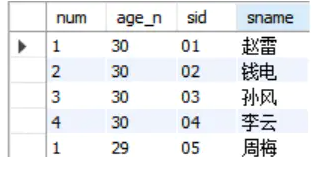

#  Mysql


##  批量添加， UUID（），Exists，GroupBy

```mysql
INSERT INTO assess_info_ability
(id, assess_info_type_id, ability_code, stage_level, type_score, start_time, end_time)
SELECT
	REPLACE(UUID(),'-','') id,
	ait.id assess_info_type_id,
	sc.ability_code,
	ait.stage_level,
	null type_score,
	SYSDATE() start_time,
	null end_time
FROM assess_info_type ait,
	(SELECT type_code, ability_code
		FROM sys_code
		WHERE type_code = '01'
		AND del_flag = '0'
		GROUP BY type_code,ability_code) sc
WHERE ait.type_code  = sc.type_code 
	AND ait.id = '00000865e3ad4f859ec51244d42010de'
	AND EXISTS(
		SELECT aqb.id
		FROM  sys_code s,
			assess_question_bank aqb 
		WHERE ability_code = sc.ability_code
			AND aqb.del_flag = '0'
			AND aqb.skill_code = s.skill_code
			AND aqb.stage_level = ait.stage_level
	)
	ORDER BY sc.ability_code
```


##  批量添加，自定义局部变量

```mysql
insert into assess_pre_result
        (id, pre_paper_id, pre_question_id, score, sort, create_time, answer_time)
      select replace(uuid(),"-","") id,
              #{prePaperId} pre_paper_id,
			  id pre_question_id,
			  null score,
			  @rowNum:=@rowNum + 1 as sort,
			  #{createTime} create_time,
			  null end_time
        from assess_pre_question_bank,
			 (select @rownum := 0) r
	   where type_code = #{typeCode}
	          and appliance_age_level = #{level}
			  and del_flag = '0'
    order by cast(id as unsigned)
    
    
    
    
    insert into assess_info_ability_detail
	    (id, assess_info_ability_id, question_id, score, user_remark, start_time, end_time, sort)
        select t.*, @rowNum:=@rowNum + 1 as sort
          from (select  replace(uuid(),"-","") id,
                         aia.id assess_info_ability_id,
                         aqb.id question_id,
                         null score,
                         null user_remark,
                         SYSDATE() start_time,
                         null end_time
                  from  assess_info_ability aia,
                         (select ability_code, skill_code
                            from sys_code
                           where del_flag = '0'
                        group by ability_code, skill_code) sc,
                         assess_question_bank aqb
                 where  sc.ability_code = aia.ability_code
                         and aqb.skill_code = sc.skill_code
                         and aia.assess_info_type_id = #{assessInfoTypeId}
                         and aqb.stage_level = aia.stage_level
                         and aia.end_time is null
                         and aia.type_score is null
                         and aqb.del_flag = '0'
              order by sc.ability_code, aqb.id) t,
               (select @rownum := 0) r
```

> 初始赋值：
>
> set @num=1 
> set @num:=1 
>
> select @num:=1
> select @num:=字段名 from 表名 where 条件
>
> 使用set时可以用“=”或“:=”，但是使用select时必须用“:=赋值”
>
> ```dart
> 根据学生的年年龄进行排序，相同年龄的学生为一组，组内编号依次为1，2，3...
> 实现：一个字段内部的排序。
> MySQL中row_number的实现
> 通常，用group by 可以实现一个字段的聚合，再结合order by进行排序。但是在一个字段内部不同的'值'再聚合并排序，就不是group by能够做到的了。
> 此处可以使用局部变量实现自增，给字段内不同value 使用case...when...进行条件判断后打上标签，也就实现了排序功能。
>   
>   
> set @row_num:=0,@customer_num:=0
> select 
> @row_num:=
>     case when @customer_num=(year(now())-year(stu.sage)) then @row_num+1 else 1 end as num,
>         @customer_num := (year(now())-year(stu.sage)) as age_n,
> stu.sid,stu.sname
> from student as stu
> order by sid
> ```




##  floor、datediff 、case...then...end

```mysql
select aiad.question_id,
         floor((DATEDIFF(ait.start_time, s.birthday) / (30 * 12))) +
         case floor((DATEDIFF(ait.start_time, s.birthday) / 30)) % 12
                             when 1 then 0.25
																	when 2 then 0.25
																	when 3 then 0.25
																	when 4 then 0.5
																	when 5 then 0.5
																	when 6 then 0.5
																	when 7 then 0.75
																	when 8 then 0.75
																	when 9 then 0.75
																	when 10 then 1
																	when 11 then 1
																	else 0
														 end  assess_age
```

> datediff：返回两个日期相差的day


##  GroupBy 非聚合字段处理

```mysql
select pr.id resultId,
              pr.pre_paper_id prePaperId,
			  pr.pre_question_id preQuestionId,
			  pqb.type_code typeCode,
			  sc.type_name typeName,
			  pqb.description description,
			  pqb.video_help videoHelp,
			  pqb.operation,
			  pqb.standard
        from assess_pre_result pr,
	          assess_pre_question_bank pqb,
	          (select type_code, max(type_name) type_name from sys_code group by type_code) sc
       where pqb.id = pr.pre_question_id
              and sc.type_code = pqb.type_code
              and pr.pre_paper_id = #{prePaperId}
              and pr.answer_time is null
       order by sort;
```


##  union

``` mysql
select app.id, '0' assess_type, app.type_code, '' stage_level, '' type_score, app.create_time start_time, app.end_time
                       from assess_pre_paper app
                      where app.student_id = '3060978c5ab4458fa8f6a450360d9939'
                             and app.end_time is not null
                     union
select ait.id, '1'  assess_type, ait.type_code, ait.stage_level, ait.type_score, ait.start_time, ait.end_time
                        from assess_info ai,
                              assess_info_type ait
                       where ait.assess_info_id = ai.id
                              and ai.student_id = '3060978c5ab4458fa8f6a450360d9939'
```

> 可以使两张毫不相⼲的表的查询结果拼接在⼀起输出，前提是两个查询的列数要相同
>
> UNION 只会选取不同的值。请使用 UNION ALL 来选取重复的值！

##  foreach 批量更新

``` mysql
<foreach collection="list" item="preResult" index="index" open="" close="" separator=";">
	update assess_pre_result
		set score = #{preResult.score},
			answer_time = #{preResult.answerTime}
	where id  = #{preResult.id}
</foreach>
```


##  Group_Concat、With as、Locate

```mysql
WITH t AS (
  select ar.student_id, art.type_code,
  GROUP_CONCAT(art.stage_level order by ar.start_time desc) level_list,
  GROUP_CONCAT(art.type_score order by ar.start_time desc) score_list,
  GROUP_CONCAT(art.ranking_num order by ar.start_time desc) ranking_num_list,
  GROUP_CONCAT(art.ranking_count order by ar.start_time desc) ranking_count_list,
  GROUP_CONCAT(art.refer_age order by ar.start_time desc) refer_age_list,

  -- 当前评估 level, score, ranking_num, ranking_count
  -- current_level
  1 current_level_index,
  IF(LOCATE(',', GROUP_CONCAT(art.stage_level order by ar.start_time desc)) = 0,
     LENGTH(GROUP_CONCAT(art.stage_level order by ar.start_time desc)),
     LOCATE(',', GROUP_CONCAT(art.stage_level order by ar.start_time desc)) - 1) current_level_length,

  -- current_score
  1 current_score_index,
  IF(LOCATE(',', GROUP_CONCAT(art.type_score order by ar.start_time desc)) = 0,
     LENGTH(GROUP_CONCAT(art.type_score order by ar.start_time desc)),
     LOCATE(',', GROUP_CONCAT(art.type_score order by ar.start_time desc)) - 1) current_score_length,

  -- current_ranking_num
  1 current_ranking_num_index,
  IF(LOCATE(',', GROUP_CONCAT(art.ranking_num order by ar.start_time desc)) = 0,
     LENGTH(GROUP_CONCAT(art.ranking_num order by ar.start_time desc)),
     LOCATE(',', GROUP_CONCAT(art.ranking_num order by ar.start_time desc)) - 1) current_ranking_num_length,

  -- current_ranking_count
  1 current_ranking_count_index,
  IF(LOCATE(',', GROUP_CONCAT(art.ranking_count order by ar.start_time desc)) = 0,
     LENGTH(GROUP_CONCAT(art.ranking_count order by ar.start_time desc)),
     LOCATE(',', GROUP_CONCAT(art.ranking_count order by ar.start_time desc)) - 1) current_ranking_count_length,

  -- current_refer_age
  1 current_refer_age_index,
  IF(LOCATE(',', GROUP_CONCAT(art.refer_age order by ar.start_time desc)) = 0,
     LENGTH(GROUP_CONCAT(art.refer_age order by ar.start_time desc) ),
     LOCATE(',', GROUP_CONCAT(art.refer_age order by ar.start_time desc)) - 1) current_refer_age_length,

  -- 上一次评估 level, score, ranking_num, ranking_count
  -- last_level
  IF(LOCATE(',', GROUP_CONCAT(art.stage_level order by ar.start_time desc)) = 0, 0,
     LOCATE(',', GROUP_CONCAT(art.stage_level order by ar.start_time desc)) + 1) last_level_index,

  IF(LOCATE(',', GROUP_CONCAT(art.stage_level order by ar.start_time desc)) = 0, 0,
     IF(LOCATE(',', GROUP_CONCAT(art.stage_level order by ar.start_time desc), LOCATE(',', GROUP_CONCAT(art.stage_level order by ar.start_time desc)) + 1) = 0,
        LENGTH(GROUP_CONCAT(art.stage_level order by ar.start_time desc)) - LOCATE(',', GROUP_CONCAT(art.stage_level order by ar.start_time desc)),
        LOCATE(',', GROUP_CONCAT(art.stage_level order by ar.start_time desc),
               LOCATE(',', GROUP_CONCAT(art.stage_level order by ar.start_time desc))+1) - (LOCATE(',', GROUP_CONCAT(art.stage_level order by ar.start_time desc))+1))
    ) last_level_length,

  -- last_score
  LOCATE(',', GROUP_CONCAT(art.type_score order by ar.start_time desc)) + 1 last_score_index,
  IF(LOCATE(',', GROUP_CONCAT(art.type_score order by ar.start_time desc)) = 0, 0,
     IF(LOCATE(',', GROUP_CONCAT(art.type_score order by ar.start_time desc), LOCATE(',', GROUP_CONCAT(art.type_score order by ar.start_time desc)) + 1) = 0,
        LENGTH(GROUP_CONCAT(art.type_score order by ar.start_time desc)) - LOCATE(',', GROUP_CONCAT(art.type_score order by ar.start_time desc)),
        LOCATE(',', GROUP_CONCAT(art.type_score order by ar.start_time desc),
               LOCATE(',', GROUP_CONCAT(art.type_score order by ar.start_time desc))+1) - (LOCATE(',', GROUP_CONCAT(art.type_score order by ar.start_time desc))+1))
    ) last_score_length,

  -- last_ranking_num
  LOCATE(',', GROUP_CONCAT(art.ranking_num order by ar.start_time desc)) + 1 last_ranking_num_index,
  IF(LOCATE(',', GROUP_CONCAT(art.ranking_num order by ar.start_time desc)) = 0, 0,
     IF(LOCATE(',', GROUP_CONCAT(art.ranking_num order by ar.start_time desc), LOCATE(',', GROUP_CONCAT(art.ranking_num order by ar.start_time desc)) + 1) = 0,
        LENGTH(GROUP_CONCAT(art.ranking_num order by ar.start_time desc)) - LOCATE(',', GROUP_CONCAT(art.ranking_num order by ar.start_time desc)),
        LOCATE(',', GROUP_CONCAT(art.ranking_num order by ar.start_time desc),
               LOCATE(',', GROUP_CONCAT(art.ranking_num order by ar.start_time desc))+1) - (LOCATE(',', GROUP_CONCAT(art.ranking_num order by ar.start_time desc))+1))
    ) last_ranking_num_length,

  -- last_ranking_count
  LOCATE(',', GROUP_CONCAT(art.ranking_count order by ar.start_time desc)) + 1 last_ranking_count_index,
  IF(LOCATE(',', GROUP_CONCAT(art.ranking_count order by ar.start_time desc)) = 0, 0,
     IF(LOCATE(',', GROUP_CONCAT(art.ranking_count order by ar.start_time desc), LOCATE(',', GROUP_CONCAT(art.ranking_count order by ar.start_time desc)) + 1) = 0,
        LENGTH(GROUP_CONCAT(art.ranking_count order by ar.start_time desc)) - LOCATE(',', GROUP_CONCAT(art.ranking_count order by ar.start_time desc)),
        LOCATE(',', GROUP_CONCAT(art.ranking_count order by ar.start_time desc),
               LOCATE(',', GROUP_CONCAT(art.ranking_count order by ar.start_time desc))+1) - (LOCATE(',', GROUP_CONCAT(art.ranking_count order by ar.start_time desc))+1))
    ) last_ranking_count_length,

  -- last_refer_age
  LOCATE(',', GROUP_CONCAT(art.refer_age order by ar.start_time desc)) + 1 last_refer_age_index,
  IF(LOCATE(',', GROUP_CONCAT(art.refer_age order by ar.start_time desc)) = 0, 0,
     IF(LOCATE(',', GROUP_CONCAT(art.refer_age order by ar.start_time desc), LOCATE(',', GROUP_CONCAT(art.refer_age order by ar.start_time desc)) + 1) = 0,
        LENGTH(GROUP_CONCAT(art.refer_age order by ar.start_time desc)) - LOCATE(',', GROUP_CONCAT(art.refer_age order by ar.start_time desc)),
        LOCATE(',', GROUP_CONCAT(art.refer_age order by ar.start_time desc),
               LOCATE(',', GROUP_CONCAT(art.refer_age order by ar.start_time desc))+1) - (LOCATE(',', GROUP_CONCAT(art.refer_age order by ar.start_time desc))+1))
    ) last_refer_age_length

  from assess_report ar,
  assess_report_type art
  where art.report_id = ar.id
  and art.type_code = '01'
  group by student_id, art.type_code
)


select t.student_id, t.type_code,
                SUBSTR(t.level_list, t.current_level_index, t.current_level_length) current_level,
                SUBSTR(t.score_list, t.current_score_index, t.current_score_length) current_score,
                IFNULL(SUBSTR(t.ranking_num_list, t.current_ranking_num_index, t.current_ranking_num_length),0) current_ranking_num,
                IFNULL(SUBSTR(t.ranking_count_list, t.current_ranking_count_index, t.current_ranking_count_length),1) current_ranking_count,
                SUBSTR(t.refer_age_list, t.current_refer_age_index, t.current_refer_age_length) current_refer_age,
                IF(t.last_level_index = 0, null,
                   IF(t.last_level_length <= 0,
                      SUBSTR(t.level_list, t.last_level_index),
                      SUBSTR(t.level_list, t.last_level_index, t.last_level_length))) last_level,
                IF(t.last_level_index = 0, null,
                   IF(t.last_score_length <= 0,
                      SUBSTR(t.score_list, t.last_score_index),
                      SUBSTR(t.score_list, t.last_score_index, t.last_score_length))) last_score,
                IFNULL(IF(t.last_level_index = 0, null,
                          IF(t.last_ranking_num_length <= 0,
                             SUBSTR(t.ranking_num_list, t.last_ranking_num_index),
                             SUBSTR(t.ranking_num_list, t.last_ranking_num_index, t.last_ranking_num_length))),0) last_ranking_num,
                IFNULL(IF(t.last_level_index = 0, null,
                          IF(t.last_ranking_count_length <= 0,
                             SUBSTR(t.ranking_count_list, t.last_ranking_count_index),
                             SUBSTR(t.ranking_count_list, t.last_ranking_count_index, t.last_ranking_count_length))),1) last_ranking_count,
                IF(t.last_level_index = 0, null,
                   IF(t.last_refer_age_length <= 0,
                      SUBSTR(t.refer_age_list, t.last_refer_age_index),
                      SUBSTR(t.refer_age_list, t.last_refer_age_index, t.last_refer_age_length))) last_refer_age
          from t


```

> group_concat 函数的作用：函数返回一个字符串结果，该结果由分组中的值连接组合而成。
>
> LOCATE(substr,str)返回字符串substr中第一次出现子字符串的位置 str
>
> LOCATE(substr,str,pos)返回字符串substr中第一个出现子 字符串的 str位置，从位置开始 pos。0 如果substr不在，则 返回str。返回 NULL如果substr 或者str是NULL

## ifnull 自关联增加查询字段

```mysql
 
SELECT
	id assess_info_id,
	stu_id student_id,
	stage_level,
	total_score,
	start_time,
	end_time,
	assess_count 
FROM
	(
	SELECT
		ifnull( count( student_id ), 0 ) assess_count,
		ifnull(student_id,'3060978c5ab4458fa8f6a450360d9939') stu_id
	FROM
			assess_info 
		WHERE
			student_id = '3060978c5ab4458fa8f6a450360d9939') ac
			LEFT JOIN assess_info ON student_id = stu_id 
		ORDER BY
		start_time DESC 
	LIMIT 1
	
	

```


## 递归查询

```xml
<?xml version="1.0" encoding="UTF-8"?>
<!DOCTYPE mapper PUBLIC "-//mybatis.org//DTD Mapper 3.0//EN" "http://mybatis.org/dtd/mybatis-3-mapper.dtd">

<mapper namespace="com.also.modules.sys.dao.SysMenuOperationDao">

   <!-- 可根据自己的需求，是否要使用 -->
    <resultMap type="com.also.modules.sys.entity.SysMenuOperationEntity" id="SysMenuOperationMap">
        <result property="id" column="id"/>
        <result property="menuId" column="menu_id"/>
        <result property="remark" column="remark"/>
        <result property="action" column="action"/>
        <result property="apiPath" column="api_path"/>
        <result property="name" column="name"/>
    </resultMap>
    <resultMap type="com.also.modules.sys.vo.MenuAndOperationVo" id="menuAndOperationMap">
        <result property="menuId" column="r_id"/>
        <result property="name" column="r_name"/>
        <result property="parentId" column="r_parent_id"/>
        <result property="key" column="r_name"/>
        <association property="operationEntities" select="child" javaType="com.also.modules.sys.vo.MenuAndOperationVo" column="childId">
            <result property="menuId" column="menu_id"/>

        </association>
        <association property="children" select="child" javaType="com.also.modules.sys.vo.MenuAndOperationVo" column="childId">
        </association>
    </resultMap>

    <resultMap type="com.also.modules.sys.vo.MenuAndOperationVo" id="menuAndOperationMapChild">
        <result property="menuId" column="r_id"/>
        <result property="name" column="r_name"/>
        <result property="parentId" column="r_parent_id"/>
        <result property="key" column="r_name"/>
        <association property="children" resultMap="levelTwoOfMenu"/>
        <association property="operationEntities" select="child">
        </association>
    </resultMap>

    <resultMap type="com.also.modules.sys.vo.MenuAndOperationVo" id="levelTwoOfMenu">
        <result property="menuId" column="rr_id"/>
        <result property="name" column="rr_name"/>
        <result property="parentId" column="rr_parent_id"/>
        <result property="key" column="rr_name"/>
        <association property="children" resultMap="levelThreeOfMenu"/>
        <association property="operationEntities" resultMap="SysMenuOperationMap" javaType="list" columnPrefix="rr_mo_"/>
    </resultMap>

    <resultMap type="com.also.modules.sys.vo.MenuAndOperationVo" id="levelThreeOfMenu">
        <result property="menuId" column="rrr_id"/>
        <result property="name" column="rrr_name"/>
        <result property="parentId" column="rrr_parent_id"/>
        <result property="key" column="rrr_name"/>
        <association property="operationEntities" resultMap="SysMenuOperationMap" javaType="list" columnPrefix="rrr_mo_"/>
    </resultMap>

    <select id="child" parameterType="string" resultMap="menuAndOperationMapChild">
        SELECT
            m_root.id           r_id,
            m_root.`name`       r_name,
            m_root.parent_id    r_parent_id,
            m.id                rr_id,
            m.`name`            rr_name,
            m.parent_id         rr_parent_id
        FROM
            m_sys_menu m
            LEFT JOIN m_sys_menu_operation mo ON m.id = mo.menu_id
        WHERE
            m.parent_id = #{childId} and m.`show` = '1'
    </select>

    <select id="listAllMenuAndOperations" resultMap="menuAndOperationMap">
        SELECT
            m_root.id           r_id,
            m_root.`name`       r_name,
            m_root.parent_id    r_parent_id,
            mo.id               rr_mo_id,
            mo.menu_id          rr_mo_menu_id,
            mo.action           rr_mo_action,
            mo.remark           rr_mo_remark,
            mo.api_path         rr_mo_api_path,
            m.`name`            rr_mo_name
        FROM
            m_sys_menu m
            LEFT JOIN m_sys_menu_operation mo ON mo.menu_id = m.id
        WHERE
            m.`show` = '1'
          AND m.parent_id = 0
    </select>
    <select id="getRolesApiPathMapping" resultType="com.also.modules.sys.entity.UriRoleEntity">
        SELECT
            mo.api_path `uri`,
            IFNULL( r.role, 'ROLE_UNDEFINED' ) `role`
        FROM
            m_sys_menu_operation mo
            LEFT JOIN m_sys_role_permission rp ON mo.id = rp.operation_id
            LEFT JOIN m_sys_role r ON r.id = rp.role_id
        WHERE
            mo.api_path IS NOT NULL
    </select>

    <select id="getMenuOperationList" resultMap="menuAndOperationMap">
        SELECT
            mo.*,
            m.id m_id,
            m.`name` m_name
        FROM
            m_sys_menu_operation mo
            LEFT JOIN m_sys_menu m ON mo.menu_id = m.id
        <where>
            <if test="item.name != null and item.name != ''">
                m.name LIKE CONCAT(#{item.name},'%')
            </if>
        </where>

    </select>
    <select id="listByRoleIds" resultType="com.also.modules.sys.entity.SysMenuOperationEntity">
        SELECT mo.*
        FROM
            m_sys_menu_operation mo
            LEFT JOIN m_sys_role_permission rp ON rp.operation_id = mo.id
        WHERE rp.role_id IN
        <foreach collection="item" separator="," open="(" close=")" item="roleId">
            #{roleId}
        </foreach>
        GROUP BY mo.id
    </select>
    <select id="listMenuAndOperationsByRole" resultMap="menuAndOperationMap">
        SELECT
            m.id m_id,
            m.`name` m_name,
            mo.*
        FROM
            m_sys_role r
            LEFT JOIN m_sys_role_permission rp ON r.id = rp.role_id
            LEFT JOIN m_sys_menu_operation mo ON rp.operation_id = mo.id
            LEFT JOIN m_sys_menu m ON mo.menu_id = m.id
        WHERE
            r.id = #{roleId}
          AND m.parent_id != '0'
          AND m.`show` = '1'
    </select>
</mapper>
```


#  MybatisPlus


##  获取集合中的最后一个，querywrapper.last

```java
AssessInfoEntity assessInfoEntity = assessInfoDao.selectOne(
                new QueryWrapper<AssessInfoEntity>().eq("student_id", studentId)
                        .and(wrapper -> wrapper.isNull("end_time"))
                        .orderByDesc("start_time")
                        .last("limit 1"));
```

SELECT
			m_root.id r_id,
			m_root.`name` r_name,
			m_root.parent_id r_parent_id,
			null rr_id,
			null rr_name,
			null rr_parent_id,
			m.id m_id,
			m.`name` m_name,
			m.parent_id m_parent_id,
			mo.* 
		FROM
			m_sys_menu m
			LEFT JOIN m_sys_menu_operation mo ON mo.menu_id = m.id
			LEFT JOIN m_sys_menu m_root ON m.parent_id = m_root.id 
		WHERE
			m.`show` = '1' 
			AND LENGTH( m.id ) = 3 
			AND mo.id IS NOT NULL

UNION
SELECT
			m_root.id r_id,
			m_root.`name` r_name,
			m_root.parent_id r_parent_id,
			m_rr.id rr_id,
			m_rr.`name` rr_name,
			m_rr.parent_id rr_parent_id,
			m.id m_id,
			m.`name` m_name,
			m.parent_id m_parent_id,
			mo.* 
		FROM
			m_sys_menu m
			LEFT JOIN m_sys_menu_operation mo ON mo.menu_id = m.id
			LEFT JOIN m_sys_menu m_rr ON m.parent_id = m_rr.id 
			LEFT JOIN m_sys_menu m_root ON m_rr.parent_id = m_root.id 
		WHERE
			m.`show` = '1' 
			AND LENGTH( m.id ) = 5 
			AND mo.id IS NOT NULL
	


