## Spring

* ## Spring 架构设计

  * 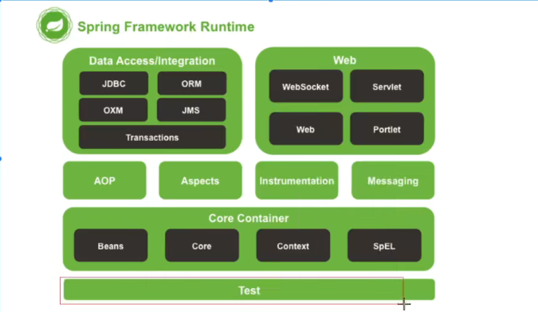
  * test模块：集成测试框架
  * Core Container：核心容器
    * Beans
    * Core：包含核心工具类
    * Context：ApplicationContext,对Beans和Core的扩展和增强，（国际化）
    * SpEL：el表达式
  * AOP：切面编程
    * IOC，DI式设计规范，spring是他的实现
  * Data Access Integration
    * 封装持久层框架
  * Web：

* ## 设计理念

  * 面向Bean的编程：
  * 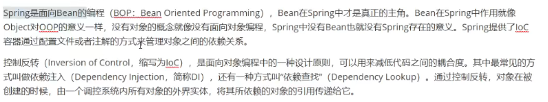

* 

* ## 核心组件介绍

  * Bean组件：org.springframework.beans

    * bean的定义：xml,注解。beandefinition
      * 加载bean定义信息到BeanDefinition
    * bean的创建：beanfactor创建bean。反射工厂模式，最底层实现类DefaultListAbleBeanFactory。spring使用的
      * 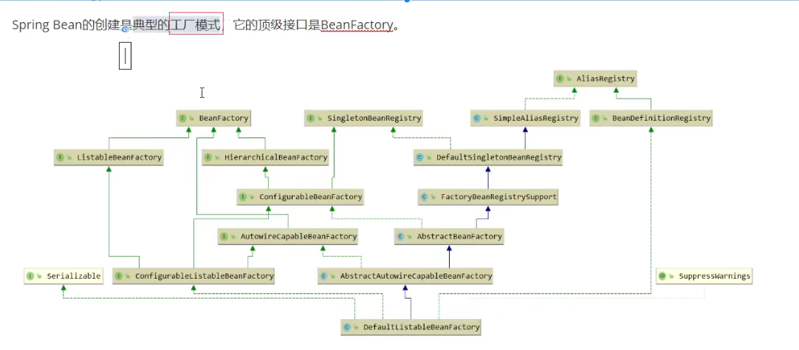
      * spring：使用**DefaultListAbleBeanFactory**来创建SpringFactory
      * beanfactory：对bean的基本操作
    * bean的解析：生命周期

  * Context组件：基于bean和core之上

    * 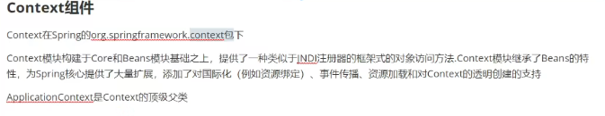
    * ApplicationContext：继承beanfactory。是一个容器对象，是对beanfactory的扩展增强

  * bean后置处理器：

    * 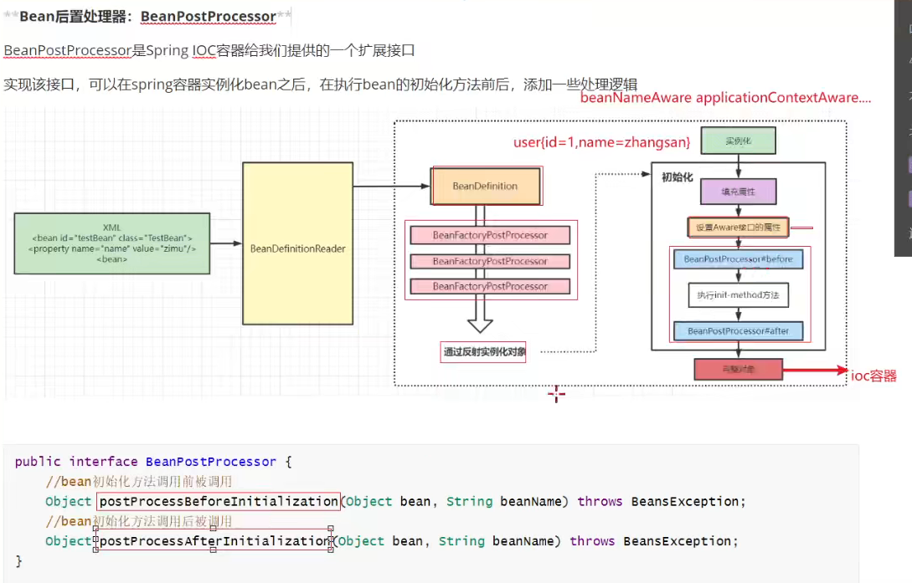
    * beanfactorypostprocessor：针对于beandefinition的初始化
    * beanpostprocessor：针对于bean的初始化

    

* ## IOC流程图

  * 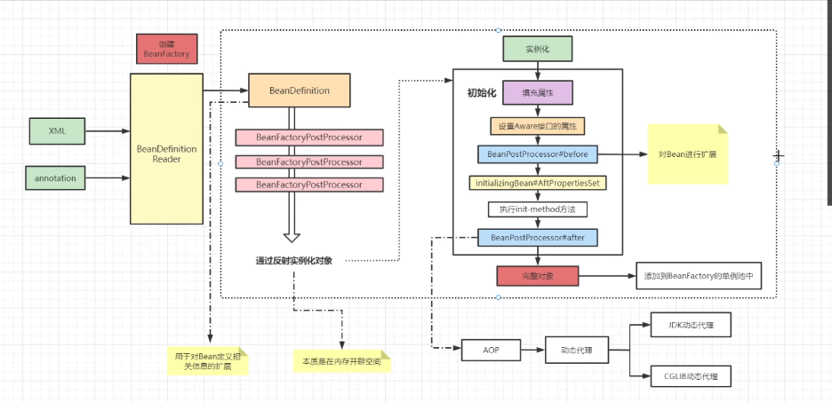
  * 配置bean信息：XML、annotation
  * BeanDefinitionReader：用来读取配置的bean信息到beandefinition中的集合
  * 通过反射实例化对象（没有任何属性赋值）
  * 实例化bean实例（bean的生命周期）
  * 实例化对象后会判断是否单例，单例：添加到beanfactory中的单例池中，多例：直接返回
  * AOP：对bean对象进行增强（生成代理对象） 

  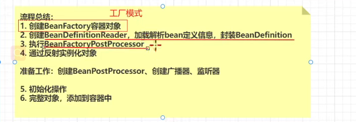

* ## Bean的生命周期

  * 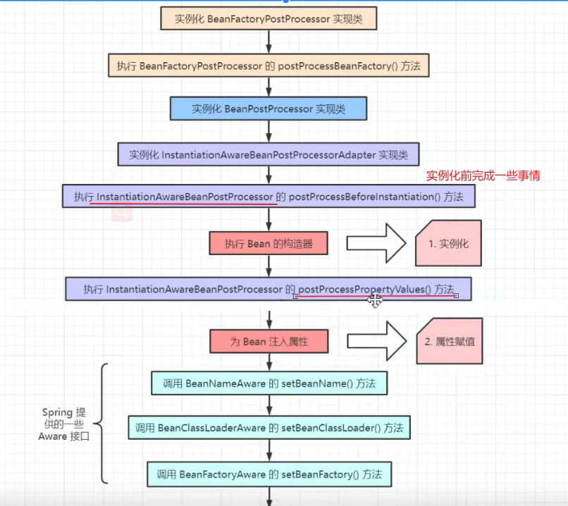
  * 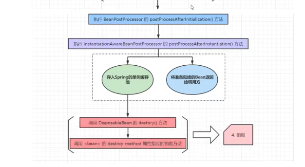
  * 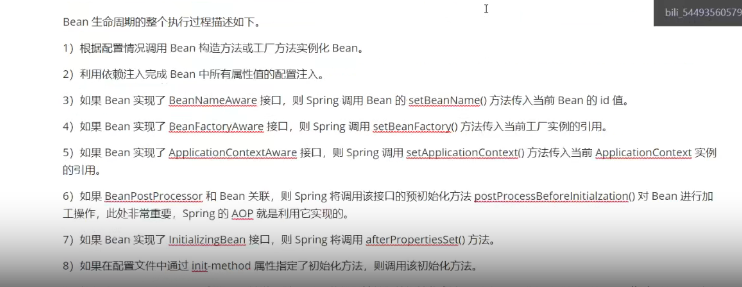
  * 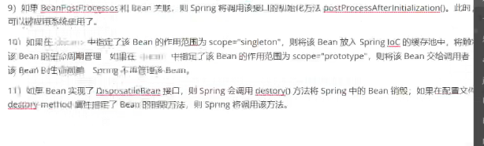

* ## SPring源码环境构建

* ## IOC源码深度剖析

  * BeanFactory
    * 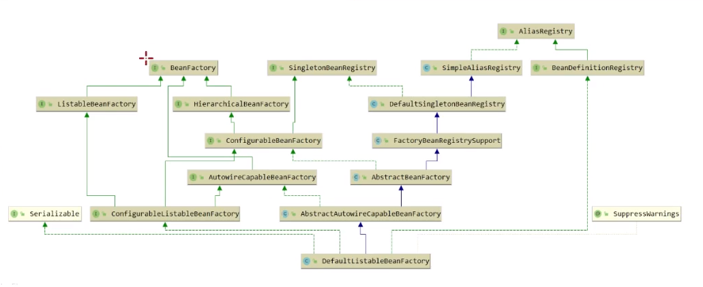
    * 

* ## Bean-循环依赖

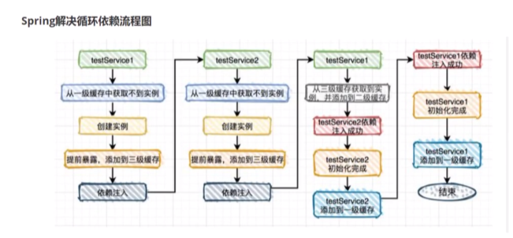

