# spring源码搭建

## 源码下载

spring[源码地址v5.2.7.RELEASE](https://github.com/spring-projects/spring-framework/tree/v5.2.7.RELEASE)


查看源码对应的gradle版本

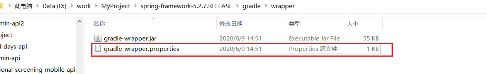


## 源码构建工具gradle

下载对应的版本gradle  [下载地址](https://services.gradle.org/distributions/)

配置gradle环境变量

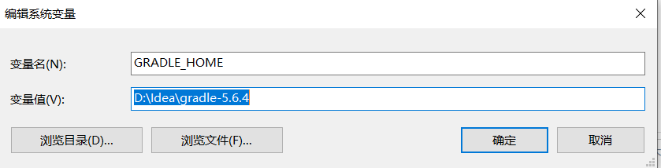

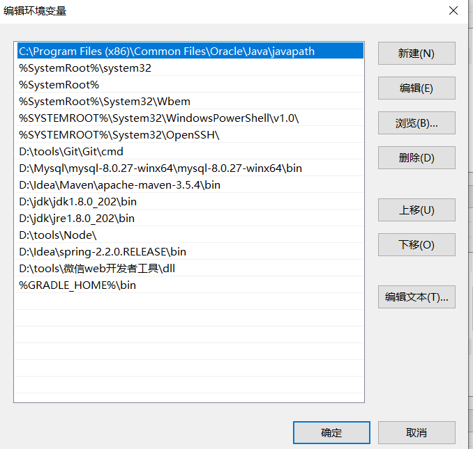

`gradle -v`查看是否配置成功


## 构建源码

解压spring源码 spring-framework-5.2.7.RELEASE.zip  --> spring-code


#### 添加gradle目录

打开spring-code\gradle\wrapper\gradle-wrapper.properties文件

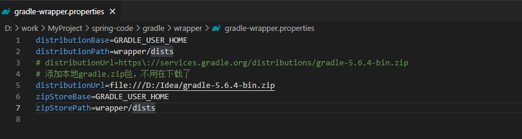


打开spring-code项目，idea会自动导包。**要全部取消**


#### 配置gradle

---

##### 资源仓库目录

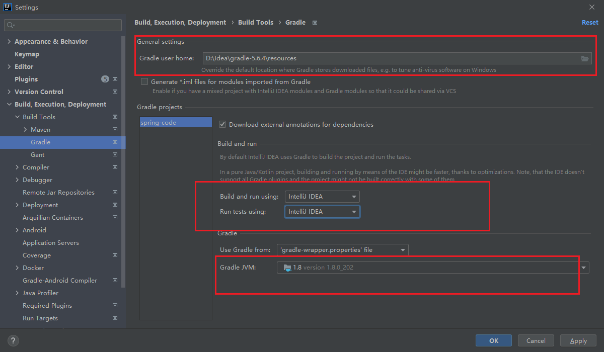

##### 配置build.gradle文件

打开build.gradle文件（这个就相当于是maven的pom文件），在文件头部加上Spring插件库

```yml
buildscript {
repositories {
maven { url "https://repo.spring.io/plugins-release" }
}
}

```

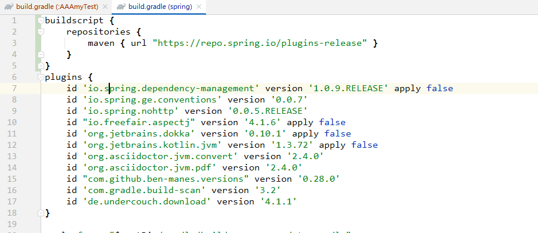


然后往下继续寻找，找到如下代码段,添加对应代码，配置阿里云镜像加速依赖下载，新增Spring插件库

```yml
//新增以下2个阿里云镜像
maven { url 'https://maven.aliyun.com/nexus/content/groups/public/' }
maven { url 'https://maven.aliyun.com/nexus/content/repositories/jcenter' }

//新增spring插件库
maven { url "https://repo.springsource.org/plugins-release" }
```

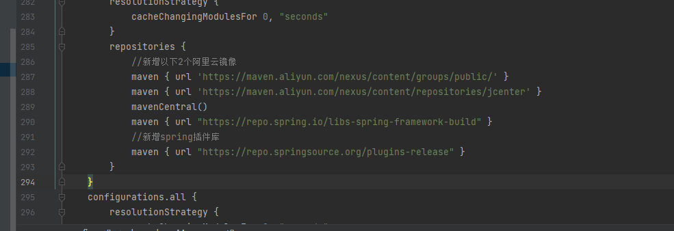

> 都修改好之后，保存一下，点击页面下图刷新图标，等待项目下载依赖构建即可，如果有报错多刷新几遍


## 新建测试模块测试是否构建成功

> 编写一个简单的applicationContext获取容器用的bean，主要是测试Spring源码构建编译过程是否成功！

```java
package xl.test;

/**
 * @author Xl
 * @date 2022/4/9 - 0:54
 * @Description:
 */
public class User {
	private String id;
	private String userName;

	public User() {
	}

	public User(String id, String userName) {
		this.id = id;
		this.userName = userName;
	}

	public String getId() {
		return id;
	}

	public void setId(String id) {
		this.id = id;
	}

	public String getUserName() {
		return userName;
	}

	public void setUserName(String userName) {
		this.userName = userName;
	}

	@Override
	public String toString() {
		return "User{" +
				"id='" + id + '\'' +
				", userName='" + userName + '\'' +
				'}';
	}
}

```

```java
package xl.test;

import org.springframework.context.annotation.Bean;
import org.springframework.context.annotation.ComponentScan;
import org.springframework.context.annotation.Configuration;

/**
 * @author Xl
 * @date 2022/4/9 - 0:55
 * @Description:
 */
@Configuration
@ComponentScan
public class JavaConfig {
	@Bean
	public User user(){
		return new User("001","Jack");
	}
}

```

```java
package xl.test;

import org.springframework.context.annotation.AnnotationConfigApplicationContext;

/**
 * @author Xl
 * @date 2022/4/9 - 0:59
 * @Description:
 */
public class Test {
	public static void main(String[] args) {
		System.out.println("hello");
		AnnotationConfigApplicationContext context = new AnnotationConfigApplicationContext(JavaConfig.class);
		User user = (User) context.getBean("user");
		System.out.println(user.toString());
	}

}

```


****

## gradle编译项目时，提示Could not find xxx.jar解决

>  将maven仓库中对应的包删除


### error1

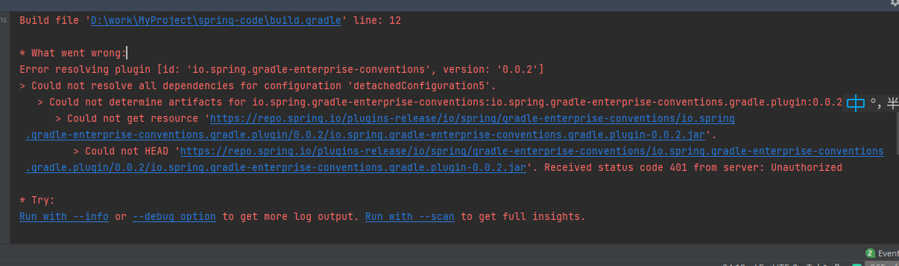

> 打开build.gradle。找到id 'io.spring.gradle-enterprise-conventions' version '0.0.2'  注释掉


### error2

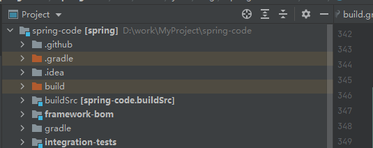

> 修改settings.gradle 文件中的rootProject.name = "spring"  为spring-code


### error3

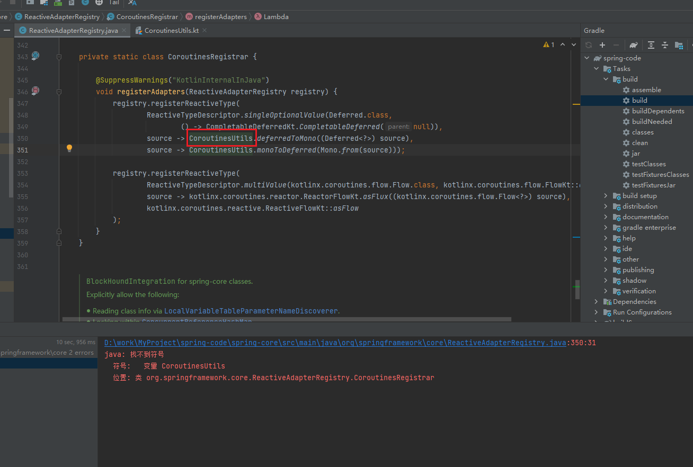

> 可以看出该错误是spring-core下的错误；查看CoroutinesUtils所在包目录是kotlin-coroutines

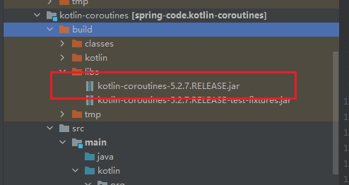

导入对应的jar到spring-core-main模块下

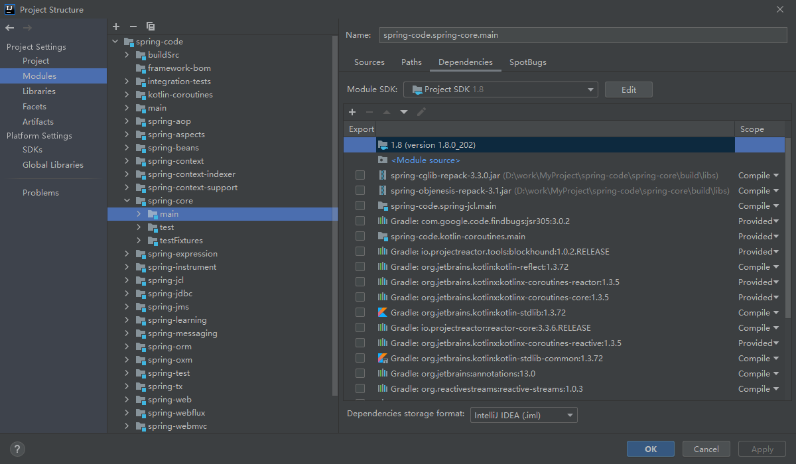

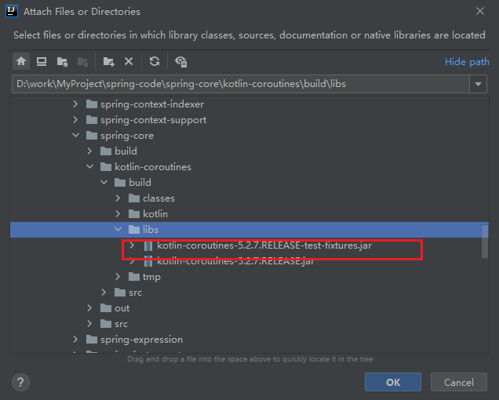


### error4

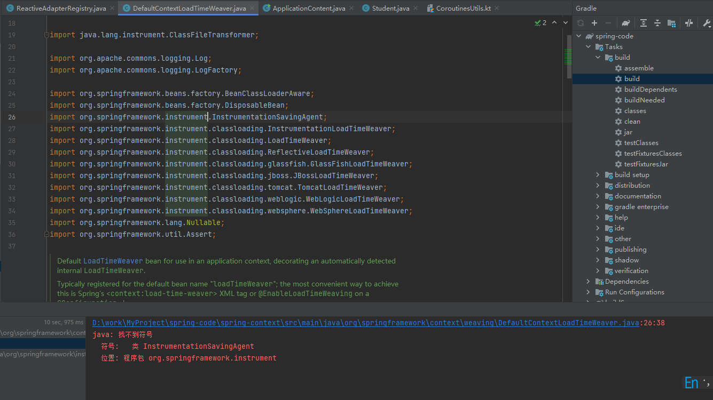

> spring-context模块下的错误；点击import org.springframework.instrument.InstrumentationSavingAgent;查看所在包路径；spring-instrument；添加该模块下build\libs包下的jar到spring-context-main下

### error5

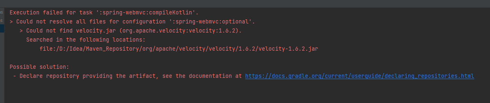

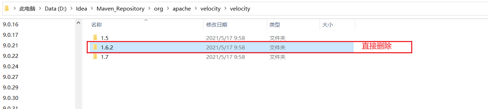

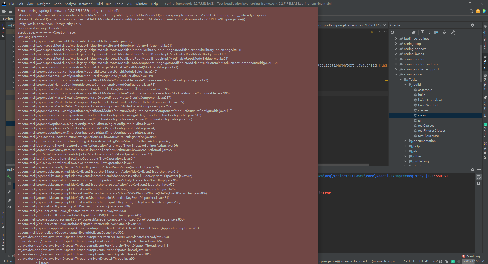